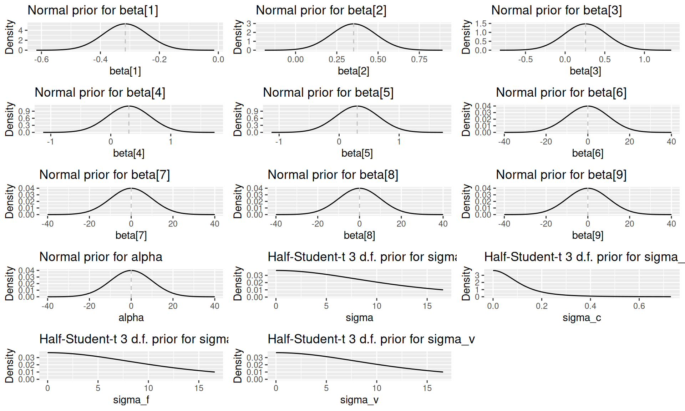
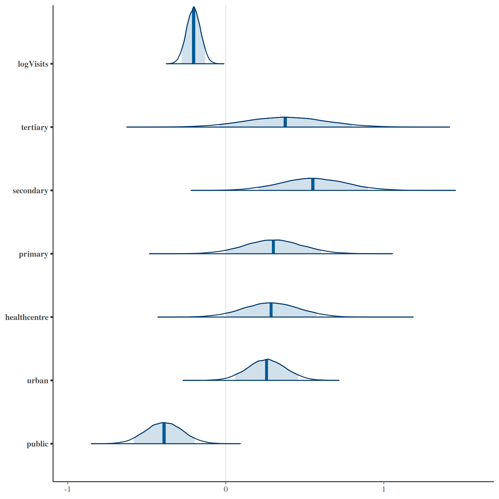
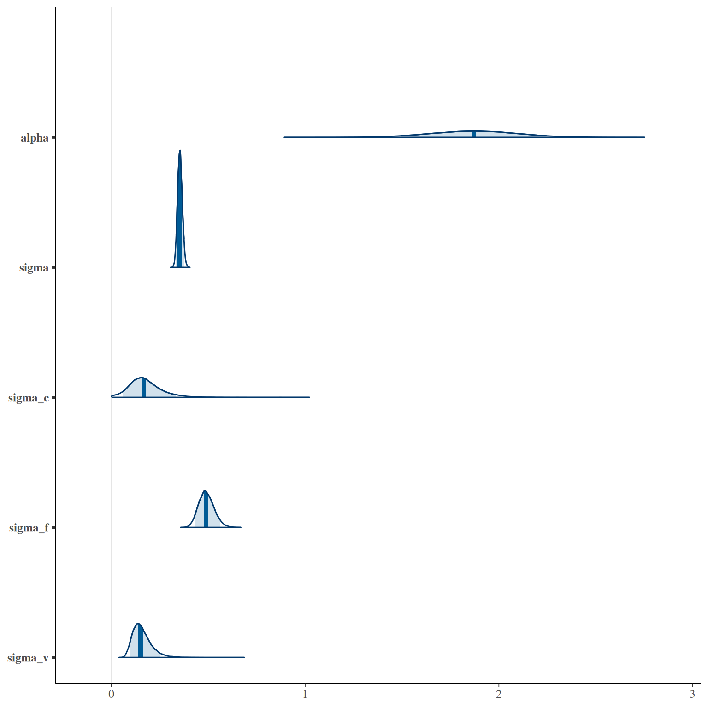
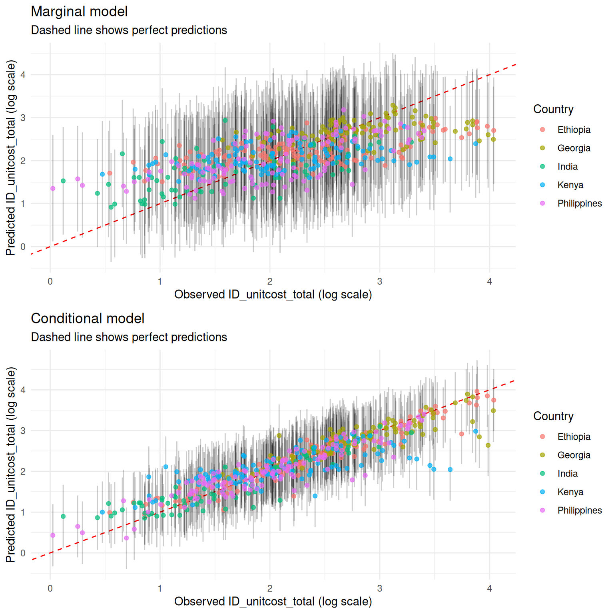
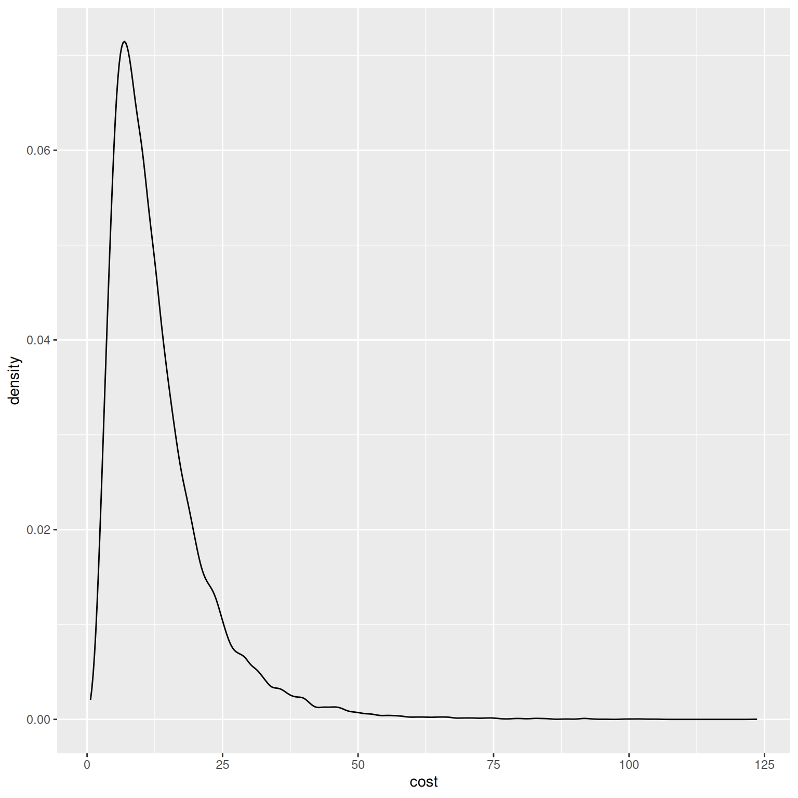

# Using the Unit Cost Model

``` r

library(ggplot2)
library(gridExtra)
library(dplyr)
```

This vignette describes use of the pre-fitted `unitcost` model.

## Model structure

The unit cost model is a mixed effects model with country, facility and
visit type effects and covariate effects that are assumed shared across
countries, facilities and visit types. Log costs are assumed to vary
normally:

``` math
\log(\text{USD\_unitcost\_total}_i) \sim \mathrm{N}(\mu_i, \sigma^2)
```

where $`\mu_i`$ is given by:

``` math
\mu_i = \alpha + \sum_{j=1}^J{\beta_j x_{ji}} + \gamma_{c_i} +  \delta_{f_i} +  \zeta_{v_i}
```

where $`x_{ji}`$ represents the value of the jth covariate, $`c_i`$ the
country, $`f_i`$ the facility, and $`v_i`$ the visit type of observation
$`i`$. The variables $`\gamma_{c_i}`$, $`\delta_{f_i}`$ and
$`\zeta_{v_i}`$ account for systematic differences across countries,
facilities and visit types, respectively, and are assumed to vary
normally about zero:

``` math
\gamma_{c} \sim \mathrm{N}(0, \sigma_c^2)
```

``` math
\delta_{f} \sim \mathrm{N}(0, \sigma_f^2)
```

``` math
\zeta_{o} \sim \mathrm{N}(0, \sigma_v^2)
```

Model instances are created via the `unitcost` function:

``` r

model <- capturetb::unitcost()
#> Multiple outputs detected. Including output-level random effects in model.

# See model covariates
covariates <- model$covariates()
print(covariates)
#> [1] "public"       "urban"        "healthcentre" "primary"      "secondary"   
#> [6] "tertiary"     "logVisits"

# See priors used in the model
priors <- model$priors()
print(priors)
#> $prior.alpha.mean
#> [1] 0
#> 
#> $prior.alpha.precision
#> [1] 0.01
#> 
#> $prior.sigma.scale
#> [1] 10
#> 
#> $prior.sigma_c.scale
#> [1] 0.1
#> 
#> $prior.sigma_f.scale
#> [1] 10
#> 
#> $prior.sigma_v.scale
#> [1] 10
#> 
#> $prior.beta.mean
#> [1] 0 0 0 0 0 0 0
#> 
#> $prior.beta.precision
#> [1] 0.01 0.01 0.01 0.01 0.01 0.01 0.01
#> 
#> attr(,"class")
#> [1] "capturetbpriors" "list"
```

The prior distribution for each model parameter can be visualised by
calling `plot(priors, parameter = "name_of_param")`:

``` r

plots <- list()
l <- length(covariates)
for(i in 1:l) {
  plots[[i]] <- plot(priors, par = paste0("beta[", i, "]"))
}
plots[[l + 1]] <- plot(priors, par = "alpha")
plots[[l + 2]] <- plot(priors, par = "sigma")
plots[[l + 3]] <- plot(priors, par = "sigma_c")
plots[[l + 4]] <- plot(priors, par = "sigma_f")
plots[[l + 5]] <- plot(priors, par = "sigma_v")

do.call(grid.arrange, c(plots, ncol = 3))
#> Warning: Removed 3341 rows containing missing values or values outside the scale range
#> (`geom_line()`).
#> Warning: Removed 4926 rows containing missing values or values outside the scale range
#> (`geom_line()`).
#> Warning: Removed 3341 rows containing missing values or values outside the scale range
#> (`geom_line()`).
#> Removed 3341 rows containing missing values or values outside the scale range
#> (`geom_line()`).
```



The posterior (fitted) distribution of each parameter can be generated
by calling `model$plot_posteriors`:

``` r

model$plot_posteriors(pars = paste0("beta[", 1:length(covariates), "]")) + 
  scale_y_discrete(labels = covariates)
#> Scale for y is already present.
#> Adding another scale for y, which will replace the existing scale.
```



Figure 1: Fitted beta cefficients

``` r

model$plot_posteriors(pars = c("alpha", "sigma", "sigma_c", "sigma_f", "sigma_v"))
```



Figure 2: Fitted intercept and standard deviations of random effects

## Training data

The `unitcost` model is fitted using top-down economic costs in 2018
International Dollars from the ValueTB database. The raw data are
installed with the package and include costs for multiple different
output types. Output types are also grouped into output groups. Run
[`capturetb::output_groups`](../reference/output_groups.md) to see all
groups, and [`capturetb::outputs()`](../reference/outputs.md) to
retrieve a complete list of available outputs:

``` r

available_output_groups <- capturetb::output_groups()
head(available_output_groups)
#> [1] "OP"

available_outputs <- capturetb::outputs()
head(available_outputs)
#> [1] "op_diagnosticvisit"     "op_treatmentvisit_ltbi" "op_treatmentvisit_dot" 
#> [4] "op_screeningvisit"      "op_vaccinations"        "op_coughtriage"
```

Subsets of the data can be retrieved using
[`capturetb::get_data()`](../reference/get_data.md), filtering by output
group or output type as needed:

``` r

data <- capturetb::get_data(output_group = "OP")
summarised <- data |> 
  group_by(fc_country) |>
  summarise(n_obs = n())

knitr::kable(summarised)
```

| fc_country  | n_obs |
|:------------|------:|
| Ethiopia    |   148 |
| Georgia     |    94 |
| India       |    74 |
| Kenya       |   111 |
| Philippines |   123 |

The fitted model predicts the cost of a single outpatient visit, given
key cost drivers. In the dataset outpatient visits of different types
have output group “OP”.

The training data was processed from the raw data by adding one
additional variable, `n_services`, which is the number of distinct TB
outpatient services provided at each facility, and by centering all
numeric covariates by their sample mean. The training data can be
inspected by calling `model$training_data()`:

``` r

dat <- model$training_data() |> 
    select(model$covariates())
head(dat)
#> # A tibble: 6 × 7
#>   public urban healthcentre primary secondary tertiary logVisits[,1]
#>   <lgl>  <lgl> <lgl>        <lgl>   <lgl>     <lgl>            <dbl>
#> 1 FALSE  TRUE  TRUE         FALSE   FALSE     FALSE           -0.622
#> 2 FALSE  TRUE  TRUE         FALSE   FALSE     FALSE           -0.622
#> 3 FALSE  TRUE  TRUE         FALSE   FALSE     FALSE           -0.622
#> 4 FALSE  TRUE  TRUE         FALSE   FALSE     FALSE           -0.622
#> 5 TRUE   TRUE  TRUE         FALSE   FALSE     FALSE           -0.528
#> 6 TRUE   TRUE  TRUE         FALSE   FALSE     FALSE           -0.528
```

## Model accuracy

To see how the model performs on the training data:

``` r

# Various measures of fit
performance <- model$performance(scale = "natural")
colnames(performance) <- c("MAE",
 "RMSE", "95% CI Coverage", "Median CI width", "Bayesian R-squ")
knitr::kable(performance)
```

|      MAE |     RMSE | 95% CI Coverage | Median CI width | Bayesian R-squ |
|---------:|---------:|----------------:|----------------:|---------------:|
| 5.449557 | 8.005849 |       0.9690909 |         26.8406 |      0.4282977 |

and by country:

``` r

# Performance by country
country_performance <- model$performance(by_country = TRUE)
colnames(country_performance) <- c("Country", "MAE",
 "RMSE", "95% CI Coverage", "Median CI width", "Bayesian R-squ")

knitr::kable(country_performance)
```

| Country     |      MAE |      RMSE | 95% CI Coverage | Median CI width | Bayesian R-squ |
|:------------|---------:|----------:|----------------:|----------------:|---------------:|
| Ethiopia    | 6.111877 |  8.954435 |       0.9932432 |        28.06320 |      0.3580516 |
| Georgia     | 7.763818 | 11.099153 |       0.9680851 |        45.64363 |      0.3857151 |
| India       | 3.492286 |  4.745580 |       0.9459459 |        18.21812 |      0.4665977 |
| Kenya       | 5.175605 |  7.559084 |       0.9459459 |        23.30778 |      0.3404449 |
| Philippines | 4.300596 |  5.558778 |       0.9756098 |        20.93304 |      0.4991497 |

By default, performance is reported after marginalising over facility
effects. To see the performance of the full conditional model, including
known facility effects:

``` r

# Various measures of fit
performance <- model$performance(scale = "natural", conditional = TRUE)
colnames(performance) <- c("MAE",
 "RMSE", "95% CI Coverage", "Median CI width", "Bayesian R-squ")
knitr::kable(performance)
```

|      MAE |     RMSE | 95% CI Coverage | Median CI width | Bayesian R-squ |
|---------:|---------:|----------------:|----------------:|---------------:|
| 2.611743 | 4.683493 |       0.9618182 |        14.33467 |      0.6557325 |

Visualisiing predictions for inputs in the training data, including
credible intervals, against observed costs:

``` r

# Plot with prediction intervals
do.call(grid.arrange, 
    c(model$plot_fit(include_ci = TRUE, scale = "log") + ggtitle("Marginal model"),
    model$plot_fit(include_ci = TRUE, scale = "log", conditional = TRUE) + ggtitle("Conditional model")))
```



## Generating predictions

Predictions of unit cost for new inputs, not in the training set, are
generated via the `predict` method. Note that numeric covariates must be
centered; to convert raw values to centered values, use the
`prepare_covariates` utility:

``` r

# Include all covariates plus facility country `fc_country` and visit type `output`
new_inputs <- list(
  logVisits = 6.9, 
    n_services = 1,
  healthcentre = FALSE,
    primary = FALSE,
  secondary = FALSE, 
    tertiary = FALSE,
  urban = FALSE, 
  public = TRUE,
  fc_country = "Ethiopia",
    output = "op_treatmentvisit"
)

# This will center covariates as required by the model
prepared_inputs <- capturetb::prepare_covariates(raw = new_inputs, mod = model)
```

``` r

pred <- model$predict(prepared_inputs,
 scale = "natural",
 summarised = TRUE,
 centrality = c("mean", "median"),
 ci = c(0.95, 0.9, 0.8))

# Expected unit cost is mean prediction
expected_unit_cost <- pred$Mean
print(expected_unit_cost)
#> [1] 13.12561 13.12561 13.12561

knitr::kable(pred)
```

| Observation |   Median |     Mean |   CI |   CI_low |  CI_high |
|:------------|---------:|---------:|-----:|---------:|---------:|
| 1           | 10.64765 | 13.12561 | 0.95 | 2.957713 | 38.02596 |
| 1           | 10.64765 | 13.12561 | 0.90 | 3.599610 | 31.00335 |
| 1           | 10.64765 | 13.12561 | 0.80 | 4.555433 | 24.31847 |

Note that by default the 95% *predictive* interval is returned. If you
instead want the 95% credible interval of the mean, pass
`ci_type = "mean"`.

To see the full distribution of predicted costs:

``` r

pred <- model$predict(prepared_inputs, scale = "natural", summarised = FALSE)
ggplot2::ggplot(data.frame(cost = pred), ggplot2::aes(x = cost)) + ggplot2::geom_density()
```


