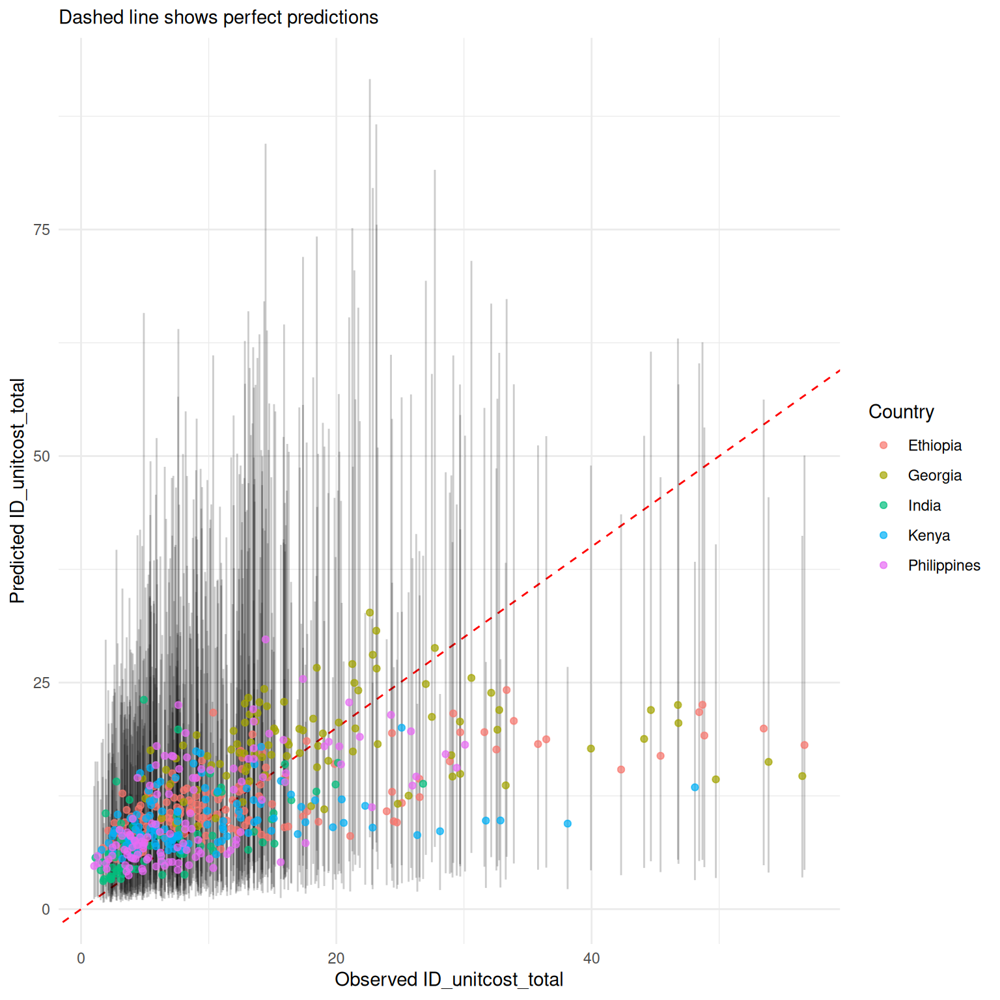
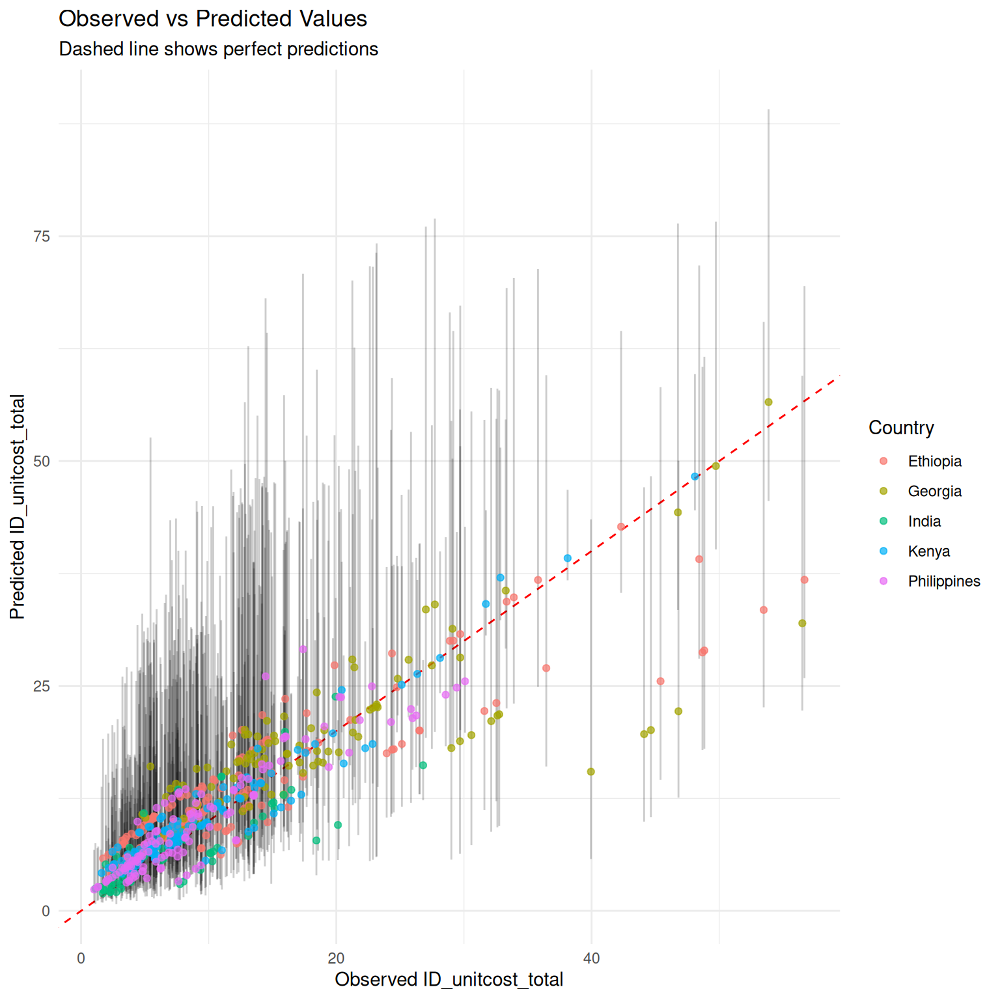
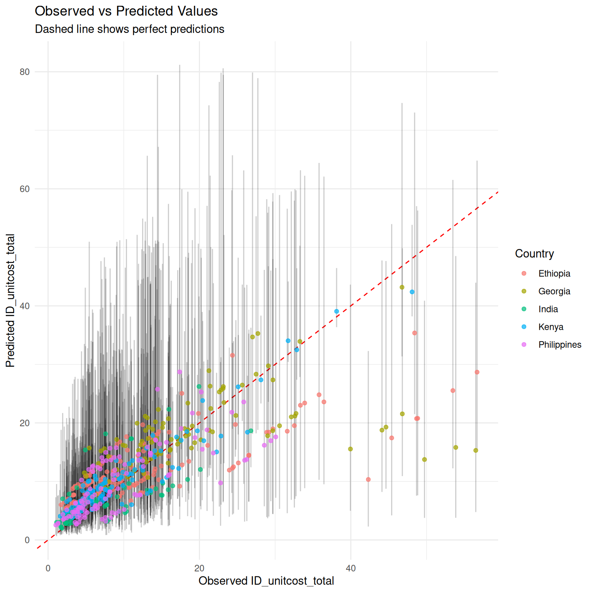

# Combining predictions with primary data

``` r

library(ggplot2)
library(dplyr)
```

In some contexts it may be feasible to collect partial costs. The
package provides two models to assist with this:

- [`unitcost_fixed()`](../reference/unitcost_fixed.md) - predicts the
  fixed costs of a single outpatient visit and can be combined with
  directly measured variable costs
- [`unitcost_ohd()`](../reference/unitcost_ohd.md) - predicts the
  overhead costs of a single outpatient visit and can be combined with
  directly measured costs excluding overheads

## Model Structures

Fixed costs vary very little by visit type, and overheads not at all by
visit type, so the Fixed Unit Cost and Overhead Unit Cost model have a
simpler structure than the Unit Cost Model.

For both, log costs are assumed to vary normally:

``` math
\log(\text{USD\_unitcost\_total}_i) \sim \mathrm{N}(\mu_i, \sigma^2)
```

where $`\mu_i`$ is given by:

``` math
\mu_i = \alpha + \sum_{j=1}^J{\beta_j x_{ji}} + \gamma_{c_i}
```

where $`x_{ji}`$ represents the value of the jth covariate and $`c_i`$
the country of observation $`i`$. The variable $`\gamma_{c_i}`$ accounts
for systematic differences across countries, and is assumed to vary
normally about zero:

``` math
\gamma_{c} \sim \mathrm{N}(0, \sigma_c^2)
```

## Comparing accuracy of each model

We compare the accuracy of predictions made by each of the models by
looking at: 1. The cost of a single visit as predicted by the `unitcost`
model. 2. The cost of a single visit as estimated by combining the
directly measured variable costs in the raw data with the predictions
for fixed costs made by the `unitcost_fixed` model. 3. The cost of a
single visit as estimated by combining the directly measured
non-overhead costs in the raw data with the predictions for overhead
costs made by the `unitcost_ohd` model.

``` r

mod_uc <- capturetb::unitcost()
#> Multiple outputs detected. Including output-level random effects in model.
mod_uc_fixed <- capturetb::unitcost_fixed()
#> Single output type detected. Not including output-level random effects in model.
mod_uc_ohd <- capturetb::unitcost_ohd()
#> Single output type detected. Not including output-level random effects in model.

dat <- mod_uc$training_data()

mod_uc$plot_fit(include_ci = TRUE, scale = "natural", conditional = FALSE)
```



``` r

# get predictions of ohd costs
pred_ohd <- mod_uc_ohd$predict(dat, scale = "natural", summarised = TRUE)
#> Warning in private$.validate_data(dat): Unknown output types:
#> op_diagnosticvisit, op_treatmentvisit_ltbi, op_treatmentvisit_dot,
#> op_screeningvisit, op_vaccinations, op_coughtriage, op_treatmentvisit_mdr,
#> op_monitoringvisit, op_screeningvisit_mch, op_adherencesupportvisit,
#> op_treatmentvisit, op_visitforinjection, op_follow-upvisit,
#> op_visitforcollectingmedicine

# add observed non-ohd costs to get the total unit cost
non_ohd <- (dat$ID_unitcost_total - dat$ID_unitcost_ohd)
pred_total <- pred_ohd %>% mutate(Mean = Mean + non_ohd,
                                    CI_low = CI_low + non_ohd,
                                    CI_high = CI_high + non_ohd)

observed <- dat$ID_unitcost_total

results_df <- data.frame(
    observed = observed,
    country = dat$fc_country,
    pred_total
)

ggplot2::ggplot(results_df, ggplot2::aes(
    x = .data$observed,
    y = .data$Mean
)) +
    ggplot2::geom_abline(
        slope = 1, intercept = 0, linetype = "dashed",
        color = "red"
    ) +
    ggplot2::labs(
        title = "Observed vs Predicted Values",
        subtitle = "Dashed line shows perfect predictions",
        x = "Observed ID_unitcost_total",
        y = "Predicted ID_unitcost_total",
        color = "Country"
    ) +
    ggplot2::theme_minimal() + 
    ggplot2::geom_errorbar(
        ggplot2::aes(ymin = .data$CI_low, ymax = .data$CI_high),
        alpha = 0.2, width = 0
    ) + ggplot2::geom_point(ggplot2::aes(color = .data$country),
        alpha = 0.7
    )
```



``` r

# get predictions of fixed costs
pred_fixed <- mod_uc_fixed$predict(dat, scale = "natural", summarised = TRUE)
#> Warning in private$.validate_data(dat): Unknown output types:
#> op_diagnosticvisit, op_treatmentvisit_ltbi, op_treatmentvisit_dot,
#> op_screeningvisit, op_vaccinations, op_coughtriage, op_treatmentvisit_mdr,
#> op_monitoringvisit, op_screeningvisit_mch, op_adherencesupportvisit,
#> op_treatmentvisit, op_visitforinjection, op_follow-upvisit,
#> op_visitforcollectingmedicine

# add observed variable costs to get the total unit cost
pred_total <- pred_fixed %>% mutate(Mean = Mean + dat$ID_unitcost_variable,
                                    CI_low = CI_low + dat$ID_unitcost_variable,
                                    CI_high = CI_high + dat$ID_unitcost_variable)

observed <- dat$ID_unitcost_total

results_df <- data.frame(
    observed = observed,
    country = dat$fc_country,
    pred_total
)

ggplot2::ggplot(results_df, ggplot2::aes(
    x = .data$observed,
    y = .data$Mean
)) +
    ggplot2::geom_abline(
        slope = 1, intercept = 0, linetype = "dashed",
        color = "red"
    ) +
    ggplot2::labs(
        title = "Observed vs Predicted Values",
        subtitle = "Dashed line shows perfect predictions",
        x = "Observed ID_unitcost_total",
        y = "Predicted ID_unitcost_total",
        color = "Country"
    ) +
    ggplot2::theme_minimal() + 
    ggplot2::geom_errorbar(
        ggplot2::aes(ymin = .data$CI_low, ymax = .data$CI_high),
        alpha = 0.2, width = 0
    ) + ggplot2::geom_point(ggplot2::aes(color = .data$country),
        alpha = 0.7
    )
```



As would be expected, measuring a subset of costs improves accuracy of
final estimates and somewhat reduces uncertainty, although uncertainty
remains high.

``` r

perf_total <- mod_uc$performance(scale = "natural")
perf_ohd <- mod_uc_ohd$performance(scale = "natural")
perf_fixed <- mod_uc_fixed$performance(scale = "natural")

performance <- rbind("unitcost" = perf_total, "unitcost_fixed" = perf_fixed, "unitcost_ohd" = perf_ohd)
colnames(performance) <- c("MAE",
 "RMSE", "95% CI Coverage", "Median CI width", "Bayesian R-squ")
knitr::kable(performance)
```

|  | MAE | RMSE | 95% CI Coverage | Median CI width | Bayesian R-squ |
|:---|---:|---:|---:|---:|---:|
| unitcost | 5.448473 | 8.008298 | 0.9690909 | 26.76053 | 0.4283979 |
| unitcost_fixed | 3.854194 | 5.738674 | 0.9739130 | 22.30759 | 0.4623236 |
| unitcost_ohd | 3.105803 | 4.659383 | 0.9754098 | 20.34419 | 0.4698256 |

Performance metrics of each model {.table .caption-top}
