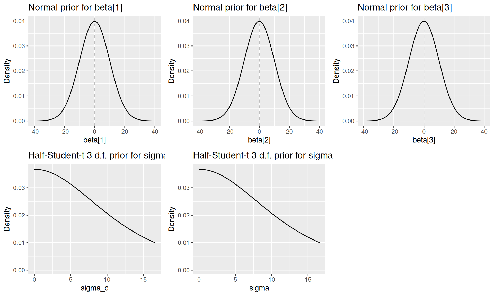
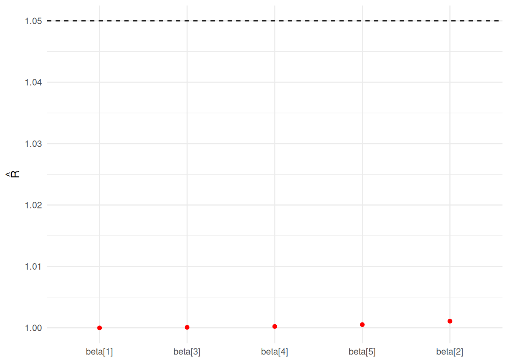
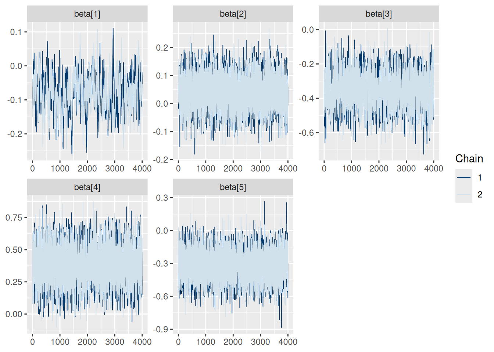
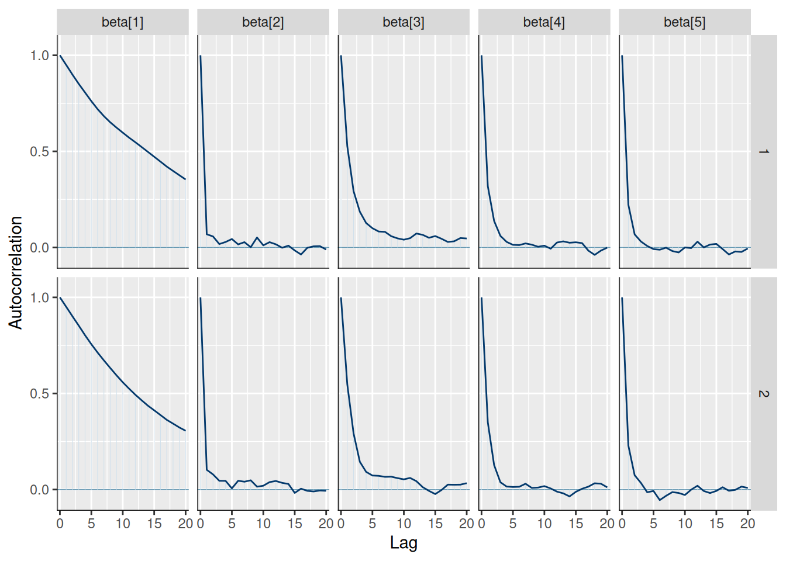
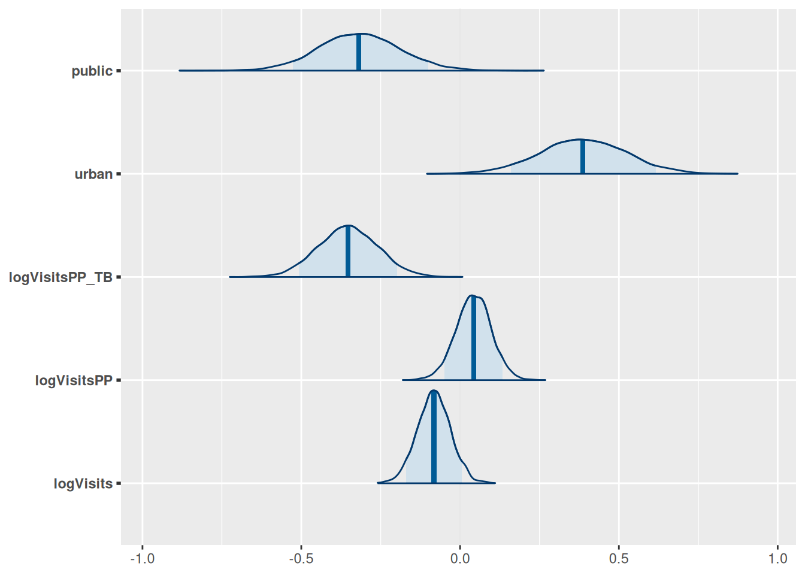
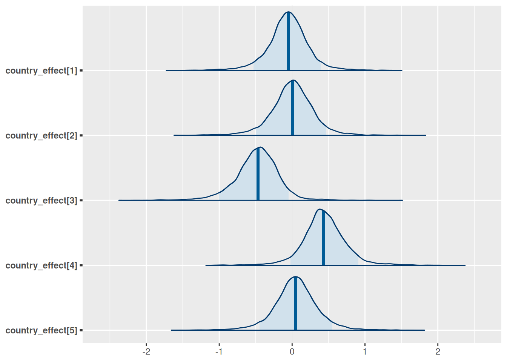
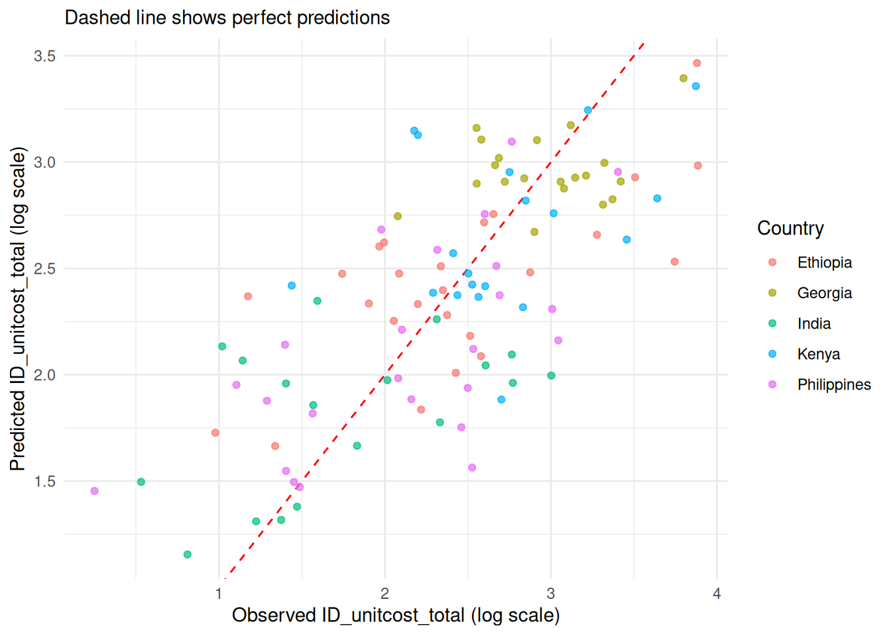
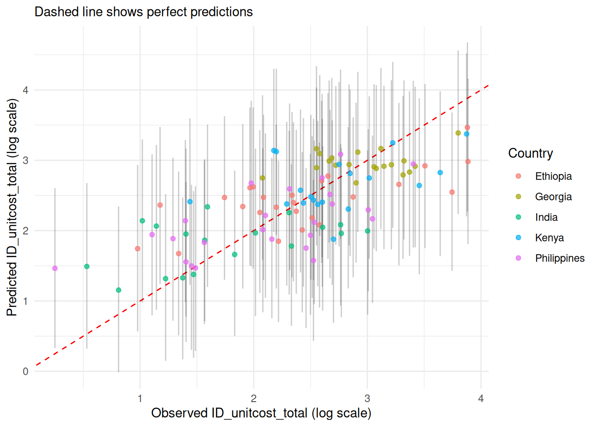
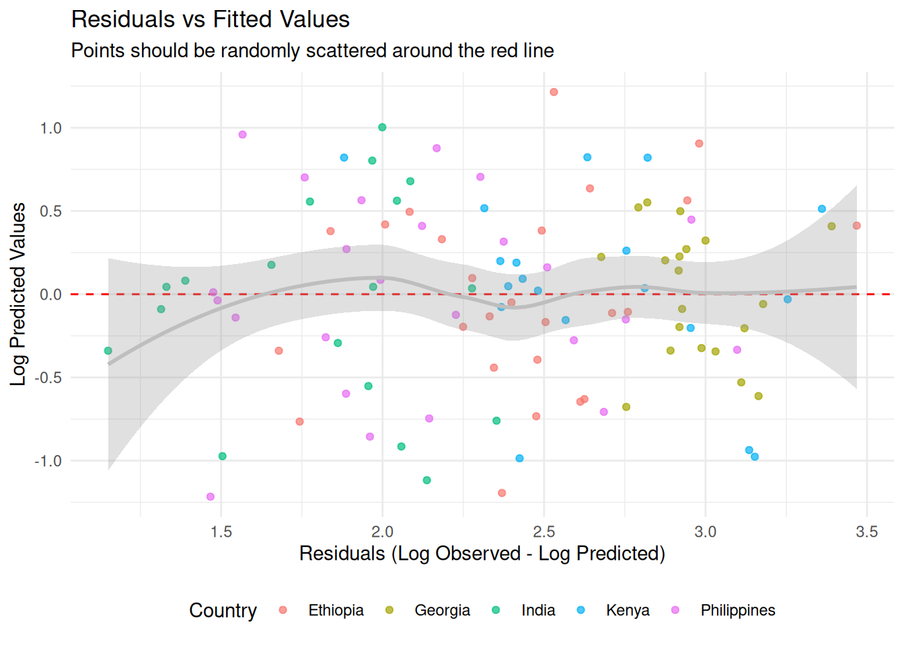
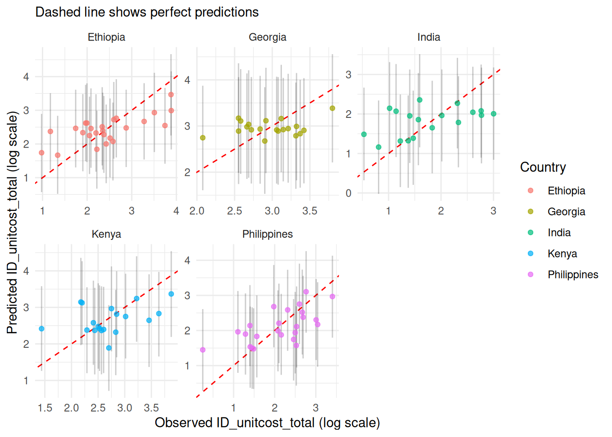

# Model Fitting

``` r
library(capturetb)
library(ggplot2)
library(dplyr)
```

This vignette demonstrates how the `unitcost`, `unitcost_fixed` and
`unitcost_ohd` models were fitted and sensitivity analyses performed. It
also shows how models could be fit using different covariates, target
variable, training data or priors.

The following functions were included in the package to make the process
of model development transparent and reproducible, but if you want to
use the final `capturetb` models to predict costs you should read
[`vignette("01_unitcost-model-predictions")`](../articles/01_unitcost-model-predictions.md)
and
[`vignette("02_combining-predictions-data")`](../articles/02_combining-predictions-data.md)
instead.

## Creating a model instance

A model instance requires a list of covariates, a target variable to
predict, training data, and priors for parameters.

``` r
covariates <- c("logVisits", "logVisitsPP", "logVisitsPP_TB", "urban", "public")

target <- "ID_unitcost_total"

# Specifying priors for the fixed effects
# One beta coefficient for each covariate
# Other parameters will take default values
priors <- capturetb::capturetb_priors(
  beta.mean = rep(0, length(covariates)),
  beta.precision = rep(0.01, length(covariates))
)

data <- get_data(output_name = "op_diagnosticvisit") 
# or provide your own data;
# see capturetb::outputs() for all output data 
# installed with the package
```

We now create an instance of the
[`capturetb::JAGSModel`](../reference/JAGSModel.md) class to fit a model
with fixed covariate effects and country level random effects. If the
data provided has more than one unique output type in the `output`
column, the model will include facility and visit type effects. If the
data has only one unique output type, no facility or visit type effects
will be included.

``` r
model <- capturetb::JAGSModel$new(
  dat = data,
  covariates = covariates,
  target = target,
  priors = priors
)
#> Warning in initialize(...): Removed 3 rows with missing data.
#> Single output type detected. Not including output-level random effects in model.
```

Priors can be visualised by calling
`plot(priors, par = "name_of_param")`:

``` r
library(gridExtra)
#> 
#> Attaching package: 'gridExtra'
#> The following object is masked from 'package:dplyr':
#> 
#>     combine
priors <- model$priors()
plots <- list()
for(i in 1:3) {
  plots[[i]] <- plot(priors, par = paste0("beta[", i, "]"))
}
plots[[4]] <- plot(priors, par = "sigma_c")
plots[[5]] <- plot(priors, par = "sigma")
do.call(grid.arrange, c(plots, ncol = 3))
#> Warning: Removed 3341 rows containing missing values or values outside the scale range
#> (`geom_line()`).
#> Removed 3341 rows containing missing values or values outside the scale range
#> (`geom_line()`).
```



## Fitting the model

Under the hood the JAGSModel class uses JAGS (Just Another Gibbs
Sampler) to fit a multilevel linear regression model. To fit the model,
[JAGS](https://sourceforge.net/projects/mcmc-jags/) and the
[runjags](https://cran.r-project.org/web/packages/runjags/index.html)
package must be installed on your machine.

For the purpose of the vignette, we’ll use fewer iterations than
recommended for faster computation:

``` r
# Fit the model with reduced iterations for demonstration
# In practice, you might want to use the defaults (n.iter = 100000)
model$fit(
 n.iter = 20000,
 n.burnin = 1000,
 n.thin = 5,
 n.chains = 2
)
```

``` r
# Check summary statistics of the fitted samples
fitted_samples <- model$samples()
summary(fitted_samples)
#> 
#> Iterations = 6001:25996
#> Thinning interval = 5 
#> Number of chains = 2 
#> Sample size per chain = 4000 
#> 
#> 1. Empirical mean and standard deviation for each variable,
#>    plus standard error of the mean:
#> 
#>                       Mean      SD  Naive SE Time-series SE
#> alpha              3.68234 0.58725 0.0065657      0.0426259
#> beta[1]           -0.08234 0.05273 0.0005895      0.0034891
#> beta[2]            0.04250 0.05569 0.0006227      0.0008785
#> beta[3]           -0.35283 0.09442 0.0010557      0.0022155
#> beta[4]            0.38707 0.13727 0.0015347      0.0022177
#> beta[5]           -0.31679 0.12858 0.0014376      0.0017677
#> sigma              0.56546 0.04143 0.0004632      0.0004949
#> sigma_c            0.54545 0.35560 0.0039758      0.0098397
#> country_effect[1] -0.05753 0.29531 0.0033017      0.0114702
#> country_effect[2]  0.00245 0.30604 0.0034216      0.0118355
#> country_effect[3] -0.48519 0.30598 0.0034209      0.0110291
#> country_effect[4]  0.43960 0.30204 0.0033769      0.0110404
#> country_effect[5]  0.05088 0.31343 0.0035043      0.0132101
#> 
#> 2. Quantiles for each variable:
#> 
#>                       2.5%       25%      50%      75%    97.5%
#> alpha              2.52989  3.293780  3.68709  4.06588  4.86129
#> beta[1]           -0.18584 -0.117499 -0.08227 -0.04739  0.02058
#> beta[2]           -0.06901  0.006089  0.04302  0.07953  0.15125
#> beta[3]           -0.53577 -0.415552 -0.35270 -0.28899 -0.16650
#> beta[4]            0.11286  0.295627  0.38659  0.47976  0.65958
#> beta[5]           -0.56798 -0.403689 -0.31827 -0.23163 -0.06078
#> sigma              0.49169  0.536254  0.56281  0.59177  0.65267
#> sigma_c            0.19110  0.331084  0.45003  0.64451  1.47908
#> country_effect[1] -0.68411 -0.205902 -0.05013  0.10472  0.52917
#> country_effect[2] -0.64998 -0.158107  0.00752  0.17512  0.60784
#> country_effect[3] -1.15281 -0.648707 -0.46641 -0.30164  0.06175
#> country_effect[4] -0.16741  0.273667  0.43124  0.60513  1.06993
#> country_effect[5] -0.59583 -0.119777  0.04989  0.22171  0.69561
```

### Diagnostics

Several functions are available on the model class to check whether the
model has converged:

Rhat:

``` r
model$mcmc_rhat(par = paste0("beta[", 1:length(covariates), "]"))
```



Trace:

``` r
model$mcmc_trace(regex_pars = "beta")
```



Auto-correlation:

``` r
model$mcmc_acf(regex_pars = "beta")
```



Effective sample size:

``` r
knitr::kable(model$n_eff())
```

|                     |         x |
|:--------------------|----------:|
| alpha               |  189.8024 |
| beta\[1\]           |  228.7928 |
| beta\[2\]           | 4113.5566 |
| beta\[3\]           | 1851.9552 |
| beta\[4\]           | 3831.4272 |
| beta\[5\]           | 5292.3801 |
| sigma               | 7029.5415 |
| sigma_c             | 1335.5299 |
| country_effect\[1\] |  729.6864 |
| country_effect\[2\] |  706.9161 |
| country_effect\[3\] |  796.9081 |
| country_effect\[4\] |  800.2086 |
| country_effect\[5\] |  568.5780 |

We can also plot the posterior distributions of each parameter:

``` r
model$plot_posteriors(pars = paste0("beta[", 1:length(covariates), "]")) + 
  ggplot2::scale_y_discrete(labels = covariates)
#> Scale for y is already present.
#> Adding another scale for y, which will replace the existing scale.
```



``` r
model$plot_posteriors(pars = paste0("country_effect[", 1:5, "]"))
```



## Generating predictions

We can now generate predictions for the training data and evaluate model
fit:

``` r
# Generate predictions for the training data on log scale
dat <- model$training_data()
predictions <- model$predict(dat, scale = "log", summarised = TRUE)
head(predictions)
#> Summary of Posterior Distribution
#> 
#> Observation | Mean |       95% CI
#> ---------------------------------
#> 1           | 3.47 | [2.27, 4.65]
#> 2           | 2.67 | [1.53, 3.79]
#> 3           | 2.10 | [0.95, 3.27]
#> 4           | 1.84 | [0.63, 3.02]
#> 5           | 2.25 | [1.09, 3.40]
#> 6           | 2.27 | [1.14, 3.40]

# Various measures of fit
performance <- model$performance(scale = "log")
knitr::kable(performance)
```

|       mae |      rmse | ci_coverage | median_ci | bayesian_r2 |
|----------:|----------:|------------:|----------:|------------:|
| 0.4341244 | 0.5370292 |   0.9716981 |  2.322776 |   0.4966464 |

## Visualising results

### 1. Predicted vs Observed

``` r
# Create scatter plot of predicted vs observed values
model$plot_fit(include_ci = FALSE, scale = "log")
```



### 2. 95% Credible Prediction Intervals

``` r
# Plot with prediction intervals
model$plot_fit(include_ci = TRUE, scale = "log")
```



### 3. Residuals

``` r
model$plot_residuals(add_smooth = TRUE, color_by_country = TRUE)
#> Warning in private$.predict(dat, conditional = TRUE): conditional = TRUE has no
#> effect when there is only one output type
#> `geom_smooth()` using formula = 'y ~ x'
```



### 4. Country-Specific perfomance

``` r
# Performance by country
country_performance <- model$performance(by_country = TRUE)
colnames(country_performance) <- c("Country", "MAE",
 "RMSE", "95% CI Coverage", "Median CI Width", "Bayesian R-squ")

knitr::kable(country_performance)
```

| Country     |      MAE |     RMSE | 95% CI Coverage | Median CI Width | Bayesian R-squ |
|:------------|---------:|---------:|----------------:|----------------:|---------------:|
| Ethiopia    | 6.972733 | 9.458944 |       0.9200000 |        32.41757 |      0.3926696 |
| Georgia     | 6.845460 | 8.006004 |       1.0000000 |        53.55560 |      0.4400349 |
| India       | 3.911706 | 4.973965 |       1.0000000 |        21.10909 |      0.3571250 |
| Kenya       | 7.031830 | 9.439055 |       1.0000000 |        37.25482 |      0.4307647 |
| Philippines | 4.474440 | 5.455667 |       0.9583333 |        22.85686 |      0.4845972 |

``` r
model$plot_fit() + 
  ggplot2::facet_wrap(~country, scales = "free")
```



### 5. Out-of-sample performance

We can check for overfitting and estimate out-of-sample performance
using k-fold cross-validation. Here we use 3 folds for quick
compilation; in practice, 10 or 20 folds would give a more accurate
picture.

``` r
res <- model$k_fold_cv(k_folds = 3, 
  n.iter = 10000,
  n.burnin = 1000,
  n.adapt = 1000, 
  scale = "log")
#> Processing fold 1 of 3
#> Single output type detected. Not including output-level random effects in model.
#> Calling 3 simulations using the parallel method...
#> Following the progress of chain 1 (the program will wait for all chains
#> to finish before continuing):
#> Welcome to JAGS 4.3.2 on Mon Dec  8 12:03:24 2025
#> JAGS is free software and comes with ABSOLUTELY NO WARRANTY
#> Loading module: basemod: ok
#> Loading module: bugs: ok
#> . . Reading data file data.txt
#> . Compiling model graph
#>    Resolving undeclared variables
#>    Allocating nodes
#> Graph information:
#>    Observed stochastic nodes: 70
#>    Unobserved stochastic nodes: 83
#>    Total graph size: 879
#> . Reading parameter file inits1.txt
#> . Initializing model
#> . Adapting 1000
#> -------------------------------------------------| 1000
#> ++++++++++++++++++++++++++++++++++++++++++++++++++ 100%
#> Adaptation successful
#> . Updating 1000
#> -------------------------------------------------| 1000
#> ************************************************** 100%
#> . . . . . . Updating 10000
#> -------------------------------------------------| 10000
#> ************************************************** 100%
#> . . . . Updating 0
#> . Deleting model
#> . 
#> All chains have finished
#> Simulation complete.  Reading coda files...
#> Coda files loaded successfully
#> Finished running the simulation
#> Compiling rjags model and adapting for 1000 iterations...
#> Obtaining DIC samples from 100 iterations...
#> Model fitted successfully with 3 chains and 10000 iterations.
#> Processing fold 2 of 3
#> Single output type detected. Not including output-level random effects in model.
#> Calling 3 simulations using the parallel method...
#> Following the progress of chain 1 (the program will wait for all chains
#> to finish before continuing):
#> Welcome to JAGS 4.3.2 on Mon Dec  8 12:03:25 2025
#> JAGS is free software and comes with ABSOLUTELY NO WARRANTY
#> Loading module: basemod: ok
#> Loading module: bugs: ok
#> . . Reading data file data.txt
#> . Compiling model graph
#>    Resolving undeclared variables
#>    Allocating nodes
#> Graph information:
#>    Observed stochastic nodes: 71
#>    Unobserved stochastic nodes: 84
#>    Total graph size: 891
#> . Reading parameter file inits1.txt
#> . Initializing model
#> . Adapting 1000
#> -------------------------------------------------| 1000
#> ++++++++++++++++++++++++++++++++++++++++++++++++++ 100%
#> Adaptation successful
#> . Updating 1000
#> -------------------------------------------------| 1000
#> ************************************************** 100%
#> . . . . . . Updating 10000
#> -------------------------------------------------| 10000
#> ************************************************** 100%
#> . . . . Updating 0
#> . Deleting model
#> . 
#> All chains have finished
#> Simulation complete.  Reading coda files...
#> Coda files loaded successfully
#> Finished running the simulation
#> Compiling rjags model and adapting for 1000 iterations...
#> Obtaining DIC samples from 100 iterations...
#> Warning in doTryCatch(return(expr), name, parentenv, handler): Model may not
#> have converged. Max rhat is 1.1710960351806
#> Model fitted successfully with 3 chains and 10000 iterations.
#> Processing fold 3 of 3
#> Single output type detected. Not including output-level random effects in model.
#> Calling 3 simulations using the parallel method...
#> Following the progress of chain 1 (the program will wait for all chains
#> to finish before continuing):
#> Welcome to JAGS 4.3.2 on Mon Dec  8 12:03:26 2025
#> JAGS is free software and comes with ABSOLUTELY NO WARRANTY
#> Loading module: basemod: ok
#> Loading module: bugs: ok
#> . . Reading data file data.txt
#> . Compiling model graph
#>    Resolving undeclared variables
#>    Allocating nodes
#> Graph information:
#>    Observed stochastic nodes: 71
#>    Unobserved stochastic nodes: 84
#>    Total graph size: 891
#> . Reading parameter file inits1.txt
#> . Initializing model
#> . Adapting 1000
#> -------------------------------------------------| 1000
#> ++++++++++++++++++++++++++++++++++++++++++++++++++ 100%
#> Adaptation successful
#> . Updating 1000
#> -------------------------------------------------| 1000
#> ************************************************** 100%
#> . . . . . . Updating 10000
#> -------------------------------------------------| 10000
#> ************************************************** 100%
#> . . . . Updating 0
#> . Deleting model
#> . 
#> All chains have finished
#> Simulation complete.  Reading coda files...
#> Coda files loaded successfully
#> Finished running the simulation
#> Compiling rjags model and adapting for 1000 iterations...
#> Obtaining DIC samples from 100 iterations...
#> Warning in doTryCatch(return(expr), name, parentenv, handler): Model may not
#> have converged. Max rhat is 1.22370777606336
#> Model fitted successfully with 3 chains and 10000 iterations.

fit <- res |> 
  group_by(fold) |> 
  summarise(rmse = sqrt(mean((observed-mean)^2)),
            mae = mean(abs(observed-mean)))

knitr::kable(fit)
```

| fold |      rmse |       mae |
|-----:|----------:|----------:|
|    1 | 0.6781356 | 0.5441479 |
|    2 | 0.5879757 | 0.4808801 |
|    3 | 0.5657037 | 0.4513155 |

## Reproducing the fitted models installed with the package

There are three pre-fitted models installed with the package:

- [`unitcost()`](../reference/unitcost.md): predicts the cost of a
  single outpatient visit
- [`unitcost_fixed()`](../reference/unitcost_fixed.md): predicts the
  fixed costs associated with a single outpatient visit
- [`unitcost_ohd()`](../reference/unitcost_ohd.md): predicts the fixed
  costs associated with a single outpatient visit

``` r
mod_unit <- unitcost()
mod_unit$fit(seed = 1)
samples <- mod_unit$samples()
DIC <- mod_unit$mcmc_DIC(summarised = FALSE)
saveRDS(samples, "inst/posterior_samples.rds")
saveRDS(DIC, "inst/posterior_samples_dic.rds")

mod_unit_fixed <- unitcost_fixed()
mod_unit_fixed$fit(seed = 1)
samples_fixed <- mod_unit_fixed$samples()
DIC <- mod_unit$mcmc_DIC(summarised = FALSE)
saveRDS(samples_fixed, "inst/posterior_samples_fixed.rds")
saveRDS(DIC_fixed, "inst/posterior_samples_dic_fixed.rds")

mod_unit_ohd <- unitcost_ohd()
mod_unit_ohd$fit(seed = 1)
samples_ohd <- mod_unit_ohd$samples()
DIC_ohd <- mod_unit_ohd$mcmc_DIC(summarised = FALSE)
saveRDS(samples_ohd, "inst/posterior_samples_ohd.rds")
saveRDS(DIC_ohd, "inst/posterior_samples_dic_ohd.rds")
```

Executing the above code will reproduce exactly the posterior samples
installed with this package. The functions
[`unitcost()`](../reference/unitcost.md),
[`unitcost_fixed()`](../reference/unitcost_fixed.md) and
[`unitcost_ohd()`](../reference/unitcost_ohd.md) use the saved
posteriors to load the models without requiring fitting at runtime.
