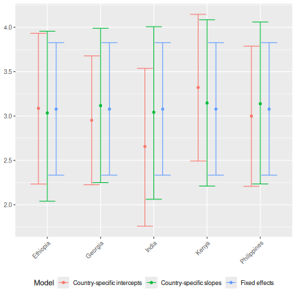
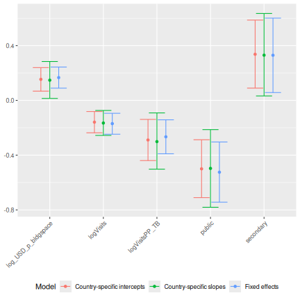
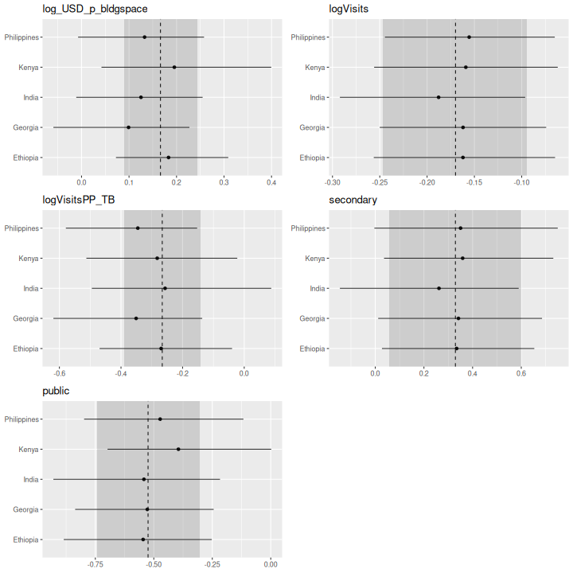
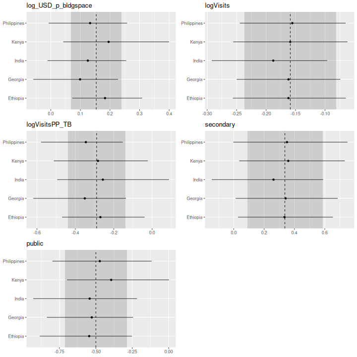
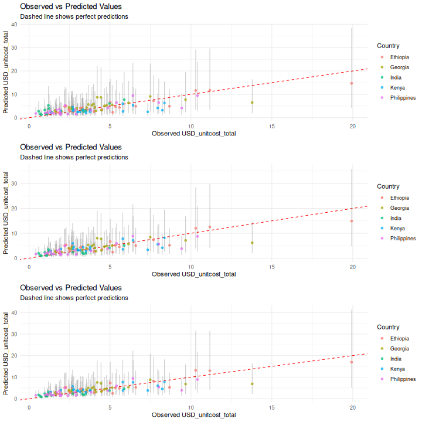
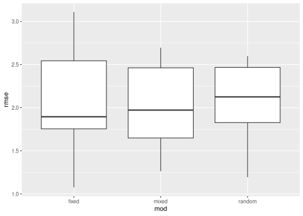

``` r
library(capturetb)
library(ggplot2)
library(dplyr)
```

## Model Comparisons

This vignette compares 3 model structures. In each structure, log costs for a particular set of input variables are assumed to follow a normal distribution:

$$
\log(\text{USD\_unitcost\_total}_i) \sim \mathcal{N}(\mu_i, \sigma^2)
$$

where $\mu_i$ is a linear combination of the inputs.

1. Fixed effects - all parameters assumed the same across observations

$$
\mu_i = \alpha + \sum_{j=1}^J{\beta_j \times x_{ji}}
$$

2. Mixed effects - intercepts vary by country
$$
\mu_i = \alpha_{c_i} + \sum_{j=1}^J{\beta_j \times x_{ji}}
$$

where 

$$
\alpha_{c} \sim \mathcal{N}(\mu_\alpha, \sigma_\alpha^2)
$$

3. Random slopes - intercepts and slopes vary by country

$$
\mu_i = \alpha_{c_i} + \sum_{j=1}^J{\beta_{jc_i} \times x_{ji}}
$$

where also, for each j,

$$
\beta_j \sim \mathcal{N}(\mu_{\beta_j}, \sigma_{\beta_j}^2)
$$

We compare the estimated effects of each covariate when fit using the different model structures:


``` r
library(coda)
# get samples from pre-fitted model
mixed_effects <- capturetb::unitcost()
samples_mixed <- as.matrix(mixed_effects$samples())

dat <- mixed_effects$training_data()

n_iter = 500000

# fit fixed effects model to same data and priors
fixed_effects <- capturetb::FixedEffects$new(dat)
#> Warning in super$initialize(dat, covariates, target, priors,
#> "fixedeffects.model"): Priors not provided. Vague priors assumed for each
#> covariate coefficient with mu 0 and precision 0.01.
fixed_effects$fit(quiet = TRUE, n.iter = n_iter)
#> Warning in rjags::jags.model(model_file, data = jags_data, n.chains = n.chains,
#> : Unused variable "prior.sigma_alpha.rate" in data
#> 
  |                                                        
  |                                                  |   0%
  |                                                        
  |*                                                 |   2%
  |                                                        
  |**                                                |   4%
  |                                                        
  |***                                               |   6%
  |                                                        
  |****                                              |   8%
  |                                                        
  |*****                                             |  10%
  |                                                        
  |******                                            |  12%
  |                                                        
  |*******                                           |  14%
  |                                                        
  |********                                          |  16%
  |                                                        
  |*********                                         |  18%
  |                                                        
  |**********                                        |  20%
  |                                                        
  |***********                                       |  22%
  |                                                        
  |************                                      |  24%
  |                                                        
  |*************                                     |  26%
  |                                                        
  |**************                                    |  28%
  |                                                        
  |***************                                   |  30%
  |                                                        
  |****************                                  |  32%
  |                                                        
  |*****************                                 |  34%
  |                                                        
  |******************                                |  36%
  |                                                        
  |*******************                               |  38%
  |                                                        
  |********************                              |  40%
  |                                                        
  |*********************                             |  42%
  |                                                        
  |**********************                            |  44%
  |                                                        
  |***********************                           |  46%
  |                                                        
  |************************                          |  48%
  |                                                        
  |*************************                         |  50%
  |                                                        
  |**************************                        |  52%
  |                                                        
  |***************************                       |  54%
  |                                                        
  |****************************                      |  56%
  |                                                        
  |*****************************                     |  58%
  |                                                        
  |******************************                    |  60%
  |                                                        
  |*******************************                   |  62%
  |                                                        
  |********************************                  |  64%
  |                                                        
  |*********************************                 |  66%
  |                                                        
  |**********************************                |  68%
  |                                                        
  |***********************************               |  70%
  |                                                        
  |************************************              |  72%
  |                                                        
  |*************************************             |  74%
  |                                                        
  |**************************************            |  76%
  |                                                        
  |***************************************           |  78%
  |                                                        
  |****************************************          |  80%
  |                                                        
  |*****************************************         |  82%
  |                                                        
  |******************************************        |  84%
  |                                                        
  |*******************************************       |  86%
  |                                                        
  |********************************************      |  88%
  |                                                        
  |*********************************************     |  90%
  |                                                        
  |**********************************************    |  92%
  |                                                        
  |***********************************************   |  94%
  |                                                        
  |************************************************  |  96%
  |                                                        
  |************************************************* |  98%
  |                                                        
  |**************************************************| 100%
#> 
  |                                                        
  |                                                  |   0%
  |                                                        
  |*                                                 |   2%
  |                                                        
  |**                                                |   4%
  |                                                        
  |***                                               |   6%
  |                                                        
  |****                                              |   8%
  |                                                        
  |*****                                             |  10%
  |                                                        
  |******                                            |  12%
  |                                                        
  |*******                                           |  14%
  |                                                        
  |********                                          |  16%
  |                                                        
  |*********                                         |  18%
  |                                                        
  |**********                                        |  20%
  |                                                        
  |***********                                       |  22%
  |                                                        
  |************                                      |  24%
  |                                                        
  |*************                                     |  26%
  |                                                        
  |**************                                    |  28%
  |                                                        
  |***************                                   |  30%
  |                                                        
  |****************                                  |  32%
  |                                                        
  |*****************                                 |  34%
  |                                                        
  |******************                                |  36%
  |                                                        
  |*******************                               |  38%
  |                                                        
  |********************                              |  40%
  |                                                        
  |*********************                             |  42%
  |                                                        
  |**********************                            |  44%
  |                                                        
  |***********************                           |  46%
  |                                                        
  |************************                          |  48%
  |                                                        
  |*************************                         |  50%
  |                                                        
  |**************************                        |  52%
  |                                                        
  |***************************                       |  54%
  |                                                        
  |****************************                      |  56%
  |                                                        
  |*****************************                     |  58%
  |                                                        
  |******************************                    |  60%
  |                                                        
  |*******************************                   |  62%
  |                                                        
  |********************************                  |  64%
  |                                                        
  |*********************************                 |  66%
  |                                                        
  |**********************************                |  68%
  |                                                        
  |***********************************               |  70%
  |                                                        
  |************************************              |  72%
  |                                                        
  |*************************************             |  74%
  |                                                        
  |**************************************            |  76%
  |                                                        
  |***************************************           |  78%
  |                                                        
  |****************************************          |  80%
  |                                                        
  |*****************************************         |  82%
  |                                                        
  |******************************************        |  84%
  |                                                        
  |*******************************************       |  86%
  |                                                        
  |********************************************      |  88%
  |                                                        
  |*********************************************     |  90%
  |                                                        
  |**********************************************    |  92%
  |                                                        
  |***********************************************   |  94%
  |                                                        
  |************************************************  |  96%
  |                                                        
  |************************************************* |  98%
  |                                                        
  |**************************************************| 100%
#> 
  |                                                        
  |                                                  |   0%
  |                                                        
  |*                                                 |   2%
  |                                                        
  |**                                                |   4%
  |                                                        
  |***                                               |   6%
  |                                                        
  |****                                              |   8%
  |                                                        
  |*****                                             |  10%
  |                                                        
  |******                                            |  12%
  |                                                        
  |*******                                           |  14%
  |                                                        
  |********                                          |  16%
  |                                                        
  |*********                                         |  18%
  |                                                        
  |**********                                        |  20%
  |                                                        
  |***********                                       |  22%
  |                                                        
  |************                                      |  24%
  |                                                        
  |*************                                     |  26%
  |                                                        
  |**************                                    |  28%
  |                                                        
  |***************                                   |  30%
  |                                                        
  |****************                                  |  32%
  |                                                        
  |*****************                                 |  34%
  |                                                        
  |******************                                |  36%
  |                                                        
  |*******************                               |  38%
  |                                                        
  |********************                              |  40%
  |                                                        
  |*********************                             |  42%
  |                                                        
  |**********************                            |  44%
  |                                                        
  |***********************                           |  46%
  |                                                        
  |************************                          |  48%
  |                                                        
  |*************************                         |  50%
  |                                                        
  |**************************                        |  52%
  |                                                        
  |***************************                       |  54%
  |                                                        
  |****************************                      |  56%
  |                                                        
  |*****************************                     |  58%
  |                                                        
  |******************************                    |  60%
  |                                                        
  |*******************************                   |  62%
  |                                                        
  |********************************                  |  64%
  |                                                        
  |*********************************                 |  66%
  |                                                        
  |**********************************                |  68%
  |                                                        
  |***********************************               |  70%
  |                                                        
  |************************************              |  72%
  |                                                        
  |*************************************             |  74%
  |                                                        
  |**************************************            |  76%
  |                                                        
  |***************************************           |  78%
  |                                                        
  |****************************************          |  80%
  |                                                        
  |*****************************************         |  82%
  |                                                        
  |******************************************        |  84%
  |                                                        
  |*******************************************       |  86%
  |                                                        
  |********************************************      |  88%
  |                                                        
  |*********************************************     |  90%
  |                                                        
  |**********************************************    |  92%
  |                                                        
  |***********************************************   |  94%
  |                                                        
  |************************************************  |  96%
  |                                                        
  |************************************************* |  98%
  |                                                        
  |**************************************************| 100%
#> Model fitted successfully with 3 chains and 5e+05 iterations.
samples_fixed <- as.matrix(fixed_effects$samples())

# fit random effects model to same data and priors
random_effects <- capturetb::RandomSlopes$new(dat)
#> Warning in super$initialize(dat, covariates, target, priors,
#> "randomslopes.model"): Priors not provided. Vague priors assumed for each
#> covariate coefficient with mu 0 and precision 0.01.
random_effects$fit(quiet = TRUE, n.iter = n_iter)
#> 
  |                                                        
  |                                                  |   0%
  |                                                        
  |*                                                 |   2%
  |                                                        
  |**                                                |   4%
  |                                                        
  |***                                               |   6%
  |                                                        
  |****                                              |   8%
  |                                                        
  |*****                                             |  10%
  |                                                        
  |******                                            |  12%
  |                                                        
  |*******                                           |  14%
  |                                                        
  |********                                          |  16%
  |                                                        
  |*********                                         |  18%
  |                                                        
  |**********                                        |  20%
  |                                                        
  |***********                                       |  22%
  |                                                        
  |************                                      |  24%
  |                                                        
  |*************                                     |  26%
  |                                                        
  |**************                                    |  28%
  |                                                        
  |***************                                   |  30%
  |                                                        
  |****************                                  |  32%
  |                                                        
  |*****************                                 |  34%
  |                                                        
  |******************                                |  36%
  |                                                        
  |*******************                               |  38%
  |                                                        
  |********************                              |  40%
  |                                                        
  |*********************                             |  42%
  |                                                        
  |**********************                            |  44%
  |                                                        
  |***********************                           |  46%
  |                                                        
  |************************                          |  48%
  |                                                        
  |*************************                         |  50%
  |                                                        
  |**************************                        |  52%
  |                                                        
  |***************************                       |  54%
  |                                                        
  |****************************                      |  56%
  |                                                        
  |*****************************                     |  58%
  |                                                        
  |******************************                    |  60%
  |                                                        
  |*******************************                   |  62%
  |                                                        
  |********************************                  |  64%
  |                                                        
  |*********************************                 |  66%
  |                                                        
  |**********************************                |  68%
  |                                                        
  |***********************************               |  70%
  |                                                        
  |************************************              |  72%
  |                                                        
  |*************************************             |  74%
  |                                                        
  |**************************************            |  76%
  |                                                        
  |***************************************           |  78%
  |                                                        
  |****************************************          |  80%
  |                                                        
  |*****************************************         |  82%
  |                                                        
  |******************************************        |  84%
  |                                                        
  |*******************************************       |  86%
  |                                                        
  |********************************************      |  88%
  |                                                        
  |*********************************************     |  90%
  |                                                        
  |**********************************************    |  92%
  |                                                        
  |***********************************************   |  94%
  |                                                        
  |************************************************  |  96%
  |                                                        
  |************************************************* |  98%
  |                                                        
  |**************************************************| 100%
#> 
  |                                                        
  |                                                  |   0%
  |                                                        
  |*                                                 |   2%
  |                                                        
  |**                                                |   4%
  |                                                        
  |***                                               |   6%
  |                                                        
  |****                                              |   8%
  |                                                        
  |*****                                             |  10%
  |                                                        
  |******                                            |  12%
  |                                                        
  |*******                                           |  14%
  |                                                        
  |********                                          |  16%
  |                                                        
  |*********                                         |  18%
  |                                                        
  |**********                                        |  20%
  |                                                        
  |***********                                       |  22%
  |                                                        
  |************                                      |  24%
  |                                                        
  |*************                                     |  26%
  |                                                        
  |**************                                    |  28%
  |                                                        
  |***************                                   |  30%
  |                                                        
  |****************                                  |  32%
  |                                                        
  |*****************                                 |  34%
  |                                                        
  |******************                                |  36%
  |                                                        
  |*******************                               |  38%
  |                                                        
  |********************                              |  40%
  |                                                        
  |*********************                             |  42%
  |                                                        
  |**********************                            |  44%
  |                                                        
  |***********************                           |  46%
  |                                                        
  |************************                          |  48%
  |                                                        
  |*************************                         |  50%
  |                                                        
  |**************************                        |  52%
  |                                                        
  |***************************                       |  54%
  |                                                        
  |****************************                      |  56%
  |                                                        
  |*****************************                     |  58%
  |                                                        
  |******************************                    |  60%
  |                                                        
  |*******************************                   |  62%
  |                                                        
  |********************************                  |  64%
  |                                                        
  |*********************************                 |  66%
  |                                                        
  |**********************************                |  68%
  |                                                        
  |***********************************               |  70%
  |                                                        
  |************************************              |  72%
  |                                                        
  |*************************************             |  74%
  |                                                        
  |**************************************            |  76%
  |                                                        
  |***************************************           |  78%
  |                                                        
  |****************************************          |  80%
  |                                                        
  |*****************************************         |  82%
  |                                                        
  |******************************************        |  84%
  |                                                        
  |*******************************************       |  86%
  |                                                        
  |********************************************      |  88%
  |                                                        
  |*********************************************     |  90%
  |                                                        
  |**********************************************    |  92%
  |                                                        
  |***********************************************   |  94%
  |                                                        
  |************************************************  |  96%
  |                                                        
  |************************************************* |  98%
  |                                                        
  |**************************************************| 100%
#> 
  |                                                        
  |                                                  |   0%
  |                                                        
  |*                                                 |   2%
  |                                                        
  |**                                                |   4%
  |                                                        
  |***                                               |   6%
  |                                                        
  |****                                              |   8%
  |                                                        
  |*****                                             |  10%
  |                                                        
  |******                                            |  12%
  |                                                        
  |*******                                           |  14%
  |                                                        
  |********                                          |  16%
  |                                                        
  |*********                                         |  18%
  |                                                        
  |**********                                        |  20%
  |                                                        
  |***********                                       |  22%
  |                                                        
  |************                                      |  24%
  |                                                        
  |*************                                     |  26%
  |                                                        
  |**************                                    |  28%
  |                                                        
  |***************                                   |  30%
  |                                                        
  |****************                                  |  32%
  |                                                        
  |*****************                                 |  34%
  |                                                        
  |******************                                |  36%
  |                                                        
  |*******************                               |  38%
  |                                                        
  |********************                              |  40%
  |                                                        
  |*********************                             |  42%
  |                                                        
  |**********************                            |  44%
  |                                                        
  |***********************                           |  46%
  |                                                        
  |************************                          |  48%
  |                                                        
  |*************************                         |  50%
  |                                                        
  |**************************                        |  52%
  |                                                        
  |***************************                       |  54%
  |                                                        
  |****************************                      |  56%
  |                                                        
  |*****************************                     |  58%
  |                                                        
  |******************************                    |  60%
  |                                                        
  |*******************************                   |  62%
  |                                                        
  |********************************                  |  64%
  |                                                        
  |*********************************                 |  66%
  |                                                        
  |**********************************                |  68%
  |                                                        
  |***********************************               |  70%
  |                                                        
  |************************************              |  72%
  |                                                        
  |*************************************             |  74%
  |                                                        
  |**************************************            |  76%
  |                                                        
  |***************************************           |  78%
  |                                                        
  |****************************************          |  80%
  |                                                        
  |*****************************************         |  82%
  |                                                        
  |******************************************        |  84%
  |                                                        
  |*******************************************       |  86%
  |                                                        
  |********************************************      |  88%
  |                                                        
  |*********************************************     |  90%
  |                                                        
  |**********************************************    |  92%
  |                                                        
  |***********************************************   |  94%
  |                                                        
  |************************************************  |  96%
  |                                                        
  |************************************************* |  98%
  |                                                        
  |**************************************************| 100%
#> Model fitted successfully with 3 chains and 5e+05 iterations.
samples_random <- as.matrix(random_effects$samples())
```

<div class="figure" style="text-align: center">

<p class="caption">Comparison of intercept estimates across models</p>
</div>

Comparing fixed coefficient estimates between the first 2 models and population mean coefficients from the third:

<div class="figure" style="text-align: center">

<p class="caption">Comparison of coefficients across models</p>
</div>

Comparing coefficient estimates between the fixed effects model and country-specific coefficients model:

<div class="figure" style="text-align: center">

<p class="caption">Comparison of country-specific slopes and fixed effects model coefficients, by country</p>
</div>

And between the mixed effects model and country-specific slopes model:

<div class="figure" style="text-align: center">

<p class="caption">Comparison of country-specific and mixed effects model coefficients, by country</p>
</div>

Comparing metrics of fit for all 3:


``` r
knitr::kable(rbind(
    fixed = fixed_effects$performance(scale = "natural"),
    mixed = mixed_effects$performance(scale = "natural"),
    random = random_effects$performance(scale = "natural")
))
```


Table: Goodness of fit to training data on natural scale

|       |      mae|     rmse| bayesian_r2| ci_coverage| median_ci|
|:------|--------:|--------:|-----------:|-----------:|---------:|
|fixed  | 1.462000| 1.974249|   0.5263592|   0.9428571|  7.552491|
|mixed  | 1.347811| 1.837117|   0.5467581|   0.9714286|  7.438032|
|random | 1.314672| 1.748830|   0.5676053|   0.9809524|  7.624525|


Penalised DIC (lower values are better):


``` r
knitr::kable(rbind(
    fixed = fixed_effects$mcmc_DIC(),
    mixed = mixed_effects$mcmc_DIC(),
    random = random_effects$mcmc_DIC()
))
```


Table: Deviance Information Criteria

|       |         |
|:------|--------:|
|fixed  | 168.9225|
|mixed  | 153.7307|
|random | 154.1626|


Visualising predictions:


``` r
gridExtra::grid.arrange(grobs = list(
	fixed_effects$plot_fit(scale = "natural"),
    mixed_effects$plot_fit(scale = "natural"),
    random_effects$plot_fit(scale = "natural")))
```



Checking each for over-fitting:


``` r
library(dplyr)
kfold_fixed <- fixed_effects$k_fold_cv(k_folds = 10, 
  n.iter = n_iter,
  n.burnin = 1000,
  n.adapt = 1000, 
  seed = 123,
  quiet = TRUE,
  scale = "natural")
#> Processing fold 1 of 10
#> Warning in rjags::jags.model(model_file, data = jags_data, n.chains = n.chains,
#> : Unused variable "prior.sigma_alpha.rate" in data
#> 
  |                                                        
  |                                                  |   0%
  |                                                        
  |*                                                 |   2%
  |                                                        
  |**                                                |   4%
  |                                                        
  |***                                               |   6%
  |                                                        
  |****                                              |   8%
  |                                                        
  |*****                                             |  10%
  |                                                        
  |******                                            |  12%
  |                                                        
  |*******                                           |  14%
  |                                                        
  |********                                          |  16%
  |                                                        
  |*********                                         |  18%
  |                                                        
  |**********                                        |  20%
  |                                                        
  |***********                                       |  22%
  |                                                        
  |************                                      |  24%
  |                                                        
  |*************                                     |  26%
  |                                                        
  |**************                                    |  28%
  |                                                        
  |***************                                   |  30%
  |                                                        
  |****************                                  |  32%
  |                                                        
  |*****************                                 |  34%
  |                                                        
  |******************                                |  36%
  |                                                        
  |*******************                               |  38%
  |                                                        
  |********************                              |  40%
  |                                                        
  |*********************                             |  42%
  |                                                        
  |**********************                            |  44%
  |                                                        
  |***********************                           |  46%
  |                                                        
  |************************                          |  48%
  |                                                        
  |*************************                         |  50%
  |                                                        
  |**************************                        |  52%
  |                                                        
  |***************************                       |  54%
  |                                                        
  |****************************                      |  56%
  |                                                        
  |*****************************                     |  58%
  |                                                        
  |******************************                    |  60%
  |                                                        
  |*******************************                   |  62%
  |                                                        
  |********************************                  |  64%
  |                                                        
  |*********************************                 |  66%
  |                                                        
  |**********************************                |  68%
  |                                                        
  |***********************************               |  70%
  |                                                        
  |************************************              |  72%
  |                                                        
  |*************************************             |  74%
  |                                                        
  |**************************************            |  76%
  |                                                        
  |***************************************           |  78%
  |                                                        
  |****************************************          |  80%
  |                                                        
  |*****************************************         |  82%
  |                                                        
  |******************************************        |  84%
  |                                                        
  |*******************************************       |  86%
  |                                                        
  |********************************************      |  88%
  |                                                        
  |*********************************************     |  90%
  |                                                        
  |**********************************************    |  92%
  |                                                        
  |***********************************************   |  94%
  |                                                        
  |************************************************  |  96%
  |                                                        
  |************************************************* |  98%
  |                                                        
  |**************************************************| 100%
#> 
  |                                                        
  |                                                  |   0%
  |                                                        
  |*                                                 |   2%
  |                                                        
  |**                                                |   4%
  |                                                        
  |***                                               |   6%
  |                                                        
  |****                                              |   8%
  |                                                        
  |*****                                             |  10%
  |                                                        
  |******                                            |  12%
  |                                                        
  |*******                                           |  14%
  |                                                        
  |********                                          |  16%
  |                                                        
  |*********                                         |  18%
  |                                                        
  |**********                                        |  20%
  |                                                        
  |***********                                       |  22%
  |                                                        
  |************                                      |  24%
  |                                                        
  |*************                                     |  26%
  |                                                        
  |**************                                    |  28%
  |                                                        
  |***************                                   |  30%
  |                                                        
  |****************                                  |  32%
  |                                                        
  |*****************                                 |  34%
  |                                                        
  |******************                                |  36%
  |                                                        
  |*******************                               |  38%
  |                                                        
  |********************                              |  40%
  |                                                        
  |*********************                             |  42%
  |                                                        
  |**********************                            |  44%
  |                                                        
  |***********************                           |  46%
  |                                                        
  |************************                          |  48%
  |                                                        
  |*************************                         |  50%
  |                                                        
  |**************************                        |  52%
  |                                                        
  |***************************                       |  54%
  |                                                        
  |****************************                      |  56%
  |                                                        
  |*****************************                     |  58%
  |                                                        
  |******************************                    |  60%
  |                                                        
  |*******************************                   |  62%
  |                                                        
  |********************************                  |  64%
  |                                                        
  |*********************************                 |  66%
  |                                                        
  |**********************************                |  68%
  |                                                        
  |***********************************               |  70%
  |                                                        
  |************************************              |  72%
  |                                                        
  |*************************************             |  74%
  |                                                        
  |**************************************            |  76%
  |                                                        
  |***************************************           |  78%
  |                                                        
  |****************************************          |  80%
  |                                                        
  |*****************************************         |  82%
  |                                                        
  |******************************************        |  84%
  |                                                        
  |*******************************************       |  86%
  |                                                        
  |********************************************      |  88%
  |                                                        
  |*********************************************     |  90%
  |                                                        
  |**********************************************    |  92%
  |                                                        
  |***********************************************   |  94%
  |                                                        
  |************************************************  |  96%
  |                                                        
  |************************************************* |  98%
  |                                                        
  |**************************************************| 100%
#> 
  |                                                        
  |                                                  |   0%
  |                                                        
  |*                                                 |   2%
  |                                                        
  |**                                                |   4%
  |                                                        
  |***                                               |   6%
  |                                                        
  |****                                              |   8%
  |                                                        
  |*****                                             |  10%
  |                                                        
  |******                                            |  12%
  |                                                        
  |*******                                           |  14%
  |                                                        
  |********                                          |  16%
  |                                                        
  |*********                                         |  18%
  |                                                        
  |**********                                        |  20%
  |                                                        
  |***********                                       |  22%
  |                                                        
  |************                                      |  24%
  |                                                        
  |*************                                     |  26%
  |                                                        
  |**************                                    |  28%
  |                                                        
  |***************                                   |  30%
  |                                                        
  |****************                                  |  32%
  |                                                        
  |*****************                                 |  34%
  |                                                        
  |******************                                |  36%
  |                                                        
  |*******************                               |  38%
  |                                                        
  |********************                              |  40%
  |                                                        
  |*********************                             |  42%
  |                                                        
  |**********************                            |  44%
  |                                                        
  |***********************                           |  46%
  |                                                        
  |************************                          |  48%
  |                                                        
  |*************************                         |  50%
  |                                                        
  |**************************                        |  52%
  |                                                        
  |***************************                       |  54%
  |                                                        
  |****************************                      |  56%
  |                                                        
  |*****************************                     |  58%
  |                                                        
  |******************************                    |  60%
  |                                                        
  |*******************************                   |  62%
  |                                                        
  |********************************                  |  64%
  |                                                        
  |*********************************                 |  66%
  |                                                        
  |**********************************                |  68%
  |                                                        
  |***********************************               |  70%
  |                                                        
  |************************************              |  72%
  |                                                        
  |*************************************             |  74%
  |                                                        
  |**************************************            |  76%
  |                                                        
  |***************************************           |  78%
  |                                                        
  |****************************************          |  80%
  |                                                        
  |*****************************************         |  82%
  |                                                        
  |******************************************        |  84%
  |                                                        
  |*******************************************       |  86%
  |                                                        
  |********************************************      |  88%
  |                                                        
  |*********************************************     |  90%
  |                                                        
  |**********************************************    |  92%
  |                                                        
  |***********************************************   |  94%
  |                                                        
  |************************************************  |  96%
  |                                                        
  |************************************************* |  98%
  |                                                        
  |**************************************************| 100%
#> Model fitted successfully with 3 chains and 5e+05 iterations.
#> Processing fold 2 of 10
#> Warning in rjags::jags.model(model_file, data = jags_data, n.chains = n.chains,
#> : Unused variable "prior.sigma_alpha.rate" in data
#> 
  |                                                        
  |                                                  |   0%
  |                                                        
  |*                                                 |   2%
  |                                                        
  |**                                                |   4%
  |                                                        
  |***                                               |   6%
  |                                                        
  |****                                              |   8%
  |                                                        
  |*****                                             |  10%
  |                                                        
  |******                                            |  12%
  |                                                        
  |*******                                           |  14%
  |                                                        
  |********                                          |  16%
  |                                                        
  |*********                                         |  18%
  |                                                        
  |**********                                        |  20%
  |                                                        
  |***********                                       |  22%
  |                                                        
  |************                                      |  24%
  |                                                        
  |*************                                     |  26%
  |                                                        
  |**************                                    |  28%
  |                                                        
  |***************                                   |  30%
  |                                                        
  |****************                                  |  32%
  |                                                        
  |*****************                                 |  34%
  |                                                        
  |******************                                |  36%
  |                                                        
  |*******************                               |  38%
  |                                                        
  |********************                              |  40%
  |                                                        
  |*********************                             |  42%
  |                                                        
  |**********************                            |  44%
  |                                                        
  |***********************                           |  46%
  |                                                        
  |************************                          |  48%
  |                                                        
  |*************************                         |  50%
  |                                                        
  |**************************                        |  52%
  |                                                        
  |***************************                       |  54%
  |                                                        
  |****************************                      |  56%
  |                                                        
  |*****************************                     |  58%
  |                                                        
  |******************************                    |  60%
  |                                                        
  |*******************************                   |  62%
  |                                                        
  |********************************                  |  64%
  |                                                        
  |*********************************                 |  66%
  |                                                        
  |**********************************                |  68%
  |                                                        
  |***********************************               |  70%
  |                                                        
  |************************************              |  72%
  |                                                        
  |*************************************             |  74%
  |                                                        
  |**************************************            |  76%
  |                                                        
  |***************************************           |  78%
  |                                                        
  |****************************************          |  80%
  |                                                        
  |*****************************************         |  82%
  |                                                        
  |******************************************        |  84%
  |                                                        
  |*******************************************       |  86%
  |                                                        
  |********************************************      |  88%
  |                                                        
  |*********************************************     |  90%
  |                                                        
  |**********************************************    |  92%
  |                                                        
  |***********************************************   |  94%
  |                                                        
  |************************************************  |  96%
  |                                                        
  |************************************************* |  98%
  |                                                        
  |**************************************************| 100%
#> 
  |                                                        
  |                                                  |   0%
  |                                                        
  |*                                                 |   2%
  |                                                        
  |**                                                |   4%
  |                                                        
  |***                                               |   6%
  |                                                        
  |****                                              |   8%
  |                                                        
  |*****                                             |  10%
  |                                                        
  |******                                            |  12%
  |                                                        
  |*******                                           |  14%
  |                                                        
  |********                                          |  16%
  |                                                        
  |*********                                         |  18%
  |                                                        
  |**********                                        |  20%
  |                                                        
  |***********                                       |  22%
  |                                                        
  |************                                      |  24%
  |                                                        
  |*************                                     |  26%
  |                                                        
  |**************                                    |  28%
  |                                                        
  |***************                                   |  30%
  |                                                        
  |****************                                  |  32%
  |                                                        
  |*****************                                 |  34%
  |                                                        
  |******************                                |  36%
  |                                                        
  |*******************                               |  38%
  |                                                        
  |********************                              |  40%
  |                                                        
  |*********************                             |  42%
  |                                                        
  |**********************                            |  44%
  |                                                        
  |***********************                           |  46%
  |                                                        
  |************************                          |  48%
  |                                                        
  |*************************                         |  50%
  |                                                        
  |**************************                        |  52%
  |                                                        
  |***************************                       |  54%
  |                                                        
  |****************************                      |  56%
  |                                                        
  |*****************************                     |  58%
  |                                                        
  |******************************                    |  60%
  |                                                        
  |*******************************                   |  62%
  |                                                        
  |********************************                  |  64%
  |                                                        
  |*********************************                 |  66%
  |                                                        
  |**********************************                |  68%
  |                                                        
  |***********************************               |  70%
  |                                                        
  |************************************              |  72%
  |                                                        
  |*************************************             |  74%
  |                                                        
  |**************************************            |  76%
  |                                                        
  |***************************************           |  78%
  |                                                        
  |****************************************          |  80%
  |                                                        
  |*****************************************         |  82%
  |                                                        
  |******************************************        |  84%
  |                                                        
  |*******************************************       |  86%
  |                                                        
  |********************************************      |  88%
  |                                                        
  |*********************************************     |  90%
  |                                                        
  |**********************************************    |  92%
  |                                                        
  |***********************************************   |  94%
  |                                                        
  |************************************************  |  96%
  |                                                        
  |************************************************* |  98%
  |                                                        
  |**************************************************| 100%
#> 
  |                                                        
  |                                                  |   0%
  |                                                        
  |*                                                 |   2%
  |                                                        
  |**                                                |   4%
  |                                                        
  |***                                               |   6%
  |                                                        
  |****                                              |   8%
  |                                                        
  |*****                                             |  10%
  |                                                        
  |******                                            |  12%
  |                                                        
  |*******                                           |  14%
  |                                                        
  |********                                          |  16%
  |                                                        
  |*********                                         |  18%
  |                                                        
  |**********                                        |  20%
  |                                                        
  |***********                                       |  22%
  |                                                        
  |************                                      |  24%
  |                                                        
  |*************                                     |  26%
  |                                                        
  |**************                                    |  28%
  |                                                        
  |***************                                   |  30%
  |                                                        
  |****************                                  |  32%
  |                                                        
  |*****************                                 |  34%
  |                                                        
  |******************                                |  36%
  |                                                        
  |*******************                               |  38%
  |                                                        
  |********************                              |  40%
  |                                                        
  |*********************                             |  42%
  |                                                        
  |**********************                            |  44%
  |                                                        
  |***********************                           |  46%
  |                                                        
  |************************                          |  48%
  |                                                        
  |*************************                         |  50%
  |                                                        
  |**************************                        |  52%
  |                                                        
  |***************************                       |  54%
  |                                                        
  |****************************                      |  56%
  |                                                        
  |*****************************                     |  58%
  |                                                        
  |******************************                    |  60%
  |                                                        
  |*******************************                   |  62%
  |                                                        
  |********************************                  |  64%
  |                                                        
  |*********************************                 |  66%
  |                                                        
  |**********************************                |  68%
  |                                                        
  |***********************************               |  70%
  |                                                        
  |************************************              |  72%
  |                                                        
  |*************************************             |  74%
  |                                                        
  |**************************************            |  76%
  |                                                        
  |***************************************           |  78%
  |                                                        
  |****************************************          |  80%
  |                                                        
  |*****************************************         |  82%
  |                                                        
  |******************************************        |  84%
  |                                                        
  |*******************************************       |  86%
  |                                                        
  |********************************************      |  88%
  |                                                        
  |*********************************************     |  90%
  |                                                        
  |**********************************************    |  92%
  |                                                        
  |***********************************************   |  94%
  |                                                        
  |************************************************  |  96%
  |                                                        
  |************************************************* |  98%
  |                                                        
  |**************************************************| 100%
#> Model fitted successfully with 3 chains and 5e+05 iterations.
#> Processing fold 3 of 10
#> Warning in rjags::jags.model(model_file, data = jags_data, n.chains = n.chains,
#> : Unused variable "prior.sigma_alpha.rate" in data
#> 
  |                                                        
  |                                                  |   0%
  |                                                        
  |*                                                 |   2%
  |                                                        
  |**                                                |   4%
  |                                                        
  |***                                               |   6%
  |                                                        
  |****                                              |   8%
  |                                                        
  |*****                                             |  10%
  |                                                        
  |******                                            |  12%
  |                                                        
  |*******                                           |  14%
  |                                                        
  |********                                          |  16%
  |                                                        
  |*********                                         |  18%
  |                                                        
  |**********                                        |  20%
  |                                                        
  |***********                                       |  22%
  |                                                        
  |************                                      |  24%
  |                                                        
  |*************                                     |  26%
  |                                                        
  |**************                                    |  28%
  |                                                        
  |***************                                   |  30%
  |                                                        
  |****************                                  |  32%
  |                                                        
  |*****************                                 |  34%
  |                                                        
  |******************                                |  36%
  |                                                        
  |*******************                               |  38%
  |                                                        
  |********************                              |  40%
  |                                                        
  |*********************                             |  42%
  |                                                        
  |**********************                            |  44%
  |                                                        
  |***********************                           |  46%
  |                                                        
  |************************                          |  48%
  |                                                        
  |*************************                         |  50%
  |                                                        
  |**************************                        |  52%
  |                                                        
  |***************************                       |  54%
  |                                                        
  |****************************                      |  56%
  |                                                        
  |*****************************                     |  58%
  |                                                        
  |******************************                    |  60%
  |                                                        
  |*******************************                   |  62%
  |                                                        
  |********************************                  |  64%
  |                                                        
  |*********************************                 |  66%
  |                                                        
  |**********************************                |  68%
  |                                                        
  |***********************************               |  70%
  |                                                        
  |************************************              |  72%
  |                                                        
  |*************************************             |  74%
  |                                                        
  |**************************************            |  76%
  |                                                        
  |***************************************           |  78%
  |                                                        
  |****************************************          |  80%
  |                                                        
  |*****************************************         |  82%
  |                                                        
  |******************************************        |  84%
  |                                                        
  |*******************************************       |  86%
  |                                                        
  |********************************************      |  88%
  |                                                        
  |*********************************************     |  90%
  |                                                        
  |**********************************************    |  92%
  |                                                        
  |***********************************************   |  94%
  |                                                        
  |************************************************  |  96%
  |                                                        
  |************************************************* |  98%
  |                                                        
  |**************************************************| 100%
#> 
  |                                                        
  |                                                  |   0%
  |                                                        
  |*                                                 |   2%
  |                                                        
  |**                                                |   4%
  |                                                        
  |***                                               |   6%
  |                                                        
  |****                                              |   8%
  |                                                        
  |*****                                             |  10%
  |                                                        
  |******                                            |  12%
  |                                                        
  |*******                                           |  14%
  |                                                        
  |********                                          |  16%
  |                                                        
  |*********                                         |  18%
  |                                                        
  |**********                                        |  20%
  |                                                        
  |***********                                       |  22%
  |                                                        
  |************                                      |  24%
  |                                                        
  |*************                                     |  26%
  |                                                        
  |**************                                    |  28%
  |                                                        
  |***************                                   |  30%
  |                                                        
  |****************                                  |  32%
  |                                                        
  |*****************                                 |  34%
  |                                                        
  |******************                                |  36%
  |                                                        
  |*******************                               |  38%
  |                                                        
  |********************                              |  40%
  |                                                        
  |*********************                             |  42%
  |                                                        
  |**********************                            |  44%
  |                                                        
  |***********************                           |  46%
  |                                                        
  |************************                          |  48%
  |                                                        
  |*************************                         |  50%
  |                                                        
  |**************************                        |  52%
  |                                                        
  |***************************                       |  54%
  |                                                        
  |****************************                      |  56%
  |                                                        
  |*****************************                     |  58%
  |                                                        
  |******************************                    |  60%
  |                                                        
  |*******************************                   |  62%
  |                                                        
  |********************************                  |  64%
  |                                                        
  |*********************************                 |  66%
  |                                                        
  |**********************************                |  68%
  |                                                        
  |***********************************               |  70%
  |                                                        
  |************************************              |  72%
  |                                                        
  |*************************************             |  74%
  |                                                        
  |**************************************            |  76%
  |                                                        
  |***************************************           |  78%
  |                                                        
  |****************************************          |  80%
  |                                                        
  |*****************************************         |  82%
  |                                                        
  |******************************************        |  84%
  |                                                        
  |*******************************************       |  86%
  |                                                        
  |********************************************      |  88%
  |                                                        
  |*********************************************     |  90%
  |                                                        
  |**********************************************    |  92%
  |                                                        
  |***********************************************   |  94%
  |                                                        
  |************************************************  |  96%
  |                                                        
  |************************************************* |  98%
  |                                                        
  |**************************************************| 100%
#> 
  |                                                        
  |                                                  |   0%
  |                                                        
  |*                                                 |   2%
  |                                                        
  |**                                                |   4%
  |                                                        
  |***                                               |   6%
  |                                                        
  |****                                              |   8%
  |                                                        
  |*****                                             |  10%
  |                                                        
  |******                                            |  12%
  |                                                        
  |*******                                           |  14%
  |                                                        
  |********                                          |  16%
  |                                                        
  |*********                                         |  18%
  |                                                        
  |**********                                        |  20%
  |                                                        
  |***********                                       |  22%
  |                                                        
  |************                                      |  24%
  |                                                        
  |*************                                     |  26%
  |                                                        
  |**************                                    |  28%
  |                                                        
  |***************                                   |  30%
  |                                                        
  |****************                                  |  32%
  |                                                        
  |*****************                                 |  34%
  |                                                        
  |******************                                |  36%
  |                                                        
  |*******************                               |  38%
  |                                                        
  |********************                              |  40%
  |                                                        
  |*********************                             |  42%
  |                                                        
  |**********************                            |  44%
  |                                                        
  |***********************                           |  46%
  |                                                        
  |************************                          |  48%
  |                                                        
  |*************************                         |  50%
  |                                                        
  |**************************                        |  52%
  |                                                        
  |***************************                       |  54%
  |                                                        
  |****************************                      |  56%
  |                                                        
  |*****************************                     |  58%
  |                                                        
  |******************************                    |  60%
  |                                                        
  |*******************************                   |  62%
  |                                                        
  |********************************                  |  64%
  |                                                        
  |*********************************                 |  66%
  |                                                        
  |**********************************                |  68%
  |                                                        
  |***********************************               |  70%
  |                                                        
  |************************************              |  72%
  |                                                        
  |*************************************             |  74%
  |                                                        
  |**************************************            |  76%
  |                                                        
  |***************************************           |  78%
  |                                                        
  |****************************************          |  80%
  |                                                        
  |*****************************************         |  82%
  |                                                        
  |******************************************        |  84%
  |                                                        
  |*******************************************       |  86%
  |                                                        
  |********************************************      |  88%
  |                                                        
  |*********************************************     |  90%
  |                                                        
  |**********************************************    |  92%
  |                                                        
  |***********************************************   |  94%
  |                                                        
  |************************************************  |  96%
  |                                                        
  |************************************************* |  98%
  |                                                        
  |**************************************************| 100%
#> Model fitted successfully with 3 chains and 5e+05 iterations.
#> Processing fold 4 of 10
#> Warning in rjags::jags.model(model_file, data = jags_data, n.chains = n.chains,
#> : Unused variable "prior.sigma_alpha.rate" in data
#> 
  |                                                        
  |                                                  |   0%
  |                                                        
  |*                                                 |   2%
  |                                                        
  |**                                                |   4%
  |                                                        
  |***                                               |   6%
  |                                                        
  |****                                              |   8%
  |                                                        
  |*****                                             |  10%
  |                                                        
  |******                                            |  12%
  |                                                        
  |*******                                           |  14%
  |                                                        
  |********                                          |  16%
  |                                                        
  |*********                                         |  18%
  |                                                        
  |**********                                        |  20%
  |                                                        
  |***********                                       |  22%
  |                                                        
  |************                                      |  24%
  |                                                        
  |*************                                     |  26%
  |                                                        
  |**************                                    |  28%
  |                                                        
  |***************                                   |  30%
  |                                                        
  |****************                                  |  32%
  |                                                        
  |*****************                                 |  34%
  |                                                        
  |******************                                |  36%
  |                                                        
  |*******************                               |  38%
  |                                                        
  |********************                              |  40%
  |                                                        
  |*********************                             |  42%
  |                                                        
  |**********************                            |  44%
  |                                                        
  |***********************                           |  46%
  |                                                        
  |************************                          |  48%
  |                                                        
  |*************************                         |  50%
  |                                                        
  |**************************                        |  52%
  |                                                        
  |***************************                       |  54%
  |                                                        
  |****************************                      |  56%
  |                                                        
  |*****************************                     |  58%
  |                                                        
  |******************************                    |  60%
  |                                                        
  |*******************************                   |  62%
  |                                                        
  |********************************                  |  64%
  |                                                        
  |*********************************                 |  66%
  |                                                        
  |**********************************                |  68%
  |                                                        
  |***********************************               |  70%
  |                                                        
  |************************************              |  72%
  |                                                        
  |*************************************             |  74%
  |                                                        
  |**************************************            |  76%
  |                                                        
  |***************************************           |  78%
  |                                                        
  |****************************************          |  80%
  |                                                        
  |*****************************************         |  82%
  |                                                        
  |******************************************        |  84%
  |                                                        
  |*******************************************       |  86%
  |                                                        
  |********************************************      |  88%
  |                                                        
  |*********************************************     |  90%
  |                                                        
  |**********************************************    |  92%
  |                                                        
  |***********************************************   |  94%
  |                                                        
  |************************************************  |  96%
  |                                                        
  |************************************************* |  98%
  |                                                        
  |**************************************************| 100%
#> 
  |                                                        
  |                                                  |   0%
  |                                                        
  |*                                                 |   2%
  |                                                        
  |**                                                |   4%
  |                                                        
  |***                                               |   6%
  |                                                        
  |****                                              |   8%
  |                                                        
  |*****                                             |  10%
  |                                                        
  |******                                            |  12%
  |                                                        
  |*******                                           |  14%
  |                                                        
  |********                                          |  16%
  |                                                        
  |*********                                         |  18%
  |                                                        
  |**********                                        |  20%
  |                                                        
  |***********                                       |  22%
  |                                                        
  |************                                      |  24%
  |                                                        
  |*************                                     |  26%
  |                                                        
  |**************                                    |  28%
  |                                                        
  |***************                                   |  30%
  |                                                        
  |****************                                  |  32%
  |                                                        
  |*****************                                 |  34%
  |                                                        
  |******************                                |  36%
  |                                                        
  |*******************                               |  38%
  |                                                        
  |********************                              |  40%
  |                                                        
  |*********************                             |  42%
  |                                                        
  |**********************                            |  44%
  |                                                        
  |***********************                           |  46%
  |                                                        
  |************************                          |  48%
  |                                                        
  |*************************                         |  50%
  |                                                        
  |**************************                        |  52%
  |                                                        
  |***************************                       |  54%
  |                                                        
  |****************************                      |  56%
  |                                                        
  |*****************************                     |  58%
  |                                                        
  |******************************                    |  60%
  |                                                        
  |*******************************                   |  62%
  |                                                        
  |********************************                  |  64%
  |                                                        
  |*********************************                 |  66%
  |                                                        
  |**********************************                |  68%
  |                                                        
  |***********************************               |  70%
  |                                                        
  |************************************              |  72%
  |                                                        
  |*************************************             |  74%
  |                                                        
  |**************************************            |  76%
  |                                                        
  |***************************************           |  78%
  |                                                        
  |****************************************          |  80%
  |                                                        
  |*****************************************         |  82%
  |                                                        
  |******************************************        |  84%
  |                                                        
  |*******************************************       |  86%
  |                                                        
  |********************************************      |  88%
  |                                                        
  |*********************************************     |  90%
  |                                                        
  |**********************************************    |  92%
  |                                                        
  |***********************************************   |  94%
  |                                                        
  |************************************************  |  96%
  |                                                        
  |************************************************* |  98%
  |                                                        
  |**************************************************| 100%
#> 
  |                                                        
  |                                                  |   0%
  |                                                        
  |*                                                 |   2%
  |                                                        
  |**                                                |   4%
  |                                                        
  |***                                               |   6%
  |                                                        
  |****                                              |   8%
  |                                                        
  |*****                                             |  10%
  |                                                        
  |******                                            |  12%
  |                                                        
  |*******                                           |  14%
  |                                                        
  |********                                          |  16%
  |                                                        
  |*********                                         |  18%
  |                                                        
  |**********                                        |  20%
  |                                                        
  |***********                                       |  22%
  |                                                        
  |************                                      |  24%
  |                                                        
  |*************                                     |  26%
  |                                                        
  |**************                                    |  28%
  |                                                        
  |***************                                   |  30%
  |                                                        
  |****************                                  |  32%
  |                                                        
  |*****************                                 |  34%
  |                                                        
  |******************                                |  36%
  |                                                        
  |*******************                               |  38%
  |                                                        
  |********************                              |  40%
  |                                                        
  |*********************                             |  42%
  |                                                        
  |**********************                            |  44%
  |                                                        
  |***********************                           |  46%
  |                                                        
  |************************                          |  48%
  |                                                        
  |*************************                         |  50%
  |                                                        
  |**************************                        |  52%
  |                                                        
  |***************************                       |  54%
  |                                                        
  |****************************                      |  56%
  |                                                        
  |*****************************                     |  58%
  |                                                        
  |******************************                    |  60%
  |                                                        
  |*******************************                   |  62%
  |                                                        
  |********************************                  |  64%
  |                                                        
  |*********************************                 |  66%
  |                                                        
  |**********************************                |  68%
  |                                                        
  |***********************************               |  70%
  |                                                        
  |************************************              |  72%
  |                                                        
  |*************************************             |  74%
  |                                                        
  |**************************************            |  76%
  |                                                        
  |***************************************           |  78%
  |                                                        
  |****************************************          |  80%
  |                                                        
  |*****************************************         |  82%
  |                                                        
  |******************************************        |  84%
  |                                                        
  |*******************************************       |  86%
  |                                                        
  |********************************************      |  88%
  |                                                        
  |*********************************************     |  90%
  |                                                        
  |**********************************************    |  92%
  |                                                        
  |***********************************************   |  94%
  |                                                        
  |************************************************  |  96%
  |                                                        
  |************************************************* |  98%
  |                                                        
  |**************************************************| 100%
#> Model fitted successfully with 3 chains and 5e+05 iterations.
#> Processing fold 5 of 10
#> Warning in rjags::jags.model(model_file, data = jags_data, n.chains = n.chains,
#> : Unused variable "prior.sigma_alpha.rate" in data
#> 
  |                                                        
  |                                                  |   0%
  |                                                        
  |*                                                 |   2%
  |                                                        
  |**                                                |   4%
  |                                                        
  |***                                               |   6%
  |                                                        
  |****                                              |   8%
  |                                                        
  |*****                                             |  10%
  |                                                        
  |******                                            |  12%
  |                                                        
  |*******                                           |  14%
  |                                                        
  |********                                          |  16%
  |                                                        
  |*********                                         |  18%
  |                                                        
  |**********                                        |  20%
  |                                                        
  |***********                                       |  22%
  |                                                        
  |************                                      |  24%
  |                                                        
  |*************                                     |  26%
  |                                                        
  |**************                                    |  28%
  |                                                        
  |***************                                   |  30%
  |                                                        
  |****************                                  |  32%
  |                                                        
  |*****************                                 |  34%
  |                                                        
  |******************                                |  36%
  |                                                        
  |*******************                               |  38%
  |                                                        
  |********************                              |  40%
  |                                                        
  |*********************                             |  42%
  |                                                        
  |**********************                            |  44%
  |                                                        
  |***********************                           |  46%
  |                                                        
  |************************                          |  48%
  |                                                        
  |*************************                         |  50%
  |                                                        
  |**************************                        |  52%
  |                                                        
  |***************************                       |  54%
  |                                                        
  |****************************                      |  56%
  |                                                        
  |*****************************                     |  58%
  |                                                        
  |******************************                    |  60%
  |                                                        
  |*******************************                   |  62%
  |                                                        
  |********************************                  |  64%
  |                                                        
  |*********************************                 |  66%
  |                                                        
  |**********************************                |  68%
  |                                                        
  |***********************************               |  70%
  |                                                        
  |************************************              |  72%
  |                                                        
  |*************************************             |  74%
  |                                                        
  |**************************************            |  76%
  |                                                        
  |***************************************           |  78%
  |                                                        
  |****************************************          |  80%
  |                                                        
  |*****************************************         |  82%
  |                                                        
  |******************************************        |  84%
  |                                                        
  |*******************************************       |  86%
  |                                                        
  |********************************************      |  88%
  |                                                        
  |*********************************************     |  90%
  |                                                        
  |**********************************************    |  92%
  |                                                        
  |***********************************************   |  94%
  |                                                        
  |************************************************  |  96%
  |                                                        
  |************************************************* |  98%
  |                                                        
  |**************************************************| 100%
#> 
  |                                                        
  |                                                  |   0%
  |                                                        
  |*                                                 |   2%
  |                                                        
  |**                                                |   4%
  |                                                        
  |***                                               |   6%
  |                                                        
  |****                                              |   8%
  |                                                        
  |*****                                             |  10%
  |                                                        
  |******                                            |  12%
  |                                                        
  |*******                                           |  14%
  |                                                        
  |********                                          |  16%
  |                                                        
  |*********                                         |  18%
  |                                                        
  |**********                                        |  20%
  |                                                        
  |***********                                       |  22%
  |                                                        
  |************                                      |  24%
  |                                                        
  |*************                                     |  26%
  |                                                        
  |**************                                    |  28%
  |                                                        
  |***************                                   |  30%
  |                                                        
  |****************                                  |  32%
  |                                                        
  |*****************                                 |  34%
  |                                                        
  |******************                                |  36%
  |                                                        
  |*******************                               |  38%
  |                                                        
  |********************                              |  40%
  |                                                        
  |*********************                             |  42%
  |                                                        
  |**********************                            |  44%
  |                                                        
  |***********************                           |  46%
  |                                                        
  |************************                          |  48%
  |                                                        
  |*************************                         |  50%
  |                                                        
  |**************************                        |  52%
  |                                                        
  |***************************                       |  54%
  |                                                        
  |****************************                      |  56%
  |                                                        
  |*****************************                     |  58%
  |                                                        
  |******************************                    |  60%
  |                                                        
  |*******************************                   |  62%
  |                                                        
  |********************************                  |  64%
  |                                                        
  |*********************************                 |  66%
  |                                                        
  |**********************************                |  68%
  |                                                        
  |***********************************               |  70%
  |                                                        
  |************************************              |  72%
  |                                                        
  |*************************************             |  74%
  |                                                        
  |**************************************            |  76%
  |                                                        
  |***************************************           |  78%
  |                                                        
  |****************************************          |  80%
  |                                                        
  |*****************************************         |  82%
  |                                                        
  |******************************************        |  84%
  |                                                        
  |*******************************************       |  86%
  |                                                        
  |********************************************      |  88%
  |                                                        
  |*********************************************     |  90%
  |                                                        
  |**********************************************    |  92%
  |                                                        
  |***********************************************   |  94%
  |                                                        
  |************************************************  |  96%
  |                                                        
  |************************************************* |  98%
  |                                                        
  |**************************************************| 100%
#> 
  |                                                        
  |                                                  |   0%
  |                                                        
  |*                                                 |   2%
  |                                                        
  |**                                                |   4%
  |                                                        
  |***                                               |   6%
  |                                                        
  |****                                              |   8%
  |                                                        
  |*****                                             |  10%
  |                                                        
  |******                                            |  12%
  |                                                        
  |*******                                           |  14%
  |                                                        
  |********                                          |  16%
  |                                                        
  |*********                                         |  18%
  |                                                        
  |**********                                        |  20%
  |                                                        
  |***********                                       |  22%
  |                                                        
  |************                                      |  24%
  |                                                        
  |*************                                     |  26%
  |                                                        
  |**************                                    |  28%
  |                                                        
  |***************                                   |  30%
  |                                                        
  |****************                                  |  32%
  |                                                        
  |*****************                                 |  34%
  |                                                        
  |******************                                |  36%
  |                                                        
  |*******************                               |  38%
  |                                                        
  |********************                              |  40%
  |                                                        
  |*********************                             |  42%
  |                                                        
  |**********************                            |  44%
  |                                                        
  |***********************                           |  46%
  |                                                        
  |************************                          |  48%
  |                                                        
  |*************************                         |  50%
  |                                                        
  |**************************                        |  52%
  |                                                        
  |***************************                       |  54%
  |                                                        
  |****************************                      |  56%
  |                                                        
  |*****************************                     |  58%
  |                                                        
  |******************************                    |  60%
  |                                                        
  |*******************************                   |  62%
  |                                                        
  |********************************                  |  64%
  |                                                        
  |*********************************                 |  66%
  |                                                        
  |**********************************                |  68%
  |                                                        
  |***********************************               |  70%
  |                                                        
  |************************************              |  72%
  |                                                        
  |*************************************             |  74%
  |                                                        
  |**************************************            |  76%
  |                                                        
  |***************************************           |  78%
  |                                                        
  |****************************************          |  80%
  |                                                        
  |*****************************************         |  82%
  |                                                        
  |******************************************        |  84%
  |                                                        
  |*******************************************       |  86%
  |                                                        
  |********************************************      |  88%
  |                                                        
  |*********************************************     |  90%
  |                                                        
  |**********************************************    |  92%
  |                                                        
  |***********************************************   |  94%
  |                                                        
  |************************************************  |  96%
  |                                                        
  |************************************************* |  98%
  |                                                        
  |**************************************************| 100%
#> Model fitted successfully with 3 chains and 5e+05 iterations.
#> Processing fold 6 of 10
#> Warning in rjags::jags.model(model_file, data = jags_data, n.chains = n.chains,
#> : Unused variable "prior.sigma_alpha.rate" in data
#> 
  |                                                        
  |                                                  |   0%
  |                                                        
  |*                                                 |   2%
  |                                                        
  |**                                                |   4%
  |                                                        
  |***                                               |   6%
  |                                                        
  |****                                              |   8%
  |                                                        
  |*****                                             |  10%
  |                                                        
  |******                                            |  12%
  |                                                        
  |*******                                           |  14%
  |                                                        
  |********                                          |  16%
  |                                                        
  |*********                                         |  18%
  |                                                        
  |**********                                        |  20%
  |                                                        
  |***********                                       |  22%
  |                                                        
  |************                                      |  24%
  |                                                        
  |*************                                     |  26%
  |                                                        
  |**************                                    |  28%
  |                                                        
  |***************                                   |  30%
  |                                                        
  |****************                                  |  32%
  |                                                        
  |*****************                                 |  34%
  |                                                        
  |******************                                |  36%
  |                                                        
  |*******************                               |  38%
  |                                                        
  |********************                              |  40%
  |                                                        
  |*********************                             |  42%
  |                                                        
  |**********************                            |  44%
  |                                                        
  |***********************                           |  46%
  |                                                        
  |************************                          |  48%
  |                                                        
  |*************************                         |  50%
  |                                                        
  |**************************                        |  52%
  |                                                        
  |***************************                       |  54%
  |                                                        
  |****************************                      |  56%
  |                                                        
  |*****************************                     |  58%
  |                                                        
  |******************************                    |  60%
  |                                                        
  |*******************************                   |  62%
  |                                                        
  |********************************                  |  64%
  |                                                        
  |*********************************                 |  66%
  |                                                        
  |**********************************                |  68%
  |                                                        
  |***********************************               |  70%
  |                                                        
  |************************************              |  72%
  |                                                        
  |*************************************             |  74%
  |                                                        
  |**************************************            |  76%
  |                                                        
  |***************************************           |  78%
  |                                                        
  |****************************************          |  80%
  |                                                        
  |*****************************************         |  82%
  |                                                        
  |******************************************        |  84%
  |                                                        
  |*******************************************       |  86%
  |                                                        
  |********************************************      |  88%
  |                                                        
  |*********************************************     |  90%
  |                                                        
  |**********************************************    |  92%
  |                                                        
  |***********************************************   |  94%
  |                                                        
  |************************************************  |  96%
  |                                                        
  |************************************************* |  98%
  |                                                        
  |**************************************************| 100%
#> 
  |                                                        
  |                                                  |   0%
  |                                                        
  |*                                                 |   2%
  |                                                        
  |**                                                |   4%
  |                                                        
  |***                                               |   6%
  |                                                        
  |****                                              |   8%
  |                                                        
  |*****                                             |  10%
  |                                                        
  |******                                            |  12%
  |                                                        
  |*******                                           |  14%
  |                                                        
  |********                                          |  16%
  |                                                        
  |*********                                         |  18%
  |                                                        
  |**********                                        |  20%
  |                                                        
  |***********                                       |  22%
  |                                                        
  |************                                      |  24%
  |                                                        
  |*************                                     |  26%
  |                                                        
  |**************                                    |  28%
  |                                                        
  |***************                                   |  30%
  |                                                        
  |****************                                  |  32%
  |                                                        
  |*****************                                 |  34%
  |                                                        
  |******************                                |  36%
  |                                                        
  |*******************                               |  38%
  |                                                        
  |********************                              |  40%
  |                                                        
  |*********************                             |  42%
  |                                                        
  |**********************                            |  44%
  |                                                        
  |***********************                           |  46%
  |                                                        
  |************************                          |  48%
  |                                                        
  |*************************                         |  50%
  |                                                        
  |**************************                        |  52%
  |                                                        
  |***************************                       |  54%
  |                                                        
  |****************************                      |  56%
  |                                                        
  |*****************************                     |  58%
  |                                                        
  |******************************                    |  60%
  |                                                        
  |*******************************                   |  62%
  |                                                        
  |********************************                  |  64%
  |                                                        
  |*********************************                 |  66%
  |                                                        
  |**********************************                |  68%
  |                                                        
  |***********************************               |  70%
  |                                                        
  |************************************              |  72%
  |                                                        
  |*************************************             |  74%
  |                                                        
  |**************************************            |  76%
  |                                                        
  |***************************************           |  78%
  |                                                        
  |****************************************          |  80%
  |                                                        
  |*****************************************         |  82%
  |                                                        
  |******************************************        |  84%
  |                                                        
  |*******************************************       |  86%
  |                                                        
  |********************************************      |  88%
  |                                                        
  |*********************************************     |  90%
  |                                                        
  |**********************************************    |  92%
  |                                                        
  |***********************************************   |  94%
  |                                                        
  |************************************************  |  96%
  |                                                        
  |************************************************* |  98%
  |                                                        
  |**************************************************| 100%
#> 
  |                                                        
  |                                                  |   0%
  |                                                        
  |*                                                 |   2%
  |                                                        
  |**                                                |   4%
  |                                                        
  |***                                               |   6%
  |                                                        
  |****                                              |   8%
  |                                                        
  |*****                                             |  10%
  |                                                        
  |******                                            |  12%
  |                                                        
  |*******                                           |  14%
  |                                                        
  |********                                          |  16%
  |                                                        
  |*********                                         |  18%
  |                                                        
  |**********                                        |  20%
  |                                                        
  |***********                                       |  22%
  |                                                        
  |************                                      |  24%
  |                                                        
  |*************                                     |  26%
  |                                                        
  |**************                                    |  28%
  |                                                        
  |***************                                   |  30%
  |                                                        
  |****************                                  |  32%
  |                                                        
  |*****************                                 |  34%
  |                                                        
  |******************                                |  36%
  |                                                        
  |*******************                               |  38%
  |                                                        
  |********************                              |  40%
  |                                                        
  |*********************                             |  42%
  |                                                        
  |**********************                            |  44%
  |                                                        
  |***********************                           |  46%
  |                                                        
  |************************                          |  48%
  |                                                        
  |*************************                         |  50%
  |                                                        
  |**************************                        |  52%
  |                                                        
  |***************************                       |  54%
  |                                                        
  |****************************                      |  56%
  |                                                        
  |*****************************                     |  58%
  |                                                        
  |******************************                    |  60%
  |                                                        
  |*******************************                   |  62%
  |                                                        
  |********************************                  |  64%
  |                                                        
  |*********************************                 |  66%
  |                                                        
  |**********************************                |  68%
  |                                                        
  |***********************************               |  70%
  |                                                        
  |************************************              |  72%
  |                                                        
  |*************************************             |  74%
  |                                                        
  |**************************************            |  76%
  |                                                        
  |***************************************           |  78%
  |                                                        
  |****************************************          |  80%
  |                                                        
  |*****************************************         |  82%
  |                                                        
  |******************************************        |  84%
  |                                                        
  |*******************************************       |  86%
  |                                                        
  |********************************************      |  88%
  |                                                        
  |*********************************************     |  90%
  |                                                        
  |**********************************************    |  92%
  |                                                        
  |***********************************************   |  94%
  |                                                        
  |************************************************  |  96%
  |                                                        
  |************************************************* |  98%
  |                                                        
  |**************************************************| 100%
#> Model fitted successfully with 3 chains and 5e+05 iterations.
#> Processing fold 7 of 10
#> Warning in rjags::jags.model(model_file, data = jags_data, n.chains = n.chains,
#> : Unused variable "prior.sigma_alpha.rate" in data
#> 
  |                                                        
  |                                                  |   0%
  |                                                        
  |*                                                 |   2%
  |                                                        
  |**                                                |   4%
  |                                                        
  |***                                               |   6%
  |                                                        
  |****                                              |   8%
  |                                                        
  |*****                                             |  10%
  |                                                        
  |******                                            |  12%
  |                                                        
  |*******                                           |  14%
  |                                                        
  |********                                          |  16%
  |                                                        
  |*********                                         |  18%
  |                                                        
  |**********                                        |  20%
  |                                                        
  |***********                                       |  22%
  |                                                        
  |************                                      |  24%
  |                                                        
  |*************                                     |  26%
  |                                                        
  |**************                                    |  28%
  |                                                        
  |***************                                   |  30%
  |                                                        
  |****************                                  |  32%
  |                                                        
  |*****************                                 |  34%
  |                                                        
  |******************                                |  36%
  |                                                        
  |*******************                               |  38%
  |                                                        
  |********************                              |  40%
  |                                                        
  |*********************                             |  42%
  |                                                        
  |**********************                            |  44%
  |                                                        
  |***********************                           |  46%
  |                                                        
  |************************                          |  48%
  |                                                        
  |*************************                         |  50%
  |                                                        
  |**************************                        |  52%
  |                                                        
  |***************************                       |  54%
  |                                                        
  |****************************                      |  56%
  |                                                        
  |*****************************                     |  58%
  |                                                        
  |******************************                    |  60%
  |                                                        
  |*******************************                   |  62%
  |                                                        
  |********************************                  |  64%
  |                                                        
  |*********************************                 |  66%
  |                                                        
  |**********************************                |  68%
  |                                                        
  |***********************************               |  70%
  |                                                        
  |************************************              |  72%
  |                                                        
  |*************************************             |  74%
  |                                                        
  |**************************************            |  76%
  |                                                        
  |***************************************           |  78%
  |                                                        
  |****************************************          |  80%
  |                                                        
  |*****************************************         |  82%
  |                                                        
  |******************************************        |  84%
  |                                                        
  |*******************************************       |  86%
  |                                                        
  |********************************************      |  88%
  |                                                        
  |*********************************************     |  90%
  |                                                        
  |**********************************************    |  92%
  |                                                        
  |***********************************************   |  94%
  |                                                        
  |************************************************  |  96%
  |                                                        
  |************************************************* |  98%
  |                                                        
  |**************************************************| 100%
#> 
  |                                                        
  |                                                  |   0%
  |                                                        
  |*                                                 |   2%
  |                                                        
  |**                                                |   4%
  |                                                        
  |***                                               |   6%
  |                                                        
  |****                                              |   8%
  |                                                        
  |*****                                             |  10%
  |                                                        
  |******                                            |  12%
  |                                                        
  |*******                                           |  14%
  |                                                        
  |********                                          |  16%
  |                                                        
  |*********                                         |  18%
  |                                                        
  |**********                                        |  20%
  |                                                        
  |***********                                       |  22%
  |                                                        
  |************                                      |  24%
  |                                                        
  |*************                                     |  26%
  |                                                        
  |**************                                    |  28%
  |                                                        
  |***************                                   |  30%
  |                                                        
  |****************                                  |  32%
  |                                                        
  |*****************                                 |  34%
  |                                                        
  |******************                                |  36%
  |                                                        
  |*******************                               |  38%
  |                                                        
  |********************                              |  40%
  |                                                        
  |*********************                             |  42%
  |                                                        
  |**********************                            |  44%
  |                                                        
  |***********************                           |  46%
  |                                                        
  |************************                          |  48%
  |                                                        
  |*************************                         |  50%
  |                                                        
  |**************************                        |  52%
  |                                                        
  |***************************                       |  54%
  |                                                        
  |****************************                      |  56%
  |                                                        
  |*****************************                     |  58%
  |                                                        
  |******************************                    |  60%
  |                                                        
  |*******************************                   |  62%
  |                                                        
  |********************************                  |  64%
  |                                                        
  |*********************************                 |  66%
  |                                                        
  |**********************************                |  68%
  |                                                        
  |***********************************               |  70%
  |                                                        
  |************************************              |  72%
  |                                                        
  |*************************************             |  74%
  |                                                        
  |**************************************            |  76%
  |                                                        
  |***************************************           |  78%
  |                                                        
  |****************************************          |  80%
  |                                                        
  |*****************************************         |  82%
  |                                                        
  |******************************************        |  84%
  |                                                        
  |*******************************************       |  86%
  |                                                        
  |********************************************      |  88%
  |                                                        
  |*********************************************     |  90%
  |                                                        
  |**********************************************    |  92%
  |                                                        
  |***********************************************   |  94%
  |                                                        
  |************************************************  |  96%
  |                                                        
  |************************************************* |  98%
  |                                                        
  |**************************************************| 100%
#> 
  |                                                        
  |                                                  |   0%
  |                                                        
  |*                                                 |   2%
  |                                                        
  |**                                                |   4%
  |                                                        
  |***                                               |   6%
  |                                                        
  |****                                              |   8%
  |                                                        
  |*****                                             |  10%
  |                                                        
  |******                                            |  12%
  |                                                        
  |*******                                           |  14%
  |                                                        
  |********                                          |  16%
  |                                                        
  |*********                                         |  18%
  |                                                        
  |**********                                        |  20%
  |                                                        
  |***********                                       |  22%
  |                                                        
  |************                                      |  24%
  |                                                        
  |*************                                     |  26%
  |                                                        
  |**************                                    |  28%
  |                                                        
  |***************                                   |  30%
  |                                                        
  |****************                                  |  32%
  |                                                        
  |*****************                                 |  34%
  |                                                        
  |******************                                |  36%
  |                                                        
  |*******************                               |  38%
  |                                                        
  |********************                              |  40%
  |                                                        
  |*********************                             |  42%
  |                                                        
  |**********************                            |  44%
  |                                                        
  |***********************                           |  46%
  |                                                        
  |************************                          |  48%
  |                                                        
  |*************************                         |  50%
  |                                                        
  |**************************                        |  52%
  |                                                        
  |***************************                       |  54%
  |                                                        
  |****************************                      |  56%
  |                                                        
  |*****************************                     |  58%
  |                                                        
  |******************************                    |  60%
  |                                                        
  |*******************************                   |  62%
  |                                                        
  |********************************                  |  64%
  |                                                        
  |*********************************                 |  66%
  |                                                        
  |**********************************                |  68%
  |                                                        
  |***********************************               |  70%
  |                                                        
  |************************************              |  72%
  |                                                        
  |*************************************             |  74%
  |                                                        
  |**************************************            |  76%
  |                                                        
  |***************************************           |  78%
  |                                                        
  |****************************************          |  80%
  |                                                        
  |*****************************************         |  82%
  |                                                        
  |******************************************        |  84%
  |                                                        
  |*******************************************       |  86%
  |                                                        
  |********************************************      |  88%
  |                                                        
  |*********************************************     |  90%
  |                                                        
  |**********************************************    |  92%
  |                                                        
  |***********************************************   |  94%
  |                                                        
  |************************************************  |  96%
  |                                                        
  |************************************************* |  98%
  |                                                        
  |**************************************************| 100%
#> Model fitted successfully with 3 chains and 5e+05 iterations.
#> Processing fold 8 of 10
#> Warning in rjags::jags.model(model_file, data = jags_data, n.chains = n.chains,
#> : Unused variable "prior.sigma_alpha.rate" in data
#> 
  |                                                        
  |                                                  |   0%
  |                                                        
  |*                                                 |   2%
  |                                                        
  |**                                                |   4%
  |                                                        
  |***                                               |   6%
  |                                                        
  |****                                              |   8%
  |                                                        
  |*****                                             |  10%
  |                                                        
  |******                                            |  12%
  |                                                        
  |*******                                           |  14%
  |                                                        
  |********                                          |  16%
  |                                                        
  |*********                                         |  18%
  |                                                        
  |**********                                        |  20%
  |                                                        
  |***********                                       |  22%
  |                                                        
  |************                                      |  24%
  |                                                        
  |*************                                     |  26%
  |                                                        
  |**************                                    |  28%
  |                                                        
  |***************                                   |  30%
  |                                                        
  |****************                                  |  32%
  |                                                        
  |*****************                                 |  34%
  |                                                        
  |******************                                |  36%
  |                                                        
  |*******************                               |  38%
  |                                                        
  |********************                              |  40%
  |                                                        
  |*********************                             |  42%
  |                                                        
  |**********************                            |  44%
  |                                                        
  |***********************                           |  46%
  |                                                        
  |************************                          |  48%
  |                                                        
  |*************************                         |  50%
  |                                                        
  |**************************                        |  52%
  |                                                        
  |***************************                       |  54%
  |                                                        
  |****************************                      |  56%
  |                                                        
  |*****************************                     |  58%
  |                                                        
  |******************************                    |  60%
  |                                                        
  |*******************************                   |  62%
  |                                                        
  |********************************                  |  64%
  |                                                        
  |*********************************                 |  66%
  |                                                        
  |**********************************                |  68%
  |                                                        
  |***********************************               |  70%
  |                                                        
  |************************************              |  72%
  |                                                        
  |*************************************             |  74%
  |                                                        
  |**************************************            |  76%
  |                                                        
  |***************************************           |  78%
  |                                                        
  |****************************************          |  80%
  |                                                        
  |*****************************************         |  82%
  |                                                        
  |******************************************        |  84%
  |                                                        
  |*******************************************       |  86%
  |                                                        
  |********************************************      |  88%
  |                                                        
  |*********************************************     |  90%
  |                                                        
  |**********************************************    |  92%
  |                                                        
  |***********************************************   |  94%
  |                                                        
  |************************************************  |  96%
  |                                                        
  |************************************************* |  98%
  |                                                        
  |**************************************************| 100%
#> 
  |                                                        
  |                                                  |   0%
  |                                                        
  |*                                                 |   2%
  |                                                        
  |**                                                |   4%
  |                                                        
  |***                                               |   6%
  |                                                        
  |****                                              |   8%
  |                                                        
  |*****                                             |  10%
  |                                                        
  |******                                            |  12%
  |                                                        
  |*******                                           |  14%
  |                                                        
  |********                                          |  16%
  |                                                        
  |*********                                         |  18%
  |                                                        
  |**********                                        |  20%
  |                                                        
  |***********                                       |  22%
  |                                                        
  |************                                      |  24%
  |                                                        
  |*************                                     |  26%
  |                                                        
  |**************                                    |  28%
  |                                                        
  |***************                                   |  30%
  |                                                        
  |****************                                  |  32%
  |                                                        
  |*****************                                 |  34%
  |                                                        
  |******************                                |  36%
  |                                                        
  |*******************                               |  38%
  |                                                        
  |********************                              |  40%
  |                                                        
  |*********************                             |  42%
  |                                                        
  |**********************                            |  44%
  |                                                        
  |***********************                           |  46%
  |                                                        
  |************************                          |  48%
  |                                                        
  |*************************                         |  50%
  |                                                        
  |**************************                        |  52%
  |                                                        
  |***************************                       |  54%
  |                                                        
  |****************************                      |  56%
  |                                                        
  |*****************************                     |  58%
  |                                                        
  |******************************                    |  60%
  |                                                        
  |*******************************                   |  62%
  |                                                        
  |********************************                  |  64%
  |                                                        
  |*********************************                 |  66%
  |                                                        
  |**********************************                |  68%
  |                                                        
  |***********************************               |  70%
  |                                                        
  |************************************              |  72%
  |                                                        
  |*************************************             |  74%
  |                                                        
  |**************************************            |  76%
  |                                                        
  |***************************************           |  78%
  |                                                        
  |****************************************          |  80%
  |                                                        
  |*****************************************         |  82%
  |                                                        
  |******************************************        |  84%
  |                                                        
  |*******************************************       |  86%
  |                                                        
  |********************************************      |  88%
  |                                                        
  |*********************************************     |  90%
  |                                                        
  |**********************************************    |  92%
  |                                                        
  |***********************************************   |  94%
  |                                                        
  |************************************************  |  96%
  |                                                        
  |************************************************* |  98%
  |                                                        
  |**************************************************| 100%
#> 
  |                                                        
  |                                                  |   0%
  |                                                        
  |*                                                 |   2%
  |                                                        
  |**                                                |   4%
  |                                                        
  |***                                               |   6%
  |                                                        
  |****                                              |   8%
  |                                                        
  |*****                                             |  10%
  |                                                        
  |******                                            |  12%
  |                                                        
  |*******                                           |  14%
  |                                                        
  |********                                          |  16%
  |                                                        
  |*********                                         |  18%
  |                                                        
  |**********                                        |  20%
  |                                                        
  |***********                                       |  22%
  |                                                        
  |************                                      |  24%
  |                                                        
  |*************                                     |  26%
  |                                                        
  |**************                                    |  28%
  |                                                        
  |***************                                   |  30%
  |                                                        
  |****************                                  |  32%
  |                                                        
  |*****************                                 |  34%
  |                                                        
  |******************                                |  36%
  |                                                        
  |*******************                               |  38%
  |                                                        
  |********************                              |  40%
  |                                                        
  |*********************                             |  42%
  |                                                        
  |**********************                            |  44%
  |                                                        
  |***********************                           |  46%
  |                                                        
  |************************                          |  48%
  |                                                        
  |*************************                         |  50%
  |                                                        
  |**************************                        |  52%
  |                                                        
  |***************************                       |  54%
  |                                                        
  |****************************                      |  56%
  |                                                        
  |*****************************                     |  58%
  |                                                        
  |******************************                    |  60%
  |                                                        
  |*******************************                   |  62%
  |                                                        
  |********************************                  |  64%
  |                                                        
  |*********************************                 |  66%
  |                                                        
  |**********************************                |  68%
  |                                                        
  |***********************************               |  70%
  |                                                        
  |************************************              |  72%
  |                                                        
  |*************************************             |  74%
  |                                                        
  |**************************************            |  76%
  |                                                        
  |***************************************           |  78%
  |                                                        
  |****************************************          |  80%
  |                                                        
  |*****************************************         |  82%
  |                                                        
  |******************************************        |  84%
  |                                                        
  |*******************************************       |  86%
  |                                                        
  |********************************************      |  88%
  |                                                        
  |*********************************************     |  90%
  |                                                        
  |**********************************************    |  92%
  |                                                        
  |***********************************************   |  94%
  |                                                        
  |************************************************  |  96%
  |                                                        
  |************************************************* |  98%
  |                                                        
  |**************************************************| 100%
#> Model fitted successfully with 3 chains and 5e+05 iterations.
#> Processing fold 9 of 10
#> Warning in rjags::jags.model(model_file, data = jags_data, n.chains = n.chains,
#> : Unused variable "prior.sigma_alpha.rate" in data
#> 
  |                                                        
  |                                                  |   0%
  |                                                        
  |*                                                 |   2%
  |                                                        
  |**                                                |   4%
  |                                                        
  |***                                               |   6%
  |                                                        
  |****                                              |   8%
  |                                                        
  |*****                                             |  10%
  |                                                        
  |******                                            |  12%
  |                                                        
  |*******                                           |  14%
  |                                                        
  |********                                          |  16%
  |                                                        
  |*********                                         |  18%
  |                                                        
  |**********                                        |  20%
  |                                                        
  |***********                                       |  22%
  |                                                        
  |************                                      |  24%
  |                                                        
  |*************                                     |  26%
  |                                                        
  |**************                                    |  28%
  |                                                        
  |***************                                   |  30%
  |                                                        
  |****************                                  |  32%
  |                                                        
  |*****************                                 |  34%
  |                                                        
  |******************                                |  36%
  |                                                        
  |*******************                               |  38%
  |                                                        
  |********************                              |  40%
  |                                                        
  |*********************                             |  42%
  |                                                        
  |**********************                            |  44%
  |                                                        
  |***********************                           |  46%
  |                                                        
  |************************                          |  48%
  |                                                        
  |*************************                         |  50%
  |                                                        
  |**************************                        |  52%
  |                                                        
  |***************************                       |  54%
  |                                                        
  |****************************                      |  56%
  |                                                        
  |*****************************                     |  58%
  |                                                        
  |******************************                    |  60%
  |                                                        
  |*******************************                   |  62%
  |                                                        
  |********************************                  |  64%
  |                                                        
  |*********************************                 |  66%
  |                                                        
  |**********************************                |  68%
  |                                                        
  |***********************************               |  70%
  |                                                        
  |************************************              |  72%
  |                                                        
  |*************************************             |  74%
  |                                                        
  |**************************************            |  76%
  |                                                        
  |***************************************           |  78%
  |                                                        
  |****************************************          |  80%
  |                                                        
  |*****************************************         |  82%
  |                                                        
  |******************************************        |  84%
  |                                                        
  |*******************************************       |  86%
  |                                                        
  |********************************************      |  88%
  |                                                        
  |*********************************************     |  90%
  |                                                        
  |**********************************************    |  92%
  |                                                        
  |***********************************************   |  94%
  |                                                        
  |************************************************  |  96%
  |                                                        
  |************************************************* |  98%
  |                                                        
  |**************************************************| 100%
#> 
  |                                                        
  |                                                  |   0%
  |                                                        
  |*                                                 |   2%
  |                                                        
  |**                                                |   4%
  |                                                        
  |***                                               |   6%
  |                                                        
  |****                                              |   8%
  |                                                        
  |*****                                             |  10%
  |                                                        
  |******                                            |  12%
  |                                                        
  |*******                                           |  14%
  |                                                        
  |********                                          |  16%
  |                                                        
  |*********                                         |  18%
  |                                                        
  |**********                                        |  20%
  |                                                        
  |***********                                       |  22%
  |                                                        
  |************                                      |  24%
  |                                                        
  |*************                                     |  26%
  |                                                        
  |**************                                    |  28%
  |                                                        
  |***************                                   |  30%
  |                                                        
  |****************                                  |  32%
  |                                                        
  |*****************                                 |  34%
  |                                                        
  |******************                                |  36%
  |                                                        
  |*******************                               |  38%
  |                                                        
  |********************                              |  40%
  |                                                        
  |*********************                             |  42%
  |                                                        
  |**********************                            |  44%
  |                                                        
  |***********************                           |  46%
  |                                                        
  |************************                          |  48%
  |                                                        
  |*************************                         |  50%
  |                                                        
  |**************************                        |  52%
  |                                                        
  |***************************                       |  54%
  |                                                        
  |****************************                      |  56%
  |                                                        
  |*****************************                     |  58%
  |                                                        
  |******************************                    |  60%
  |                                                        
  |*******************************                   |  62%
  |                                                        
  |********************************                  |  64%
  |                                                        
  |*********************************                 |  66%
  |                                                        
  |**********************************                |  68%
  |                                                        
  |***********************************               |  70%
  |                                                        
  |************************************              |  72%
  |                                                        
  |*************************************             |  74%
  |                                                        
  |**************************************            |  76%
  |                                                        
  |***************************************           |  78%
  |                                                        
  |****************************************          |  80%
  |                                                        
  |*****************************************         |  82%
  |                                                        
  |******************************************        |  84%
  |                                                        
  |*******************************************       |  86%
  |                                                        
  |********************************************      |  88%
  |                                                        
  |*********************************************     |  90%
  |                                                        
  |**********************************************    |  92%
  |                                                        
  |***********************************************   |  94%
  |                                                        
  |************************************************  |  96%
  |                                                        
  |************************************************* |  98%
  |                                                        
  |**************************************************| 100%
#> 
  |                                                        
  |                                                  |   0%
  |                                                        
  |*                                                 |   2%
  |                                                        
  |**                                                |   4%
  |                                                        
  |***                                               |   6%
  |                                                        
  |****                                              |   8%
  |                                                        
  |*****                                             |  10%
  |                                                        
  |******                                            |  12%
  |                                                        
  |*******                                           |  14%
  |                                                        
  |********                                          |  16%
  |                                                        
  |*********                                         |  18%
  |                                                        
  |**********                                        |  20%
  |                                                        
  |***********                                       |  22%
  |                                                        
  |************                                      |  24%
  |                                                        
  |*************                                     |  26%
  |                                                        
  |**************                                    |  28%
  |                                                        
  |***************                                   |  30%
  |                                                        
  |****************                                  |  32%
  |                                                        
  |*****************                                 |  34%
  |                                                        
  |******************                                |  36%
  |                                                        
  |*******************                               |  38%
  |                                                        
  |********************                              |  40%
  |                                                        
  |*********************                             |  42%
  |                                                        
  |**********************                            |  44%
  |                                                        
  |***********************                           |  46%
  |                                                        
  |************************                          |  48%
  |                                                        
  |*************************                         |  50%
  |                                                        
  |**************************                        |  52%
  |                                                        
  |***************************                       |  54%
  |                                                        
  |****************************                      |  56%
  |                                                        
  |*****************************                     |  58%
  |                                                        
  |******************************                    |  60%
  |                                                        
  |*******************************                   |  62%
  |                                                        
  |********************************                  |  64%
  |                                                        
  |*********************************                 |  66%
  |                                                        
  |**********************************                |  68%
  |                                                        
  |***********************************               |  70%
  |                                                        
  |************************************              |  72%
  |                                                        
  |*************************************             |  74%
  |                                                        
  |**************************************            |  76%
  |                                                        
  |***************************************           |  78%
  |                                                        
  |****************************************          |  80%
  |                                                        
  |*****************************************         |  82%
  |                                                        
  |******************************************        |  84%
  |                                                        
  |*******************************************       |  86%
  |                                                        
  |********************************************      |  88%
  |                                                        
  |*********************************************     |  90%
  |                                                        
  |**********************************************    |  92%
  |                                                        
  |***********************************************   |  94%
  |                                                        
  |************************************************  |  96%
  |                                                        
  |************************************************* |  98%
  |                                                        
  |**************************************************| 100%
#> Model fitted successfully with 3 chains and 5e+05 iterations.
#> Processing fold 10 of 10
#> Warning in rjags::jags.model(model_file, data = jags_data, n.chains = n.chains,
#> : Unused variable "prior.sigma_alpha.rate" in data
#> 
  |                                                        
  |                                                  |   0%
  |                                                        
  |*                                                 |   2%
  |                                                        
  |**                                                |   4%
  |                                                        
  |***                                               |   6%
  |                                                        
  |****                                              |   8%
  |                                                        
  |*****                                             |  10%
  |                                                        
  |******                                            |  12%
  |                                                        
  |*******                                           |  14%
  |                                                        
  |********                                          |  16%
  |                                                        
  |*********                                         |  18%
  |                                                        
  |**********                                        |  20%
  |                                                        
  |***********                                       |  22%
  |                                                        
  |************                                      |  24%
  |                                                        
  |*************                                     |  26%
  |                                                        
  |**************                                    |  28%
  |                                                        
  |***************                                   |  30%
  |                                                        
  |****************                                  |  32%
  |                                                        
  |*****************                                 |  34%
  |                                                        
  |******************                                |  36%
  |                                                        
  |*******************                               |  38%
  |                                                        
  |********************                              |  40%
  |                                                        
  |*********************                             |  42%
  |                                                        
  |**********************                            |  44%
  |                                                        
  |***********************                           |  46%
  |                                                        
  |************************                          |  48%
  |                                                        
  |*************************                         |  50%
  |                                                        
  |**************************                        |  52%
  |                                                        
  |***************************                       |  54%
  |                                                        
  |****************************                      |  56%
  |                                                        
  |*****************************                     |  58%
  |                                                        
  |******************************                    |  60%
  |                                                        
  |*******************************                   |  62%
  |                                                        
  |********************************                  |  64%
  |                                                        
  |*********************************                 |  66%
  |                                                        
  |**********************************                |  68%
  |                                                        
  |***********************************               |  70%
  |                                                        
  |************************************              |  72%
  |                                                        
  |*************************************             |  74%
  |                                                        
  |**************************************            |  76%
  |                                                        
  |***************************************           |  78%
  |                                                        
  |****************************************          |  80%
  |                                                        
  |*****************************************         |  82%
  |                                                        
  |******************************************        |  84%
  |                                                        
  |*******************************************       |  86%
  |                                                        
  |********************************************      |  88%
  |                                                        
  |*********************************************     |  90%
  |                                                        
  |**********************************************    |  92%
  |                                                        
  |***********************************************   |  94%
  |                                                        
  |************************************************  |  96%
  |                                                        
  |************************************************* |  98%
  |                                                        
  |**************************************************| 100%
#> 
  |                                                        
  |                                                  |   0%
  |                                                        
  |*                                                 |   2%
  |                                                        
  |**                                                |   4%
  |                                                        
  |***                                               |   6%
  |                                                        
  |****                                              |   8%
  |                                                        
  |*****                                             |  10%
  |                                                        
  |******                                            |  12%
  |                                                        
  |*******                                           |  14%
  |                                                        
  |********                                          |  16%
  |                                                        
  |*********                                         |  18%
  |                                                        
  |**********                                        |  20%
  |                                                        
  |***********                                       |  22%
  |                                                        
  |************                                      |  24%
  |                                                        
  |*************                                     |  26%
  |                                                        
  |**************                                    |  28%
  |                                                        
  |***************                                   |  30%
  |                                                        
  |****************                                  |  32%
  |                                                        
  |*****************                                 |  34%
  |                                                        
  |******************                                |  36%
  |                                                        
  |*******************                               |  38%
  |                                                        
  |********************                              |  40%
  |                                                        
  |*********************                             |  42%
  |                                                        
  |**********************                            |  44%
  |                                                        
  |***********************                           |  46%
  |                                                        
  |************************                          |  48%
  |                                                        
  |*************************                         |  50%
  |                                                        
  |**************************                        |  52%
  |                                                        
  |***************************                       |  54%
  |                                                        
  |****************************                      |  56%
  |                                                        
  |*****************************                     |  58%
  |                                                        
  |******************************                    |  60%
  |                                                        
  |*******************************                   |  62%
  |                                                        
  |********************************                  |  64%
  |                                                        
  |*********************************                 |  66%
  |                                                        
  |**********************************                |  68%
  |                                                        
  |***********************************               |  70%
  |                                                        
  |************************************              |  72%
  |                                                        
  |*************************************             |  74%
  |                                                        
  |**************************************            |  76%
  |                                                        
  |***************************************           |  78%
  |                                                        
  |****************************************          |  80%
  |                                                        
  |*****************************************         |  82%
  |                                                        
  |******************************************        |  84%
  |                                                        
  |*******************************************       |  86%
  |                                                        
  |********************************************      |  88%
  |                                                        
  |*********************************************     |  90%
  |                                                        
  |**********************************************    |  92%
  |                                                        
  |***********************************************   |  94%
  |                                                        
  |************************************************  |  96%
  |                                                        
  |************************************************* |  98%
  |                                                        
  |**************************************************| 100%
#> 
  |                                                        
  |                                                  |   0%
  |                                                        
  |*                                                 |   2%
  |                                                        
  |**                                                |   4%
  |                                                        
  |***                                               |   6%
  |                                                        
  |****                                              |   8%
  |                                                        
  |*****                                             |  10%
  |                                                        
  |******                                            |  12%
  |                                                        
  |*******                                           |  14%
  |                                                        
  |********                                          |  16%
  |                                                        
  |*********                                         |  18%
  |                                                        
  |**********                                        |  20%
  |                                                        
  |***********                                       |  22%
  |                                                        
  |************                                      |  24%
  |                                                        
  |*************                                     |  26%
  |                                                        
  |**************                                    |  28%
  |                                                        
  |***************                                   |  30%
  |                                                        
  |****************                                  |  32%
  |                                                        
  |*****************                                 |  34%
  |                                                        
  |******************                                |  36%
  |                                                        
  |*******************                               |  38%
  |                                                        
  |********************                              |  40%
  |                                                        
  |*********************                             |  42%
  |                                                        
  |**********************                            |  44%
  |                                                        
  |***********************                           |  46%
  |                                                        
  |************************                          |  48%
  |                                                        
  |*************************                         |  50%
  |                                                        
  |**************************                        |  52%
  |                                                        
  |***************************                       |  54%
  |                                                        
  |****************************                      |  56%
  |                                                        
  |*****************************                     |  58%
  |                                                        
  |******************************                    |  60%
  |                                                        
  |*******************************                   |  62%
  |                                                        
  |********************************                  |  64%
  |                                                        
  |*********************************                 |  66%
  |                                                        
  |**********************************                |  68%
  |                                                        
  |***********************************               |  70%
  |                                                        
  |************************************              |  72%
  |                                                        
  |*************************************             |  74%
  |                                                        
  |**************************************            |  76%
  |                                                        
  |***************************************           |  78%
  |                                                        
  |****************************************          |  80%
  |                                                        
  |*****************************************         |  82%
  |                                                        
  |******************************************        |  84%
  |                                                        
  |*******************************************       |  86%
  |                                                        
  |********************************************      |  88%
  |                                                        
  |*********************************************     |  90%
  |                                                        
  |**********************************************    |  92%
  |                                                        
  |***********************************************   |  94%
  |                                                        
  |************************************************  |  96%
  |                                                        
  |************************************************* |  98%
  |                                                        
  |**************************************************| 100%
#> Model fitted successfully with 3 chains and 5e+05 iterations.

kfold_mixed <- mixed_effects$k_fold_cv(k_folds = 10, 
  n.iter = n_iter,
  n.burnin = 1000,
  n.adapt = 1000,
  seed = 123,
  quiet = TRUE,
  scale = "natural")
#> Processing fold 1 of 10
#> 
  |                                                        
  |                                                  |   0%
  |                                                        
  |*                                                 |   2%
  |                                                        
  |**                                                |   4%
  |                                                        
  |***                                               |   6%
  |                                                        
  |****                                              |   8%
  |                                                        
  |*****                                             |  10%
  |                                                        
  |******                                            |  12%
  |                                                        
  |*******                                           |  14%
  |                                                        
  |********                                          |  16%
  |                                                        
  |*********                                         |  18%
  |                                                        
  |**********                                        |  20%
  |                                                        
  |***********                                       |  22%
  |                                                        
  |************                                      |  24%
  |                                                        
  |*************                                     |  26%
  |                                                        
  |**************                                    |  28%
  |                                                        
  |***************                                   |  30%
  |                                                        
  |****************                                  |  32%
  |                                                        
  |*****************                                 |  34%
  |                                                        
  |******************                                |  36%
  |                                                        
  |*******************                               |  38%
  |                                                        
  |********************                              |  40%
  |                                                        
  |*********************                             |  42%
  |                                                        
  |**********************                            |  44%
  |                                                        
  |***********************                           |  46%
  |                                                        
  |************************                          |  48%
  |                                                        
  |*************************                         |  50%
  |                                                        
  |**************************                        |  52%
  |                                                        
  |***************************                       |  54%
  |                                                        
  |****************************                      |  56%
  |                                                        
  |*****************************                     |  58%
  |                                                        
  |******************************                    |  60%
  |                                                        
  |*******************************                   |  62%
  |                                                        
  |********************************                  |  64%
  |                                                        
  |*********************************                 |  66%
  |                                                        
  |**********************************                |  68%
  |                                                        
  |***********************************               |  70%
  |                                                        
  |************************************              |  72%
  |                                                        
  |*************************************             |  74%
  |                                                        
  |**************************************            |  76%
  |                                                        
  |***************************************           |  78%
  |                                                        
  |****************************************          |  80%
  |                                                        
  |*****************************************         |  82%
  |                                                        
  |******************************************        |  84%
  |                                                        
  |*******************************************       |  86%
  |                                                        
  |********************************************      |  88%
  |                                                        
  |*********************************************     |  90%
  |                                                        
  |**********************************************    |  92%
  |                                                        
  |***********************************************   |  94%
  |                                                        
  |************************************************  |  96%
  |                                                        
  |************************************************* |  98%
  |                                                        
  |**************************************************| 100%
#> 
  |                                                        
  |                                                  |   0%
  |                                                        
  |*                                                 |   2%
  |                                                        
  |**                                                |   4%
  |                                                        
  |***                                               |   6%
  |                                                        
  |****                                              |   8%
  |                                                        
  |*****                                             |  10%
  |                                                        
  |******                                            |  12%
  |                                                        
  |*******                                           |  14%
  |                                                        
  |********                                          |  16%
  |                                                        
  |*********                                         |  18%
  |                                                        
  |**********                                        |  20%
  |                                                        
  |***********                                       |  22%
  |                                                        
  |************                                      |  24%
  |                                                        
  |*************                                     |  26%
  |                                                        
  |**************                                    |  28%
  |                                                        
  |***************                                   |  30%
  |                                                        
  |****************                                  |  32%
  |                                                        
  |*****************                                 |  34%
  |                                                        
  |******************                                |  36%
  |                                                        
  |*******************                               |  38%
  |                                                        
  |********************                              |  40%
  |                                                        
  |*********************                             |  42%
  |                                                        
  |**********************                            |  44%
  |                                                        
  |***********************                           |  46%
  |                                                        
  |************************                          |  48%
  |                                                        
  |*************************                         |  50%
  |                                                        
  |**************************                        |  52%
  |                                                        
  |***************************                       |  54%
  |                                                        
  |****************************                      |  56%
  |                                                        
  |*****************************                     |  58%
  |                                                        
  |******************************                    |  60%
  |                                                        
  |*******************************                   |  62%
  |                                                        
  |********************************                  |  64%
  |                                                        
  |*********************************                 |  66%
  |                                                        
  |**********************************                |  68%
  |                                                        
  |***********************************               |  70%
  |                                                        
  |************************************              |  72%
  |                                                        
  |*************************************             |  74%
  |                                                        
  |**************************************            |  76%
  |                                                        
  |***************************************           |  78%
  |                                                        
  |****************************************          |  80%
  |                                                        
  |*****************************************         |  82%
  |                                                        
  |******************************************        |  84%
  |                                                        
  |*******************************************       |  86%
  |                                                        
  |********************************************      |  88%
  |                                                        
  |*********************************************     |  90%
  |                                                        
  |**********************************************    |  92%
  |                                                        
  |***********************************************   |  94%
  |                                                        
  |************************************************  |  96%
  |                                                        
  |************************************************* |  98%
  |                                                        
  |**************************************************| 100%
#> 
  |                                                        
  |                                                  |   0%
  |                                                        
  |*                                                 |   2%
  |                                                        
  |**                                                |   4%
  |                                                        
  |***                                               |   6%
  |                                                        
  |****                                              |   8%
  |                                                        
  |*****                                             |  10%
  |                                                        
  |******                                            |  12%
  |                                                        
  |*******                                           |  14%
  |                                                        
  |********                                          |  16%
  |                                                        
  |*********                                         |  18%
  |                                                        
  |**********                                        |  20%
  |                                                        
  |***********                                       |  22%
  |                                                        
  |************                                      |  24%
  |                                                        
  |*************                                     |  26%
  |                                                        
  |**************                                    |  28%
  |                                                        
  |***************                                   |  30%
  |                                                        
  |****************                                  |  32%
  |                                                        
  |*****************                                 |  34%
  |                                                        
  |******************                                |  36%
  |                                                        
  |*******************                               |  38%
  |                                                        
  |********************                              |  40%
  |                                                        
  |*********************                             |  42%
  |                                                        
  |**********************                            |  44%
  |                                                        
  |***********************                           |  46%
  |                                                        
  |************************                          |  48%
  |                                                        
  |*************************                         |  50%
  |                                                        
  |**************************                        |  52%
  |                                                        
  |***************************                       |  54%
  |                                                        
  |****************************                      |  56%
  |                                                        
  |*****************************                     |  58%
  |                                                        
  |******************************                    |  60%
  |                                                        
  |*******************************                   |  62%
  |                                                        
  |********************************                  |  64%
  |                                                        
  |*********************************                 |  66%
  |                                                        
  |**********************************                |  68%
  |                                                        
  |***********************************               |  70%
  |                                                        
  |************************************              |  72%
  |                                                        
  |*************************************             |  74%
  |                                                        
  |**************************************            |  76%
  |                                                        
  |***************************************           |  78%
  |                                                        
  |****************************************          |  80%
  |                                                        
  |*****************************************         |  82%
  |                                                        
  |******************************************        |  84%
  |                                                        
  |*******************************************       |  86%
  |                                                        
  |********************************************      |  88%
  |                                                        
  |*********************************************     |  90%
  |                                                        
  |**********************************************    |  92%
  |                                                        
  |***********************************************   |  94%
  |                                                        
  |************************************************  |  96%
  |                                                        
  |************************************************* |  98%
  |                                                        
  |**************************************************| 100%
#> Model fitted successfully with 3 chains and 5e+05 iterations.
#> Processing fold 2 of 10
#> 
  |                                                        
  |                                                  |   0%
  |                                                        
  |*                                                 |   2%
  |                                                        
  |**                                                |   4%
  |                                                        
  |***                                               |   6%
  |                                                        
  |****                                              |   8%
  |                                                        
  |*****                                             |  10%
  |                                                        
  |******                                            |  12%
  |                                                        
  |*******                                           |  14%
  |                                                        
  |********                                          |  16%
  |                                                        
  |*********                                         |  18%
  |                                                        
  |**********                                        |  20%
  |                                                        
  |***********                                       |  22%
  |                                                        
  |************                                      |  24%
  |                                                        
  |*************                                     |  26%
  |                                                        
  |**************                                    |  28%
  |                                                        
  |***************                                   |  30%
  |                                                        
  |****************                                  |  32%
  |                                                        
  |*****************                                 |  34%
  |                                                        
  |******************                                |  36%
  |                                                        
  |*******************                               |  38%
  |                                                        
  |********************                              |  40%
  |                                                        
  |*********************                             |  42%
  |                                                        
  |**********************                            |  44%
  |                                                        
  |***********************                           |  46%
  |                                                        
  |************************                          |  48%
  |                                                        
  |*************************                         |  50%
  |                                                        
  |**************************                        |  52%
  |                                                        
  |***************************                       |  54%
  |                                                        
  |****************************                      |  56%
  |                                                        
  |*****************************                     |  58%
  |                                                        
  |******************************                    |  60%
  |                                                        
  |*******************************                   |  62%
  |                                                        
  |********************************                  |  64%
  |                                                        
  |*********************************                 |  66%
  |                                                        
  |**********************************                |  68%
  |                                                        
  |***********************************               |  70%
  |                                                        
  |************************************              |  72%
  |                                                        
  |*************************************             |  74%
  |                                                        
  |**************************************            |  76%
  |                                                        
  |***************************************           |  78%
  |                                                        
  |****************************************          |  80%
  |                                                        
  |*****************************************         |  82%
  |                                                        
  |******************************************        |  84%
  |                                                        
  |*******************************************       |  86%
  |                                                        
  |********************************************      |  88%
  |                                                        
  |*********************************************     |  90%
  |                                                        
  |**********************************************    |  92%
  |                                                        
  |***********************************************   |  94%
  |                                                        
  |************************************************  |  96%
  |                                                        
  |************************************************* |  98%
  |                                                        
  |**************************************************| 100%
#> 
  |                                                        
  |                                                  |   0%
  |                                                        
  |*                                                 |   2%
  |                                                        
  |**                                                |   4%
  |                                                        
  |***                                               |   6%
  |                                                        
  |****                                              |   8%
  |                                                        
  |*****                                             |  10%
  |                                                        
  |******                                            |  12%
  |                                                        
  |*******                                           |  14%
  |                                                        
  |********                                          |  16%
  |                                                        
  |*********                                         |  18%
  |                                                        
  |**********                                        |  20%
  |                                                        
  |***********                                       |  22%
  |                                                        
  |************                                      |  24%
  |                                                        
  |*************                                     |  26%
  |                                                        
  |**************                                    |  28%
  |                                                        
  |***************                                   |  30%
  |                                                        
  |****************                                  |  32%
  |                                                        
  |*****************                                 |  34%
  |                                                        
  |******************                                |  36%
  |                                                        
  |*******************                               |  38%
  |                                                        
  |********************                              |  40%
  |                                                        
  |*********************                             |  42%
  |                                                        
  |**********************                            |  44%
  |                                                        
  |***********************                           |  46%
  |                                                        
  |************************                          |  48%
  |                                                        
  |*************************                         |  50%
  |                                                        
  |**************************                        |  52%
  |                                                        
  |***************************                       |  54%
  |                                                        
  |****************************                      |  56%
  |                                                        
  |*****************************                     |  58%
  |                                                        
  |******************************                    |  60%
  |                                                        
  |*******************************                   |  62%
  |                                                        
  |********************************                  |  64%
  |                                                        
  |*********************************                 |  66%
  |                                                        
  |**********************************                |  68%
  |                                                        
  |***********************************               |  70%
  |                                                        
  |************************************              |  72%
  |                                                        
  |*************************************             |  74%
  |                                                        
  |**************************************            |  76%
  |                                                        
  |***************************************           |  78%
  |                                                        
  |****************************************          |  80%
  |                                                        
  |*****************************************         |  82%
  |                                                        
  |******************************************        |  84%
  |                                                        
  |*******************************************       |  86%
  |                                                        
  |********************************************      |  88%
  |                                                        
  |*********************************************     |  90%
  |                                                        
  |**********************************************    |  92%
  |                                                        
  |***********************************************   |  94%
  |                                                        
  |************************************************  |  96%
  |                                                        
  |************************************************* |  98%
  |                                                        
  |**************************************************| 100%
#> 
  |                                                        
  |                                                  |   0%
  |                                                        
  |*                                                 |   2%
  |                                                        
  |**                                                |   4%
  |                                                        
  |***                                               |   6%
  |                                                        
  |****                                              |   8%
  |                                                        
  |*****                                             |  10%
  |                                                        
  |******                                            |  12%
  |                                                        
  |*******                                           |  14%
  |                                                        
  |********                                          |  16%
  |                                                        
  |*********                                         |  18%
  |                                                        
  |**********                                        |  20%
  |                                                        
  |***********                                       |  22%
  |                                                        
  |************                                      |  24%
  |                                                        
  |*************                                     |  26%
  |                                                        
  |**************                                    |  28%
  |                                                        
  |***************                                   |  30%
  |                                                        
  |****************                                  |  32%
  |                                                        
  |*****************                                 |  34%
  |                                                        
  |******************                                |  36%
  |                                                        
  |*******************                               |  38%
  |                                                        
  |********************                              |  40%
  |                                                        
  |*********************                             |  42%
  |                                                        
  |**********************                            |  44%
  |                                                        
  |***********************                           |  46%
  |                                                        
  |************************                          |  48%
  |                                                        
  |*************************                         |  50%
  |                                                        
  |**************************                        |  52%
  |                                                        
  |***************************                       |  54%
  |                                                        
  |****************************                      |  56%
  |                                                        
  |*****************************                     |  58%
  |                                                        
  |******************************                    |  60%
  |                                                        
  |*******************************                   |  62%
  |                                                        
  |********************************                  |  64%
  |                                                        
  |*********************************                 |  66%
  |                                                        
  |**********************************                |  68%
  |                                                        
  |***********************************               |  70%
  |                                                        
  |************************************              |  72%
  |                                                        
  |*************************************             |  74%
  |                                                        
  |**************************************            |  76%
  |                                                        
  |***************************************           |  78%
  |                                                        
  |****************************************          |  80%
  |                                                        
  |*****************************************         |  82%
  |                                                        
  |******************************************        |  84%
  |                                                        
  |*******************************************       |  86%
  |                                                        
  |********************************************      |  88%
  |                                                        
  |*********************************************     |  90%
  |                                                        
  |**********************************************    |  92%
  |                                                        
  |***********************************************   |  94%
  |                                                        
  |************************************************  |  96%
  |                                                        
  |************************************************* |  98%
  |                                                        
  |**************************************************| 100%
#> Model fitted successfully with 3 chains and 5e+05 iterations.
#> Processing fold 3 of 10
#> 
  |                                                        
  |                                                  |   0%
  |                                                        
  |*                                                 |   2%
  |                                                        
  |**                                                |   4%
  |                                                        
  |***                                               |   6%
  |                                                        
  |****                                              |   8%
  |                                                        
  |*****                                             |  10%
  |                                                        
  |******                                            |  12%
  |                                                        
  |*******                                           |  14%
  |                                                        
  |********                                          |  16%
  |                                                        
  |*********                                         |  18%
  |                                                        
  |**********                                        |  20%
  |                                                        
  |***********                                       |  22%
  |                                                        
  |************                                      |  24%
  |                                                        
  |*************                                     |  26%
  |                                                        
  |**************                                    |  28%
  |                                                        
  |***************                                   |  30%
  |                                                        
  |****************                                  |  32%
  |                                                        
  |*****************                                 |  34%
  |                                                        
  |******************                                |  36%
  |                                                        
  |*******************                               |  38%
  |                                                        
  |********************                              |  40%
  |                                                        
  |*********************                             |  42%
  |                                                        
  |**********************                            |  44%
  |                                                        
  |***********************                           |  46%
  |                                                        
  |************************                          |  48%
  |                                                        
  |*************************                         |  50%
  |                                                        
  |**************************                        |  52%
  |                                                        
  |***************************                       |  54%
  |                                                        
  |****************************                      |  56%
  |                                                        
  |*****************************                     |  58%
  |                                                        
  |******************************                    |  60%
  |                                                        
  |*******************************                   |  62%
  |                                                        
  |********************************                  |  64%
  |                                                        
  |*********************************                 |  66%
  |                                                        
  |**********************************                |  68%
  |                                                        
  |***********************************               |  70%
  |                                                        
  |************************************              |  72%
  |                                                        
  |*************************************             |  74%
  |                                                        
  |**************************************            |  76%
  |                                                        
  |***************************************           |  78%
  |                                                        
  |****************************************          |  80%
  |                                                        
  |*****************************************         |  82%
  |                                                        
  |******************************************        |  84%
  |                                                        
  |*******************************************       |  86%
  |                                                        
  |********************************************      |  88%
  |                                                        
  |*********************************************     |  90%
  |                                                        
  |**********************************************    |  92%
  |                                                        
  |***********************************************   |  94%
  |                                                        
  |************************************************  |  96%
  |                                                        
  |************************************************* |  98%
  |                                                        
  |**************************************************| 100%
#> 
  |                                                        
  |                                                  |   0%
  |                                                        
  |*                                                 |   2%
  |                                                        
  |**                                                |   4%
  |                                                        
  |***                                               |   6%
  |                                                        
  |****                                              |   8%
  |                                                        
  |*****                                             |  10%
  |                                                        
  |******                                            |  12%
  |                                                        
  |*******                                           |  14%
  |                                                        
  |********                                          |  16%
  |                                                        
  |*********                                         |  18%
  |                                                        
  |**********                                        |  20%
  |                                                        
  |***********                                       |  22%
  |                                                        
  |************                                      |  24%
  |                                                        
  |*************                                     |  26%
  |                                                        
  |**************                                    |  28%
  |                                                        
  |***************                                   |  30%
  |                                                        
  |****************                                  |  32%
  |                                                        
  |*****************                                 |  34%
  |                                                        
  |******************                                |  36%
  |                                                        
  |*******************                               |  38%
  |                                                        
  |********************                              |  40%
  |                                                        
  |*********************                             |  42%
  |                                                        
  |**********************                            |  44%
  |                                                        
  |***********************                           |  46%
  |                                                        
  |************************                          |  48%
  |                                                        
  |*************************                         |  50%
  |                                                        
  |**************************                        |  52%
  |                                                        
  |***************************                       |  54%
  |                                                        
  |****************************                      |  56%
  |                                                        
  |*****************************                     |  58%
  |                                                        
  |******************************                    |  60%
  |                                                        
  |*******************************                   |  62%
  |                                                        
  |********************************                  |  64%
  |                                                        
  |*********************************                 |  66%
  |                                                        
  |**********************************                |  68%
  |                                                        
  |***********************************               |  70%
  |                                                        
  |************************************              |  72%
  |                                                        
  |*************************************             |  74%
  |                                                        
  |**************************************            |  76%
  |                                                        
  |***************************************           |  78%
  |                                                        
  |****************************************          |  80%
  |                                                        
  |*****************************************         |  82%
  |                                                        
  |******************************************        |  84%
  |                                                        
  |*******************************************       |  86%
  |                                                        
  |********************************************      |  88%
  |                                                        
  |*********************************************     |  90%
  |                                                        
  |**********************************************    |  92%
  |                                                        
  |***********************************************   |  94%
  |                                                        
  |************************************************  |  96%
  |                                                        
  |************************************************* |  98%
  |                                                        
  |**************************************************| 100%
#> 
  |                                                        
  |                                                  |   0%
  |                                                        
  |*                                                 |   2%
  |                                                        
  |**                                                |   4%
  |                                                        
  |***                                               |   6%
  |                                                        
  |****                                              |   8%
  |                                                        
  |*****                                             |  10%
  |                                                        
  |******                                            |  12%
  |                                                        
  |*******                                           |  14%
  |                                                        
  |********                                          |  16%
  |                                                        
  |*********                                         |  18%
  |                                                        
  |**********                                        |  20%
  |                                                        
  |***********                                       |  22%
  |                                                        
  |************                                      |  24%
  |                                                        
  |*************                                     |  26%
  |                                                        
  |**************                                    |  28%
  |                                                        
  |***************                                   |  30%
  |                                                        
  |****************                                  |  32%
  |                                                        
  |*****************                                 |  34%
  |                                                        
  |******************                                |  36%
  |                                                        
  |*******************                               |  38%
  |                                                        
  |********************                              |  40%
  |                                                        
  |*********************                             |  42%
  |                                                        
  |**********************                            |  44%
  |                                                        
  |***********************                           |  46%
  |                                                        
  |************************                          |  48%
  |                                                        
  |*************************                         |  50%
  |                                                        
  |**************************                        |  52%
  |                                                        
  |***************************                       |  54%
  |                                                        
  |****************************                      |  56%
  |                                                        
  |*****************************                     |  58%
  |                                                        
  |******************************                    |  60%
  |                                                        
  |*******************************                   |  62%
  |                                                        
  |********************************                  |  64%
  |                                                        
  |*********************************                 |  66%
  |                                                        
  |**********************************                |  68%
  |                                                        
  |***********************************               |  70%
  |                                                        
  |************************************              |  72%
  |                                                        
  |*************************************             |  74%
  |                                                        
  |**************************************            |  76%
  |                                                        
  |***************************************           |  78%
  |                                                        
  |****************************************          |  80%
  |                                                        
  |*****************************************         |  82%
  |                                                        
  |******************************************        |  84%
  |                                                        
  |*******************************************       |  86%
  |                                                        
  |********************************************      |  88%
  |                                                        
  |*********************************************     |  90%
  |                                                        
  |**********************************************    |  92%
  |                                                        
  |***********************************************   |  94%
  |                                                        
  |************************************************  |  96%
  |                                                        
  |************************************************* |  98%
  |                                                        
  |**************************************************| 100%
#> Model fitted successfully with 3 chains and 5e+05 iterations.
#> Processing fold 4 of 10
#> 
  |                                                        
  |                                                  |   0%
  |                                                        
  |*                                                 |   2%
  |                                                        
  |**                                                |   4%
  |                                                        
  |***                                               |   6%
  |                                                        
  |****                                              |   8%
  |                                                        
  |*****                                             |  10%
  |                                                        
  |******                                            |  12%
  |                                                        
  |*******                                           |  14%
  |                                                        
  |********                                          |  16%
  |                                                        
  |*********                                         |  18%
  |                                                        
  |**********                                        |  20%
  |                                                        
  |***********                                       |  22%
  |                                                        
  |************                                      |  24%
  |                                                        
  |*************                                     |  26%
  |                                                        
  |**************                                    |  28%
  |                                                        
  |***************                                   |  30%
  |                                                        
  |****************                                  |  32%
  |                                                        
  |*****************                                 |  34%
  |                                                        
  |******************                                |  36%
  |                                                        
  |*******************                               |  38%
  |                                                        
  |********************                              |  40%
  |                                                        
  |*********************                             |  42%
  |                                                        
  |**********************                            |  44%
  |                                                        
  |***********************                           |  46%
  |                                                        
  |************************                          |  48%
  |                                                        
  |*************************                         |  50%
  |                                                        
  |**************************                        |  52%
  |                                                        
  |***************************                       |  54%
  |                                                        
  |****************************                      |  56%
  |                                                        
  |*****************************                     |  58%
  |                                                        
  |******************************                    |  60%
  |                                                        
  |*******************************                   |  62%
  |                                                        
  |********************************                  |  64%
  |                                                        
  |*********************************                 |  66%
  |                                                        
  |**********************************                |  68%
  |                                                        
  |***********************************               |  70%
  |                                                        
  |************************************              |  72%
  |                                                        
  |*************************************             |  74%
  |                                                        
  |**************************************            |  76%
  |                                                        
  |***************************************           |  78%
  |                                                        
  |****************************************          |  80%
  |                                                        
  |*****************************************         |  82%
  |                                                        
  |******************************************        |  84%
  |                                                        
  |*******************************************       |  86%
  |                                                        
  |********************************************      |  88%
  |                                                        
  |*********************************************     |  90%
  |                                                        
  |**********************************************    |  92%
  |                                                        
  |***********************************************   |  94%
  |                                                        
  |************************************************  |  96%
  |                                                        
  |************************************************* |  98%
  |                                                        
  |**************************************************| 100%
#> 
  |                                                        
  |                                                  |   0%
  |                                                        
  |*                                                 |   2%
  |                                                        
  |**                                                |   4%
  |                                                        
  |***                                               |   6%
  |                                                        
  |****                                              |   8%
  |                                                        
  |*****                                             |  10%
  |                                                        
  |******                                            |  12%
  |                                                        
  |*******                                           |  14%
  |                                                        
  |********                                          |  16%
  |                                                        
  |*********                                         |  18%
  |                                                        
  |**********                                        |  20%
  |                                                        
  |***********                                       |  22%
  |                                                        
  |************                                      |  24%
  |                                                        
  |*************                                     |  26%
  |                                                        
  |**************                                    |  28%
  |                                                        
  |***************                                   |  30%
  |                                                        
  |****************                                  |  32%
  |                                                        
  |*****************                                 |  34%
  |                                                        
  |******************                                |  36%
  |                                                        
  |*******************                               |  38%
  |                                                        
  |********************                              |  40%
  |                                                        
  |*********************                             |  42%
  |                                                        
  |**********************                            |  44%
  |                                                        
  |***********************                           |  46%
  |                                                        
  |************************                          |  48%
  |                                                        
  |*************************                         |  50%
  |                                                        
  |**************************                        |  52%
  |                                                        
  |***************************                       |  54%
  |                                                        
  |****************************                      |  56%
  |                                                        
  |*****************************                     |  58%
  |                                                        
  |******************************                    |  60%
  |                                                        
  |*******************************                   |  62%
  |                                                        
  |********************************                  |  64%
  |                                                        
  |*********************************                 |  66%
  |                                                        
  |**********************************                |  68%
  |                                                        
  |***********************************               |  70%
  |                                                        
  |************************************              |  72%
  |                                                        
  |*************************************             |  74%
  |                                                        
  |**************************************            |  76%
  |                                                        
  |***************************************           |  78%
  |                                                        
  |****************************************          |  80%
  |                                                        
  |*****************************************         |  82%
  |                                                        
  |******************************************        |  84%
  |                                                        
  |*******************************************       |  86%
  |                                                        
  |********************************************      |  88%
  |                                                        
  |*********************************************     |  90%
  |                                                        
  |**********************************************    |  92%
  |                                                        
  |***********************************************   |  94%
  |                                                        
  |************************************************  |  96%
  |                                                        
  |************************************************* |  98%
  |                                                        
  |**************************************************| 100%
#> 
  |                                                        
  |                                                  |   0%
  |                                                        
  |*                                                 |   2%
  |                                                        
  |**                                                |   4%
  |                                                        
  |***                                               |   6%
  |                                                        
  |****                                              |   8%
  |                                                        
  |*****                                             |  10%
  |                                                        
  |******                                            |  12%
  |                                                        
  |*******                                           |  14%
  |                                                        
  |********                                          |  16%
  |                                                        
  |*********                                         |  18%
  |                                                        
  |**********                                        |  20%
  |                                                        
  |***********                                       |  22%
  |                                                        
  |************                                      |  24%
  |                                                        
  |*************                                     |  26%
  |                                                        
  |**************                                    |  28%
  |                                                        
  |***************                                   |  30%
  |                                                        
  |****************                                  |  32%
  |                                                        
  |*****************                                 |  34%
  |                                                        
  |******************                                |  36%
  |                                                        
  |*******************                               |  38%
  |                                                        
  |********************                              |  40%
  |                                                        
  |*********************                             |  42%
  |                                                        
  |**********************                            |  44%
  |                                                        
  |***********************                           |  46%
  |                                                        
  |************************                          |  48%
  |                                                        
  |*************************                         |  50%
  |                                                        
  |**************************                        |  52%
  |                                                        
  |***************************                       |  54%
  |                                                        
  |****************************                      |  56%
  |                                                        
  |*****************************                     |  58%
  |                                                        
  |******************************                    |  60%
  |                                                        
  |*******************************                   |  62%
  |                                                        
  |********************************                  |  64%
  |                                                        
  |*********************************                 |  66%
  |                                                        
  |**********************************                |  68%
  |                                                        
  |***********************************               |  70%
  |                                                        
  |************************************              |  72%
  |                                                        
  |*************************************             |  74%
  |                                                        
  |**************************************            |  76%
  |                                                        
  |***************************************           |  78%
  |                                                        
  |****************************************          |  80%
  |                                                        
  |*****************************************         |  82%
  |                                                        
  |******************************************        |  84%
  |                                                        
  |*******************************************       |  86%
  |                                                        
  |********************************************      |  88%
  |                                                        
  |*********************************************     |  90%
  |                                                        
  |**********************************************    |  92%
  |                                                        
  |***********************************************   |  94%
  |                                                        
  |************************************************  |  96%
  |                                                        
  |************************************************* |  98%
  |                                                        
  |**************************************************| 100%
#> Model fitted successfully with 3 chains and 5e+05 iterations.
#> Processing fold 5 of 10
#> 
  |                                                        
  |                                                  |   0%
  |                                                        
  |*                                                 |   2%
  |                                                        
  |**                                                |   4%
  |                                                        
  |***                                               |   6%
  |                                                        
  |****                                              |   8%
  |                                                        
  |*****                                             |  10%
  |                                                        
  |******                                            |  12%
  |                                                        
  |*******                                           |  14%
  |                                                        
  |********                                          |  16%
  |                                                        
  |*********                                         |  18%
  |                                                        
  |**********                                        |  20%
  |                                                        
  |***********                                       |  22%
  |                                                        
  |************                                      |  24%
  |                                                        
  |*************                                     |  26%
  |                                                        
  |**************                                    |  28%
  |                                                        
  |***************                                   |  30%
  |                                                        
  |****************                                  |  32%
  |                                                        
  |*****************                                 |  34%
  |                                                        
  |******************                                |  36%
  |                                                        
  |*******************                               |  38%
  |                                                        
  |********************                              |  40%
  |                                                        
  |*********************                             |  42%
  |                                                        
  |**********************                            |  44%
  |                                                        
  |***********************                           |  46%
  |                                                        
  |************************                          |  48%
  |                                                        
  |*************************                         |  50%
  |                                                        
  |**************************                        |  52%
  |                                                        
  |***************************                       |  54%
  |                                                        
  |****************************                      |  56%
  |                                                        
  |*****************************                     |  58%
  |                                                        
  |******************************                    |  60%
  |                                                        
  |*******************************                   |  62%
  |                                                        
  |********************************                  |  64%
  |                                                        
  |*********************************                 |  66%
  |                                                        
  |**********************************                |  68%
  |                                                        
  |***********************************               |  70%
  |                                                        
  |************************************              |  72%
  |                                                        
  |*************************************             |  74%
  |                                                        
  |**************************************            |  76%
  |                                                        
  |***************************************           |  78%
  |                                                        
  |****************************************          |  80%
  |                                                        
  |*****************************************         |  82%
  |                                                        
  |******************************************        |  84%
  |                                                        
  |*******************************************       |  86%
  |                                                        
  |********************************************      |  88%
  |                                                        
  |*********************************************     |  90%
  |                                                        
  |**********************************************    |  92%
  |                                                        
  |***********************************************   |  94%
  |                                                        
  |************************************************  |  96%
  |                                                        
  |************************************************* |  98%
  |                                                        
  |**************************************************| 100%
#> 
  |                                                        
  |                                                  |   0%
  |                                                        
  |*                                                 |   2%
  |                                                        
  |**                                                |   4%
  |                                                        
  |***                                               |   6%
  |                                                        
  |****                                              |   8%
  |                                                        
  |*****                                             |  10%
  |                                                        
  |******                                            |  12%
  |                                                        
  |*******                                           |  14%
  |                                                        
  |********                                          |  16%
  |                                                        
  |*********                                         |  18%
  |                                                        
  |**********                                        |  20%
  |                                                        
  |***********                                       |  22%
  |                                                        
  |************                                      |  24%
  |                                                        
  |*************                                     |  26%
  |                                                        
  |**************                                    |  28%
  |                                                        
  |***************                                   |  30%
  |                                                        
  |****************                                  |  32%
  |                                                        
  |*****************                                 |  34%
  |                                                        
  |******************                                |  36%
  |                                                        
  |*******************                               |  38%
  |                                                        
  |********************                              |  40%
  |                                                        
  |*********************                             |  42%
  |                                                        
  |**********************                            |  44%
  |                                                        
  |***********************                           |  46%
  |                                                        
  |************************                          |  48%
  |                                                        
  |*************************                         |  50%
  |                                                        
  |**************************                        |  52%
  |                                                        
  |***************************                       |  54%
  |                                                        
  |****************************                      |  56%
  |                                                        
  |*****************************                     |  58%
  |                                                        
  |******************************                    |  60%
  |                                                        
  |*******************************                   |  62%
  |                                                        
  |********************************                  |  64%
  |                                                        
  |*********************************                 |  66%
  |                                                        
  |**********************************                |  68%
  |                                                        
  |***********************************               |  70%
  |                                                        
  |************************************              |  72%
  |                                                        
  |*************************************             |  74%
  |                                                        
  |**************************************            |  76%
  |                                                        
  |***************************************           |  78%
  |                                                        
  |****************************************          |  80%
  |                                                        
  |*****************************************         |  82%
  |                                                        
  |******************************************        |  84%
  |                                                        
  |*******************************************       |  86%
  |                                                        
  |********************************************      |  88%
  |                                                        
  |*********************************************     |  90%
  |                                                        
  |**********************************************    |  92%
  |                                                        
  |***********************************************   |  94%
  |                                                        
  |************************************************  |  96%
  |                                                        
  |************************************************* |  98%
  |                                                        
  |**************************************************| 100%
#> 
  |                                                        
  |                                                  |   0%
  |                                                        
  |*                                                 |   2%
  |                                                        
  |**                                                |   4%
  |                                                        
  |***                                               |   6%
  |                                                        
  |****                                              |   8%
  |                                                        
  |*****                                             |  10%
  |                                                        
  |******                                            |  12%
  |                                                        
  |*******                                           |  14%
  |                                                        
  |********                                          |  16%
  |                                                        
  |*********                                         |  18%
  |                                                        
  |**********                                        |  20%
  |                                                        
  |***********                                       |  22%
  |                                                        
  |************                                      |  24%
  |                                                        
  |*************                                     |  26%
  |                                                        
  |**************                                    |  28%
  |                                                        
  |***************                                   |  30%
  |                                                        
  |****************                                  |  32%
  |                                                        
  |*****************                                 |  34%
  |                                                        
  |******************                                |  36%
  |                                                        
  |*******************                               |  38%
  |                                                        
  |********************                              |  40%
  |                                                        
  |*********************                             |  42%
  |                                                        
  |**********************                            |  44%
  |                                                        
  |***********************                           |  46%
  |                                                        
  |************************                          |  48%
  |                                                        
  |*************************                         |  50%
  |                                                        
  |**************************                        |  52%
  |                                                        
  |***************************                       |  54%
  |                                                        
  |****************************                      |  56%
  |                                                        
  |*****************************                     |  58%
  |                                                        
  |******************************                    |  60%
  |                                                        
  |*******************************                   |  62%
  |                                                        
  |********************************                  |  64%
  |                                                        
  |*********************************                 |  66%
  |                                                        
  |**********************************                |  68%
  |                                                        
  |***********************************               |  70%
  |                                                        
  |************************************              |  72%
  |                                                        
  |*************************************             |  74%
  |                                                        
  |**************************************            |  76%
  |                                                        
  |***************************************           |  78%
  |                                                        
  |****************************************          |  80%
  |                                                        
  |*****************************************         |  82%
  |                                                        
  |******************************************        |  84%
  |                                                        
  |*******************************************       |  86%
  |                                                        
  |********************************************      |  88%
  |                                                        
  |*********************************************     |  90%
  |                                                        
  |**********************************************    |  92%
  |                                                        
  |***********************************************   |  94%
  |                                                        
  |************************************************  |  96%
  |                                                        
  |************************************************* |  98%
  |                                                        
  |**************************************************| 100%
#> Model fitted successfully with 3 chains and 5e+05 iterations.
#> Processing fold 6 of 10
#> 
  |                                                        
  |                                                  |   0%
  |                                                        
  |*                                                 |   2%
  |                                                        
  |**                                                |   4%
  |                                                        
  |***                                               |   6%
  |                                                        
  |****                                              |   8%
  |                                                        
  |*****                                             |  10%
  |                                                        
  |******                                            |  12%
  |                                                        
  |*******                                           |  14%
  |                                                        
  |********                                          |  16%
  |                                                        
  |*********                                         |  18%
  |                                                        
  |**********                                        |  20%
  |                                                        
  |***********                                       |  22%
  |                                                        
  |************                                      |  24%
  |                                                        
  |*************                                     |  26%
  |                                                        
  |**************                                    |  28%
  |                                                        
  |***************                                   |  30%
  |                                                        
  |****************                                  |  32%
  |                                                        
  |*****************                                 |  34%
  |                                                        
  |******************                                |  36%
  |                                                        
  |*******************                               |  38%
  |                                                        
  |********************                              |  40%
  |                                                        
  |*********************                             |  42%
  |                                                        
  |**********************                            |  44%
  |                                                        
  |***********************                           |  46%
  |                                                        
  |************************                          |  48%
  |                                                        
  |*************************                         |  50%
  |                                                        
  |**************************                        |  52%
  |                                                        
  |***************************                       |  54%
  |                                                        
  |****************************                      |  56%
  |                                                        
  |*****************************                     |  58%
  |                                                        
  |******************************                    |  60%
  |                                                        
  |*******************************                   |  62%
  |                                                        
  |********************************                  |  64%
  |                                                        
  |*********************************                 |  66%
  |                                                        
  |**********************************                |  68%
  |                                                        
  |***********************************               |  70%
  |                                                        
  |************************************              |  72%
  |                                                        
  |*************************************             |  74%
  |                                                        
  |**************************************            |  76%
  |                                                        
  |***************************************           |  78%
  |                                                        
  |****************************************          |  80%
  |                                                        
  |*****************************************         |  82%
  |                                                        
  |******************************************        |  84%
  |                                                        
  |*******************************************       |  86%
  |                                                        
  |********************************************      |  88%
  |                                                        
  |*********************************************     |  90%
  |                                                        
  |**********************************************    |  92%
  |                                                        
  |***********************************************   |  94%
  |                                                        
  |************************************************  |  96%
  |                                                        
  |************************************************* |  98%
  |                                                        
  |**************************************************| 100%
#> 
  |                                                        
  |                                                  |   0%
  |                                                        
  |*                                                 |   2%
  |                                                        
  |**                                                |   4%
  |                                                        
  |***                                               |   6%
  |                                                        
  |****                                              |   8%
  |                                                        
  |*****                                             |  10%
  |                                                        
  |******                                            |  12%
  |                                                        
  |*******                                           |  14%
  |                                                        
  |********                                          |  16%
  |                                                        
  |*********                                         |  18%
  |                                                        
  |**********                                        |  20%
  |                                                        
  |***********                                       |  22%
  |                                                        
  |************                                      |  24%
  |                                                        
  |*************                                     |  26%
  |                                                        
  |**************                                    |  28%
  |                                                        
  |***************                                   |  30%
  |                                                        
  |****************                                  |  32%
  |                                                        
  |*****************                                 |  34%
  |                                                        
  |******************                                |  36%
  |                                                        
  |*******************                               |  38%
  |                                                        
  |********************                              |  40%
  |                                                        
  |*********************                             |  42%
  |                                                        
  |**********************                            |  44%
  |                                                        
  |***********************                           |  46%
  |                                                        
  |************************                          |  48%
  |                                                        
  |*************************                         |  50%
  |                                                        
  |**************************                        |  52%
  |                                                        
  |***************************                       |  54%
  |                                                        
  |****************************                      |  56%
  |                                                        
  |*****************************                     |  58%
  |                                                        
  |******************************                    |  60%
  |                                                        
  |*******************************                   |  62%
  |                                                        
  |********************************                  |  64%
  |                                                        
  |*********************************                 |  66%
  |                                                        
  |**********************************                |  68%
  |                                                        
  |***********************************               |  70%
  |                                                        
  |************************************              |  72%
  |                                                        
  |*************************************             |  74%
  |                                                        
  |**************************************            |  76%
  |                                                        
  |***************************************           |  78%
  |                                                        
  |****************************************          |  80%
  |                                                        
  |*****************************************         |  82%
  |                                                        
  |******************************************        |  84%
  |                                                        
  |*******************************************       |  86%
  |                                                        
  |********************************************      |  88%
  |                                                        
  |*********************************************     |  90%
  |                                                        
  |**********************************************    |  92%
  |                                                        
  |***********************************************   |  94%
  |                                                        
  |************************************************  |  96%
  |                                                        
  |************************************************* |  98%
  |                                                        
  |**************************************************| 100%
#> 
  |                                                        
  |                                                  |   0%
  |                                                        
  |*                                                 |   2%
  |                                                        
  |**                                                |   4%
  |                                                        
  |***                                               |   6%
  |                                                        
  |****                                              |   8%
  |                                                        
  |*****                                             |  10%
  |                                                        
  |******                                            |  12%
  |                                                        
  |*******                                           |  14%
  |                                                        
  |********                                          |  16%
  |                                                        
  |*********                                         |  18%
  |                                                        
  |**********                                        |  20%
  |                                                        
  |***********                                       |  22%
  |                                                        
  |************                                      |  24%
  |                                                        
  |*************                                     |  26%
  |                                                        
  |**************                                    |  28%
  |                                                        
  |***************                                   |  30%
  |                                                        
  |****************                                  |  32%
  |                                                        
  |*****************                                 |  34%
  |                                                        
  |******************                                |  36%
  |                                                        
  |*******************                               |  38%
  |                                                        
  |********************                              |  40%
  |                                                        
  |*********************                             |  42%
  |                                                        
  |**********************                            |  44%
  |                                                        
  |***********************                           |  46%
  |                                                        
  |************************                          |  48%
  |                                                        
  |*************************                         |  50%
  |                                                        
  |**************************                        |  52%
  |                                                        
  |***************************                       |  54%
  |                                                        
  |****************************                      |  56%
  |                                                        
  |*****************************                     |  58%
  |                                                        
  |******************************                    |  60%
  |                                                        
  |*******************************                   |  62%
  |                                                        
  |********************************                  |  64%
  |                                                        
  |*********************************                 |  66%
  |                                                        
  |**********************************                |  68%
  |                                                        
  |***********************************               |  70%
  |                                                        
  |************************************              |  72%
  |                                                        
  |*************************************             |  74%
  |                                                        
  |**************************************            |  76%
  |                                                        
  |***************************************           |  78%
  |                                                        
  |****************************************          |  80%
  |                                                        
  |*****************************************         |  82%
  |                                                        
  |******************************************        |  84%
  |                                                        
  |*******************************************       |  86%
  |                                                        
  |********************************************      |  88%
  |                                                        
  |*********************************************     |  90%
  |                                                        
  |**********************************************    |  92%
  |                                                        
  |***********************************************   |  94%
  |                                                        
  |************************************************  |  96%
  |                                                        
  |************************************************* |  98%
  |                                                        
  |**************************************************| 100%
#> Model fitted successfully with 3 chains and 5e+05 iterations.
#> Processing fold 7 of 10
#> 
  |                                                        
  |                                                  |   0%
  |                                                        
  |*                                                 |   2%
  |                                                        
  |**                                                |   4%
  |                                                        
  |***                                               |   6%
  |                                                        
  |****                                              |   8%
  |                                                        
  |*****                                             |  10%
  |                                                        
  |******                                            |  12%
  |                                                        
  |*******                                           |  14%
  |                                                        
  |********                                          |  16%
  |                                                        
  |*********                                         |  18%
  |                                                        
  |**********                                        |  20%
  |                                                        
  |***********                                       |  22%
  |                                                        
  |************                                      |  24%
  |                                                        
  |*************                                     |  26%
  |                                                        
  |**************                                    |  28%
  |                                                        
  |***************                                   |  30%
  |                                                        
  |****************                                  |  32%
  |                                                        
  |*****************                                 |  34%
  |                                                        
  |******************                                |  36%
  |                                                        
  |*******************                               |  38%
  |                                                        
  |********************                              |  40%
  |                                                        
  |*********************                             |  42%
  |                                                        
  |**********************                            |  44%
  |                                                        
  |***********************                           |  46%
  |                                                        
  |************************                          |  48%
  |                                                        
  |*************************                         |  50%
  |                                                        
  |**************************                        |  52%
  |                                                        
  |***************************                       |  54%
  |                                                        
  |****************************                      |  56%
  |                                                        
  |*****************************                     |  58%
  |                                                        
  |******************************                    |  60%
  |                                                        
  |*******************************                   |  62%
  |                                                        
  |********************************                  |  64%
  |                                                        
  |*********************************                 |  66%
  |                                                        
  |**********************************                |  68%
  |                                                        
  |***********************************               |  70%
  |                                                        
  |************************************              |  72%
  |                                                        
  |*************************************             |  74%
  |                                                        
  |**************************************            |  76%
  |                                                        
  |***************************************           |  78%
  |                                                        
  |****************************************          |  80%
  |                                                        
  |*****************************************         |  82%
  |                                                        
  |******************************************        |  84%
  |                                                        
  |*******************************************       |  86%
  |                                                        
  |********************************************      |  88%
  |                                                        
  |*********************************************     |  90%
  |                                                        
  |**********************************************    |  92%
  |                                                        
  |***********************************************   |  94%
  |                                                        
  |************************************************  |  96%
  |                                                        
  |************************************************* |  98%
  |                                                        
  |**************************************************| 100%
#> 
  |                                                        
  |                                                  |   0%
  |                                                        
  |*                                                 |   2%
  |                                                        
  |**                                                |   4%
  |                                                        
  |***                                               |   6%
  |                                                        
  |****                                              |   8%
  |                                                        
  |*****                                             |  10%
  |                                                        
  |******                                            |  12%
  |                                                        
  |*******                                           |  14%
  |                                                        
  |********                                          |  16%
  |                                                        
  |*********                                         |  18%
  |                                                        
  |**********                                        |  20%
  |                                                        
  |***********                                       |  22%
  |                                                        
  |************                                      |  24%
  |                                                        
  |*************                                     |  26%
  |                                                        
  |**************                                    |  28%
  |                                                        
  |***************                                   |  30%
  |                                                        
  |****************                                  |  32%
  |                                                        
  |*****************                                 |  34%
  |                                                        
  |******************                                |  36%
  |                                                        
  |*******************                               |  38%
  |                                                        
  |********************                              |  40%
  |                                                        
  |*********************                             |  42%
  |                                                        
  |**********************                            |  44%
  |                                                        
  |***********************                           |  46%
  |                                                        
  |************************                          |  48%
  |                                                        
  |*************************                         |  50%
  |                                                        
  |**************************                        |  52%
  |                                                        
  |***************************                       |  54%
  |                                                        
  |****************************                      |  56%
  |                                                        
  |*****************************                     |  58%
  |                                                        
  |******************************                    |  60%
  |                                                        
  |*******************************                   |  62%
  |                                                        
  |********************************                  |  64%
  |                                                        
  |*********************************                 |  66%
  |                                                        
  |**********************************                |  68%
  |                                                        
  |***********************************               |  70%
  |                                                        
  |************************************              |  72%
  |                                                        
  |*************************************             |  74%
  |                                                        
  |**************************************            |  76%
  |                                                        
  |***************************************           |  78%
  |                                                        
  |****************************************          |  80%
  |                                                        
  |*****************************************         |  82%
  |                                                        
  |******************************************        |  84%
  |                                                        
  |*******************************************       |  86%
  |                                                        
  |********************************************      |  88%
  |                                                        
  |*********************************************     |  90%
  |                                                        
  |**********************************************    |  92%
  |                                                        
  |***********************************************   |  94%
  |                                                        
  |************************************************  |  96%
  |                                                        
  |************************************************* |  98%
  |                                                        
  |**************************************************| 100%
#> 
  |                                                        
  |                                                  |   0%
  |                                                        
  |*                                                 |   2%
  |                                                        
  |**                                                |   4%
  |                                                        
  |***                                               |   6%
  |                                                        
  |****                                              |   8%
  |                                                        
  |*****                                             |  10%
  |                                                        
  |******                                            |  12%
  |                                                        
  |*******                                           |  14%
  |                                                        
  |********                                          |  16%
  |                                                        
  |*********                                         |  18%
  |                                                        
  |**********                                        |  20%
  |                                                        
  |***********                                       |  22%
  |                                                        
  |************                                      |  24%
  |                                                        
  |*************                                     |  26%
  |                                                        
  |**************                                    |  28%
  |                                                        
  |***************                                   |  30%
  |                                                        
  |****************                                  |  32%
  |                                                        
  |*****************                                 |  34%
  |                                                        
  |******************                                |  36%
  |                                                        
  |*******************                               |  38%
  |                                                        
  |********************                              |  40%
  |                                                        
  |*********************                             |  42%
  |                                                        
  |**********************                            |  44%
  |                                                        
  |***********************                           |  46%
  |                                                        
  |************************                          |  48%
  |                                                        
  |*************************                         |  50%
  |                                                        
  |**************************                        |  52%
  |                                                        
  |***************************                       |  54%
  |                                                        
  |****************************                      |  56%
  |                                                        
  |*****************************                     |  58%
  |                                                        
  |******************************                    |  60%
  |                                                        
  |*******************************                   |  62%
  |                                                        
  |********************************                  |  64%
  |                                                        
  |*********************************                 |  66%
  |                                                        
  |**********************************                |  68%
  |                                                        
  |***********************************               |  70%
  |                                                        
  |************************************              |  72%
  |                                                        
  |*************************************             |  74%
  |                                                        
  |**************************************            |  76%
  |                                                        
  |***************************************           |  78%
  |                                                        
  |****************************************          |  80%
  |                                                        
  |*****************************************         |  82%
  |                                                        
  |******************************************        |  84%
  |                                                        
  |*******************************************       |  86%
  |                                                        
  |********************************************      |  88%
  |                                                        
  |*********************************************     |  90%
  |                                                        
  |**********************************************    |  92%
  |                                                        
  |***********************************************   |  94%
  |                                                        
  |************************************************  |  96%
  |                                                        
  |************************************************* |  98%
  |                                                        
  |**************************************************| 100%
#> Model fitted successfully with 3 chains and 5e+05 iterations.
#> Processing fold 8 of 10
#> 
  |                                                        
  |                                                  |   0%
  |                                                        
  |*                                                 |   2%
  |                                                        
  |**                                                |   4%
  |                                                        
  |***                                               |   6%
  |                                                        
  |****                                              |   8%
  |                                                        
  |*****                                             |  10%
  |                                                        
  |******                                            |  12%
  |                                                        
  |*******                                           |  14%
  |                                                        
  |********                                          |  16%
  |                                                        
  |*********                                         |  18%
  |                                                        
  |**********                                        |  20%
  |                                                        
  |***********                                       |  22%
  |                                                        
  |************                                      |  24%
  |                                                        
  |*************                                     |  26%
  |                                                        
  |**************                                    |  28%
  |                                                        
  |***************                                   |  30%
  |                                                        
  |****************                                  |  32%
  |                                                        
  |*****************                                 |  34%
  |                                                        
  |******************                                |  36%
  |                                                        
  |*******************                               |  38%
  |                                                        
  |********************                              |  40%
  |                                                        
  |*********************                             |  42%
  |                                                        
  |**********************                            |  44%
  |                                                        
  |***********************                           |  46%
  |                                                        
  |************************                          |  48%
  |                                                        
  |*************************                         |  50%
  |                                                        
  |**************************                        |  52%
  |                                                        
  |***************************                       |  54%
  |                                                        
  |****************************                      |  56%
  |                                                        
  |*****************************                     |  58%
  |                                                        
  |******************************                    |  60%
  |                                                        
  |*******************************                   |  62%
  |                                                        
  |********************************                  |  64%
  |                                                        
  |*********************************                 |  66%
  |                                                        
  |**********************************                |  68%
  |                                                        
  |***********************************               |  70%
  |                                                        
  |************************************              |  72%
  |                                                        
  |*************************************             |  74%
  |                                                        
  |**************************************            |  76%
  |                                                        
  |***************************************           |  78%
  |                                                        
  |****************************************          |  80%
  |                                                        
  |*****************************************         |  82%
  |                                                        
  |******************************************        |  84%
  |                                                        
  |*******************************************       |  86%
  |                                                        
  |********************************************      |  88%
  |                                                        
  |*********************************************     |  90%
  |                                                        
  |**********************************************    |  92%
  |                                                        
  |***********************************************   |  94%
  |                                                        
  |************************************************  |  96%
  |                                                        
  |************************************************* |  98%
  |                                                        
  |**************************************************| 100%
#> 
  |                                                        
  |                                                  |   0%
  |                                                        
  |*                                                 |   2%
  |                                                        
  |**                                                |   4%
  |                                                        
  |***                                               |   6%
  |                                                        
  |****                                              |   8%
  |                                                        
  |*****                                             |  10%
  |                                                        
  |******                                            |  12%
  |                                                        
  |*******                                           |  14%
  |                                                        
  |********                                          |  16%
  |                                                        
  |*********                                         |  18%
  |                                                        
  |**********                                        |  20%
  |                                                        
  |***********                                       |  22%
  |                                                        
  |************                                      |  24%
  |                                                        
  |*************                                     |  26%
  |                                                        
  |**************                                    |  28%
  |                                                        
  |***************                                   |  30%
  |                                                        
  |****************                                  |  32%
  |                                                        
  |*****************                                 |  34%
  |                                                        
  |******************                                |  36%
  |                                                        
  |*******************                               |  38%
  |                                                        
  |********************                              |  40%
  |                                                        
  |*********************                             |  42%
  |                                                        
  |**********************                            |  44%
  |                                                        
  |***********************                           |  46%
  |                                                        
  |************************                          |  48%
  |                                                        
  |*************************                         |  50%
  |                                                        
  |**************************                        |  52%
  |                                                        
  |***************************                       |  54%
  |                                                        
  |****************************                      |  56%
  |                                                        
  |*****************************                     |  58%
  |                                                        
  |******************************                    |  60%
  |                                                        
  |*******************************                   |  62%
  |                                                        
  |********************************                  |  64%
  |                                                        
  |*********************************                 |  66%
  |                                                        
  |**********************************                |  68%
  |                                                        
  |***********************************               |  70%
  |                                                        
  |************************************              |  72%
  |                                                        
  |*************************************             |  74%
  |                                                        
  |**************************************            |  76%
  |                                                        
  |***************************************           |  78%
  |                                                        
  |****************************************          |  80%
  |                                                        
  |*****************************************         |  82%
  |                                                        
  |******************************************        |  84%
  |                                                        
  |*******************************************       |  86%
  |                                                        
  |********************************************      |  88%
  |                                                        
  |*********************************************     |  90%
  |                                                        
  |**********************************************    |  92%
  |                                                        
  |***********************************************   |  94%
  |                                                        
  |************************************************  |  96%
  |                                                        
  |************************************************* |  98%
  |                                                        
  |**************************************************| 100%
#> 
  |                                                        
  |                                                  |   0%
  |                                                        
  |*                                                 |   2%
  |                                                        
  |**                                                |   4%
  |                                                        
  |***                                               |   6%
  |                                                        
  |****                                              |   8%
  |                                                        
  |*****                                             |  10%
  |                                                        
  |******                                            |  12%
  |                                                        
  |*******                                           |  14%
  |                                                        
  |********                                          |  16%
  |                                                        
  |*********                                         |  18%
  |                                                        
  |**********                                        |  20%
  |                                                        
  |***********                                       |  22%
  |                                                        
  |************                                      |  24%
  |                                                        
  |*************                                     |  26%
  |                                                        
  |**************                                    |  28%
  |                                                        
  |***************                                   |  30%
  |                                                        
  |****************                                  |  32%
  |                                                        
  |*****************                                 |  34%
  |                                                        
  |******************                                |  36%
  |                                                        
  |*******************                               |  38%
  |                                                        
  |********************                              |  40%
  |                                                        
  |*********************                             |  42%
  |                                                        
  |**********************                            |  44%
  |                                                        
  |***********************                           |  46%
  |                                                        
  |************************                          |  48%
  |                                                        
  |*************************                         |  50%
  |                                                        
  |**************************                        |  52%
  |                                                        
  |***************************                       |  54%
  |                                                        
  |****************************                      |  56%
  |                                                        
  |*****************************                     |  58%
  |                                                        
  |******************************                    |  60%
  |                                                        
  |*******************************                   |  62%
  |                                                        
  |********************************                  |  64%
  |                                                        
  |*********************************                 |  66%
  |                                                        
  |**********************************                |  68%
  |                                                        
  |***********************************               |  70%
  |                                                        
  |************************************              |  72%
  |                                                        
  |*************************************             |  74%
  |                                                        
  |**************************************            |  76%
  |                                                        
  |***************************************           |  78%
  |                                                        
  |****************************************          |  80%
  |                                                        
  |*****************************************         |  82%
  |                                                        
  |******************************************        |  84%
  |                                                        
  |*******************************************       |  86%
  |                                                        
  |********************************************      |  88%
  |                                                        
  |*********************************************     |  90%
  |                                                        
  |**********************************************    |  92%
  |                                                        
  |***********************************************   |  94%
  |                                                        
  |************************************************  |  96%
  |                                                        
  |************************************************* |  98%
  |                                                        
  |**************************************************| 100%
#> Model fitted successfully with 3 chains and 5e+05 iterations.
#> Processing fold 9 of 10
#> 
  |                                                        
  |                                                  |   0%
  |                                                        
  |*                                                 |   2%
  |                                                        
  |**                                                |   4%
  |                                                        
  |***                                               |   6%
  |                                                        
  |****                                              |   8%
  |                                                        
  |*****                                             |  10%
  |                                                        
  |******                                            |  12%
  |                                                        
  |*******                                           |  14%
  |                                                        
  |********                                          |  16%
  |                                                        
  |*********                                         |  18%
  |                                                        
  |**********                                        |  20%
  |                                                        
  |***********                                       |  22%
  |                                                        
  |************                                      |  24%
  |                                                        
  |*************                                     |  26%
  |                                                        
  |**************                                    |  28%
  |                                                        
  |***************                                   |  30%
  |                                                        
  |****************                                  |  32%
  |                                                        
  |*****************                                 |  34%
  |                                                        
  |******************                                |  36%
  |                                                        
  |*******************                               |  38%
  |                                                        
  |********************                              |  40%
  |                                                        
  |*********************                             |  42%
  |                                                        
  |**********************                            |  44%
  |                                                        
  |***********************                           |  46%
  |                                                        
  |************************                          |  48%
  |                                                        
  |*************************                         |  50%
  |                                                        
  |**************************                        |  52%
  |                                                        
  |***************************                       |  54%
  |                                                        
  |****************************                      |  56%
  |                                                        
  |*****************************                     |  58%
  |                                                        
  |******************************                    |  60%
  |                                                        
  |*******************************                   |  62%
  |                                                        
  |********************************                  |  64%
  |                                                        
  |*********************************                 |  66%
  |                                                        
  |**********************************                |  68%
  |                                                        
  |***********************************               |  70%
  |                                                        
  |************************************              |  72%
  |                                                        
  |*************************************             |  74%
  |                                                        
  |**************************************            |  76%
  |                                                        
  |***************************************           |  78%
  |                                                        
  |****************************************          |  80%
  |                                                        
  |*****************************************         |  82%
  |                                                        
  |******************************************        |  84%
  |                                                        
  |*******************************************       |  86%
  |                                                        
  |********************************************      |  88%
  |                                                        
  |*********************************************     |  90%
  |                                                        
  |**********************************************    |  92%
  |                                                        
  |***********************************************   |  94%
  |                                                        
  |************************************************  |  96%
  |                                                        
  |************************************************* |  98%
  |                                                        
  |**************************************************| 100%
#> 
  |                                                        
  |                                                  |   0%
  |                                                        
  |*                                                 |   2%
  |                                                        
  |**                                                |   4%
  |                                                        
  |***                                               |   6%
  |                                                        
  |****                                              |   8%
  |                                                        
  |*****                                             |  10%
  |                                                        
  |******                                            |  12%
  |                                                        
  |*******                                           |  14%
  |                                                        
  |********                                          |  16%
  |                                                        
  |*********                                         |  18%
  |                                                        
  |**********                                        |  20%
  |                                                        
  |***********                                       |  22%
  |                                                        
  |************                                      |  24%
  |                                                        
  |*************                                     |  26%
  |                                                        
  |**************                                    |  28%
  |                                                        
  |***************                                   |  30%
  |                                                        
  |****************                                  |  32%
  |                                                        
  |*****************                                 |  34%
  |                                                        
  |******************                                |  36%
  |                                                        
  |*******************                               |  38%
  |                                                        
  |********************                              |  40%
  |                                                        
  |*********************                             |  42%
  |                                                        
  |**********************                            |  44%
  |                                                        
  |***********************                           |  46%
  |                                                        
  |************************                          |  48%
  |                                                        
  |*************************                         |  50%
  |                                                        
  |**************************                        |  52%
  |                                                        
  |***************************                       |  54%
  |                                                        
  |****************************                      |  56%
  |                                                        
  |*****************************                     |  58%
  |                                                        
  |******************************                    |  60%
  |                                                        
  |*******************************                   |  62%
  |                                                        
  |********************************                  |  64%
  |                                                        
  |*********************************                 |  66%
  |                                                        
  |**********************************                |  68%
  |                                                        
  |***********************************               |  70%
  |                                                        
  |************************************              |  72%
  |                                                        
  |*************************************             |  74%
  |                                                        
  |**************************************            |  76%
  |                                                        
  |***************************************           |  78%
  |                                                        
  |****************************************          |  80%
  |                                                        
  |*****************************************         |  82%
  |                                                        
  |******************************************        |  84%
  |                                                        
  |*******************************************       |  86%
  |                                                        
  |********************************************      |  88%
  |                                                        
  |*********************************************     |  90%
  |                                                        
  |**********************************************    |  92%
  |                                                        
  |***********************************************   |  94%
  |                                                        
  |************************************************  |  96%
  |                                                        
  |************************************************* |  98%
  |                                                        
  |**************************************************| 100%
#> 
  |                                                        
  |                                                  |   0%
  |                                                        
  |*                                                 |   2%
  |                                                        
  |**                                                |   4%
  |                                                        
  |***                                               |   6%
  |                                                        
  |****                                              |   8%
  |                                                        
  |*****                                             |  10%
  |                                                        
  |******                                            |  12%
  |                                                        
  |*******                                           |  14%
  |                                                        
  |********                                          |  16%
  |                                                        
  |*********                                         |  18%
  |                                                        
  |**********                                        |  20%
  |                                                        
  |***********                                       |  22%
  |                                                        
  |************                                      |  24%
  |                                                        
  |*************                                     |  26%
  |                                                        
  |**************                                    |  28%
  |                                                        
  |***************                                   |  30%
  |                                                        
  |****************                                  |  32%
  |                                                        
  |*****************                                 |  34%
  |                                                        
  |******************                                |  36%
  |                                                        
  |*******************                               |  38%
  |                                                        
  |********************                              |  40%
  |                                                        
  |*********************                             |  42%
  |                                                        
  |**********************                            |  44%
  |                                                        
  |***********************                           |  46%
  |                                                        
  |************************                          |  48%
  |                                                        
  |*************************                         |  50%
  |                                                        
  |**************************                        |  52%
  |                                                        
  |***************************                       |  54%
  |                                                        
  |****************************                      |  56%
  |                                                        
  |*****************************                     |  58%
  |                                                        
  |******************************                    |  60%
  |                                                        
  |*******************************                   |  62%
  |                                                        
  |********************************                  |  64%
  |                                                        
  |*********************************                 |  66%
  |                                                        
  |**********************************                |  68%
  |                                                        
  |***********************************               |  70%
  |                                                        
  |************************************              |  72%
  |                                                        
  |*************************************             |  74%
  |                                                        
  |**************************************            |  76%
  |                                                        
  |***************************************           |  78%
  |                                                        
  |****************************************          |  80%
  |                                                        
  |*****************************************         |  82%
  |                                                        
  |******************************************        |  84%
  |                                                        
  |*******************************************       |  86%
  |                                                        
  |********************************************      |  88%
  |                                                        
  |*********************************************     |  90%
  |                                                        
  |**********************************************    |  92%
  |                                                        
  |***********************************************   |  94%
  |                                                        
  |************************************************  |  96%
  |                                                        
  |************************************************* |  98%
  |                                                        
  |**************************************************| 100%
#> Model fitted successfully with 3 chains and 5e+05 iterations.
#> Processing fold 10 of 10
#> 
  |                                                        
  |                                                  |   0%
  |                                                        
  |*                                                 |   2%
  |                                                        
  |**                                                |   4%
  |                                                        
  |***                                               |   6%
  |                                                        
  |****                                              |   8%
  |                                                        
  |*****                                             |  10%
  |                                                        
  |******                                            |  12%
  |                                                        
  |*******                                           |  14%
  |                                                        
  |********                                          |  16%
  |                                                        
  |*********                                         |  18%
  |                                                        
  |**********                                        |  20%
  |                                                        
  |***********                                       |  22%
  |                                                        
  |************                                      |  24%
  |                                                        
  |*************                                     |  26%
  |                                                        
  |**************                                    |  28%
  |                                                        
  |***************                                   |  30%
  |                                                        
  |****************                                  |  32%
  |                                                        
  |*****************                                 |  34%
  |                                                        
  |******************                                |  36%
  |                                                        
  |*******************                               |  38%
  |                                                        
  |********************                              |  40%
  |                                                        
  |*********************                             |  42%
  |                                                        
  |**********************                            |  44%
  |                                                        
  |***********************                           |  46%
  |                                                        
  |************************                          |  48%
  |                                                        
  |*************************                         |  50%
  |                                                        
  |**************************                        |  52%
  |                                                        
  |***************************                       |  54%
  |                                                        
  |****************************                      |  56%
  |                                                        
  |*****************************                     |  58%
  |                                                        
  |******************************                    |  60%
  |                                                        
  |*******************************                   |  62%
  |                                                        
  |********************************                  |  64%
  |                                                        
  |*********************************                 |  66%
  |                                                        
  |**********************************                |  68%
  |                                                        
  |***********************************               |  70%
  |                                                        
  |************************************              |  72%
  |                                                        
  |*************************************             |  74%
  |                                                        
  |**************************************            |  76%
  |                                                        
  |***************************************           |  78%
  |                                                        
  |****************************************          |  80%
  |                                                        
  |*****************************************         |  82%
  |                                                        
  |******************************************        |  84%
  |                                                        
  |*******************************************       |  86%
  |                                                        
  |********************************************      |  88%
  |                                                        
  |*********************************************     |  90%
  |                                                        
  |**********************************************    |  92%
  |                                                        
  |***********************************************   |  94%
  |                                                        
  |************************************************  |  96%
  |                                                        
  |************************************************* |  98%
  |                                                        
  |**************************************************| 100%
#> 
  |                                                        
  |                                                  |   0%
  |                                                        
  |*                                                 |   2%
  |                                                        
  |**                                                |   4%
  |                                                        
  |***                                               |   6%
  |                                                        
  |****                                              |   8%
  |                                                        
  |*****                                             |  10%
  |                                                        
  |******                                            |  12%
  |                                                        
  |*******                                           |  14%
  |                                                        
  |********                                          |  16%
  |                                                        
  |*********                                         |  18%
  |                                                        
  |**********                                        |  20%
  |                                                        
  |***********                                       |  22%
  |                                                        
  |************                                      |  24%
  |                                                        
  |*************                                     |  26%
  |                                                        
  |**************                                    |  28%
  |                                                        
  |***************                                   |  30%
  |                                                        
  |****************                                  |  32%
  |                                                        
  |*****************                                 |  34%
  |                                                        
  |******************                                |  36%
  |                                                        
  |*******************                               |  38%
  |                                                        
  |********************                              |  40%
  |                                                        
  |*********************                             |  42%
  |                                                        
  |**********************                            |  44%
  |                                                        
  |***********************                           |  46%
  |                                                        
  |************************                          |  48%
  |                                                        
  |*************************                         |  50%
  |                                                        
  |**************************                        |  52%
  |                                                        
  |***************************                       |  54%
  |                                                        
  |****************************                      |  56%
  |                                                        
  |*****************************                     |  58%
  |                                                        
  |******************************                    |  60%
  |                                                        
  |*******************************                   |  62%
  |                                                        
  |********************************                  |  64%
  |                                                        
  |*********************************                 |  66%
  |                                                        
  |**********************************                |  68%
  |                                                        
  |***********************************               |  70%
  |                                                        
  |************************************              |  72%
  |                                                        
  |*************************************             |  74%
  |                                                        
  |**************************************            |  76%
  |                                                        
  |***************************************           |  78%
  |                                                        
  |****************************************          |  80%
  |                                                        
  |*****************************************         |  82%
  |                                                        
  |******************************************        |  84%
  |                                                        
  |*******************************************       |  86%
  |                                                        
  |********************************************      |  88%
  |                                                        
  |*********************************************     |  90%
  |                                                        
  |**********************************************    |  92%
  |                                                        
  |***********************************************   |  94%
  |                                                        
  |************************************************  |  96%
  |                                                        
  |************************************************* |  98%
  |                                                        
  |**************************************************| 100%
#> 
  |                                                        
  |                                                  |   0%
  |                                                        
  |*                                                 |   2%
  |                                                        
  |**                                                |   4%
  |                                                        
  |***                                               |   6%
  |                                                        
  |****                                              |   8%
  |                                                        
  |*****                                             |  10%
  |                                                        
  |******                                            |  12%
  |                                                        
  |*******                                           |  14%
  |                                                        
  |********                                          |  16%
  |                                                        
  |*********                                         |  18%
  |                                                        
  |**********                                        |  20%
  |                                                        
  |***********                                       |  22%
  |                                                        
  |************                                      |  24%
  |                                                        
  |*************                                     |  26%
  |                                                        
  |**************                                    |  28%
  |                                                        
  |***************                                   |  30%
  |                                                        
  |****************                                  |  32%
  |                                                        
  |*****************                                 |  34%
  |                                                        
  |******************                                |  36%
  |                                                        
  |*******************                               |  38%
  |                                                        
  |********************                              |  40%
  |                                                        
  |*********************                             |  42%
  |                                                        
  |**********************                            |  44%
  |                                                        
  |***********************                           |  46%
  |                                                        
  |************************                          |  48%
  |                                                        
  |*************************                         |  50%
  |                                                        
  |**************************                        |  52%
  |                                                        
  |***************************                       |  54%
  |                                                        
  |****************************                      |  56%
  |                                                        
  |*****************************                     |  58%
  |                                                        
  |******************************                    |  60%
  |                                                        
  |*******************************                   |  62%
  |                                                        
  |********************************                  |  64%
  |                                                        
  |*********************************                 |  66%
  |                                                        
  |**********************************                |  68%
  |                                                        
  |***********************************               |  70%
  |                                                        
  |************************************              |  72%
  |                                                        
  |*************************************             |  74%
  |                                                        
  |**************************************            |  76%
  |                                                        
  |***************************************           |  78%
  |                                                        
  |****************************************          |  80%
  |                                                        
  |*****************************************         |  82%
  |                                                        
  |******************************************        |  84%
  |                                                        
  |*******************************************       |  86%
  |                                                        
  |********************************************      |  88%
  |                                                        
  |*********************************************     |  90%
  |                                                        
  |**********************************************    |  92%
  |                                                        
  |***********************************************   |  94%
  |                                                        
  |************************************************  |  96%
  |                                                        
  |************************************************* |  98%
  |                                                        
  |**************************************************| 100%
#> Model fitted successfully with 3 chains and 5e+05 iterations.

kfold_random <- random_effects$k_fold_cv(k_folds = 10, 
  n.iter = n_iter,
  n.burnin = 1000,
  n.adapt = 1000,
  seed = 123, 
  quiet = TRUE,
  scale = "natural")
#> Processing fold 1 of 10
#> 
  |                                                        
  |                                                  |   0%
  |                                                        
  |*                                                 |   2%
  |                                                        
  |**                                                |   4%
  |                                                        
  |***                                               |   6%
  |                                                        
  |****                                              |   8%
  |                                                        
  |*****                                             |  10%
  |                                                        
  |******                                            |  12%
  |                                                        
  |*******                                           |  14%
  |                                                        
  |********                                          |  16%
  |                                                        
  |*********                                         |  18%
  |                                                        
  |**********                                        |  20%
  |                                                        
  |***********                                       |  22%
  |                                                        
  |************                                      |  24%
  |                                                        
  |*************                                     |  26%
  |                                                        
  |**************                                    |  28%
  |                                                        
  |***************                                   |  30%
  |                                                        
  |****************                                  |  32%
  |                                                        
  |*****************                                 |  34%
  |                                                        
  |******************                                |  36%
  |                                                        
  |*******************                               |  38%
  |                                                        
  |********************                              |  40%
  |                                                        
  |*********************                             |  42%
  |                                                        
  |**********************                            |  44%
  |                                                        
  |***********************                           |  46%
  |                                                        
  |************************                          |  48%
  |                                                        
  |*************************                         |  50%
  |                                                        
  |**************************                        |  52%
  |                                                        
  |***************************                       |  54%
  |                                                        
  |****************************                      |  56%
  |                                                        
  |*****************************                     |  58%
  |                                                        
  |******************************                    |  60%
  |                                                        
  |*******************************                   |  62%
  |                                                        
  |********************************                  |  64%
  |                                                        
  |*********************************                 |  66%
  |                                                        
  |**********************************                |  68%
  |                                                        
  |***********************************               |  70%
  |                                                        
  |************************************              |  72%
  |                                                        
  |*************************************             |  74%
  |                                                        
  |**************************************            |  76%
  |                                                        
  |***************************************           |  78%
  |                                                        
  |****************************************          |  80%
  |                                                        
  |*****************************************         |  82%
  |                                                        
  |******************************************        |  84%
  |                                                        
  |*******************************************       |  86%
  |                                                        
  |********************************************      |  88%
  |                                                        
  |*********************************************     |  90%
  |                                                        
  |**********************************************    |  92%
  |                                                        
  |***********************************************   |  94%
  |                                                        
  |************************************************  |  96%
  |                                                        
  |************************************************* |  98%
  |                                                        
  |**************************************************| 100%
#> 
  |                                                        
  |                                                  |   0%
  |                                                        
  |*                                                 |   2%
  |                                                        
  |**                                                |   4%
  |                                                        
  |***                                               |   6%
  |                                                        
  |****                                              |   8%
  |                                                        
  |*****                                             |  10%
  |                                                        
  |******                                            |  12%
  |                                                        
  |*******                                           |  14%
  |                                                        
  |********                                          |  16%
  |                                                        
  |*********                                         |  18%
  |                                                        
  |**********                                        |  20%
  |                                                        
  |***********                                       |  22%
  |                                                        
  |************                                      |  24%
  |                                                        
  |*************                                     |  26%
  |                                                        
  |**************                                    |  28%
  |                                                        
  |***************                                   |  30%
  |                                                        
  |****************                                  |  32%
  |                                                        
  |*****************                                 |  34%
  |                                                        
  |******************                                |  36%
  |                                                        
  |*******************                               |  38%
  |                                                        
  |********************                              |  40%
  |                                                        
  |*********************                             |  42%
  |                                                        
  |**********************                            |  44%
  |                                                        
  |***********************                           |  46%
  |                                                        
  |************************                          |  48%
  |                                                        
  |*************************                         |  50%
  |                                                        
  |**************************                        |  52%
  |                                                        
  |***************************                       |  54%
  |                                                        
  |****************************                      |  56%
  |                                                        
  |*****************************                     |  58%
  |                                                        
  |******************************                    |  60%
  |                                                        
  |*******************************                   |  62%
  |                                                        
  |********************************                  |  64%
  |                                                        
  |*********************************                 |  66%
  |                                                        
  |**********************************                |  68%
  |                                                        
  |***********************************               |  70%
  |                                                        
  |************************************              |  72%
  |                                                        
  |*************************************             |  74%
  |                                                        
  |**************************************            |  76%
  |                                                        
  |***************************************           |  78%
  |                                                        
  |****************************************          |  80%
  |                                                        
  |*****************************************         |  82%
  |                                                        
  |******************************************        |  84%
  |                                                        
  |*******************************************       |  86%
  |                                                        
  |********************************************      |  88%
  |                                                        
  |*********************************************     |  90%
  |                                                        
  |**********************************************    |  92%
  |                                                        
  |***********************************************   |  94%
  |                                                        
  |************************************************  |  96%
  |                                                        
  |************************************************* |  98%
  |                                                        
  |**************************************************| 100%
#> 
  |                                                        
  |                                                  |   0%
  |                                                        
  |*                                                 |   2%
  |                                                        
  |**                                                |   4%
  |                                                        
  |***                                               |   6%
  |                                                        
  |****                                              |   8%
  |                                                        
  |*****                                             |  10%
  |                                                        
  |******                                            |  12%
  |                                                        
  |*******                                           |  14%
  |                                                        
  |********                                          |  16%
  |                                                        
  |*********                                         |  18%
  |                                                        
  |**********                                        |  20%
  |                                                        
  |***********                                       |  22%
  |                                                        
  |************                                      |  24%
  |                                                        
  |*************                                     |  26%
  |                                                        
  |**************                                    |  28%
  |                                                        
  |***************                                   |  30%
  |                                                        
  |****************                                  |  32%
  |                                                        
  |*****************                                 |  34%
  |                                                        
  |******************                                |  36%
  |                                                        
  |*******************                               |  38%
  |                                                        
  |********************                              |  40%
  |                                                        
  |*********************                             |  42%
  |                                                        
  |**********************                            |  44%
  |                                                        
  |***********************                           |  46%
  |                                                        
  |************************                          |  48%
  |                                                        
  |*************************                         |  50%
  |                                                        
  |**************************                        |  52%
  |                                                        
  |***************************                       |  54%
  |                                                        
  |****************************                      |  56%
  |                                                        
  |*****************************                     |  58%
  |                                                        
  |******************************                    |  60%
  |                                                        
  |*******************************                   |  62%
  |                                                        
  |********************************                  |  64%
  |                                                        
  |*********************************                 |  66%
  |                                                        
  |**********************************                |  68%
  |                                                        
  |***********************************               |  70%
  |                                                        
  |************************************              |  72%
  |                                                        
  |*************************************             |  74%
  |                                                        
  |**************************************            |  76%
  |                                                        
  |***************************************           |  78%
  |                                                        
  |****************************************          |  80%
  |                                                        
  |*****************************************         |  82%
  |                                                        
  |******************************************        |  84%
  |                                                        
  |*******************************************       |  86%
  |                                                        
  |********************************************      |  88%
  |                                                        
  |*********************************************     |  90%
  |                                                        
  |**********************************************    |  92%
  |                                                        
  |***********************************************   |  94%
  |                                                        
  |************************************************  |  96%
  |                                                        
  |************************************************* |  98%
  |                                                        
  |**************************************************| 100%
#> Model fitted successfully with 3 chains and 5e+05 iterations.
#> Processing fold 2 of 10
#> 
  |                                                        
  |                                                  |   0%
  |                                                        
  |*                                                 |   2%
  |                                                        
  |**                                                |   4%
  |                                                        
  |***                                               |   6%
  |                                                        
  |****                                              |   8%
  |                                                        
  |*****                                             |  10%
  |                                                        
  |******                                            |  12%
  |                                                        
  |*******                                           |  14%
  |                                                        
  |********                                          |  16%
  |                                                        
  |*********                                         |  18%
  |                                                        
  |**********                                        |  20%
  |                                                        
  |***********                                       |  22%
  |                                                        
  |************                                      |  24%
  |                                                        
  |*************                                     |  26%
  |                                                        
  |**************                                    |  28%
  |                                                        
  |***************                                   |  30%
  |                                                        
  |****************                                  |  32%
  |                                                        
  |*****************                                 |  34%
  |                                                        
  |******************                                |  36%
  |                                                        
  |*******************                               |  38%
  |                                                        
  |********************                              |  40%
  |                                                        
  |*********************                             |  42%
  |                                                        
  |**********************                            |  44%
  |                                                        
  |***********************                           |  46%
  |                                                        
  |************************                          |  48%
  |                                                        
  |*************************                         |  50%
  |                                                        
  |**************************                        |  52%
  |                                                        
  |***************************                       |  54%
  |                                                        
  |****************************                      |  56%
  |                                                        
  |*****************************                     |  58%
  |                                                        
  |******************************                    |  60%
  |                                                        
  |*******************************                   |  62%
  |                                                        
  |********************************                  |  64%
  |                                                        
  |*********************************                 |  66%
  |                                                        
  |**********************************                |  68%
  |                                                        
  |***********************************               |  70%
  |                                                        
  |************************************              |  72%
  |                                                        
  |*************************************             |  74%
  |                                                        
  |**************************************            |  76%
  |                                                        
  |***************************************           |  78%
  |                                                        
  |****************************************          |  80%
  |                                                        
  |*****************************************         |  82%
  |                                                        
  |******************************************        |  84%
  |                                                        
  |*******************************************       |  86%
  |                                                        
  |********************************************      |  88%
  |                                                        
  |*********************************************     |  90%
  |                                                        
  |**********************************************    |  92%
  |                                                        
  |***********************************************   |  94%
  |                                                        
  |************************************************  |  96%
  |                                                        
  |************************************************* |  98%
  |                                                        
  |**************************************************| 100%
#> 
  |                                                        
  |                                                  |   0%
  |                                                        
  |*                                                 |   2%
  |                                                        
  |**                                                |   4%
  |                                                        
  |***                                               |   6%
  |                                                        
  |****                                              |   8%
  |                                                        
  |*****                                             |  10%
  |                                                        
  |******                                            |  12%
  |                                                        
  |*******                                           |  14%
  |                                                        
  |********                                          |  16%
  |                                                        
  |*********                                         |  18%
  |                                                        
  |**********                                        |  20%
  |                                                        
  |***********                                       |  22%
  |                                                        
  |************                                      |  24%
  |                                                        
  |*************                                     |  26%
  |                                                        
  |**************                                    |  28%
  |                                                        
  |***************                                   |  30%
  |                                                        
  |****************                                  |  32%
  |                                                        
  |*****************                                 |  34%
  |                                                        
  |******************                                |  36%
  |                                                        
  |*******************                               |  38%
  |                                                        
  |********************                              |  40%
  |                                                        
  |*********************                             |  42%
  |                                                        
  |**********************                            |  44%
  |                                                        
  |***********************                           |  46%
  |                                                        
  |************************                          |  48%
  |                                                        
  |*************************                         |  50%
  |                                                        
  |**************************                        |  52%
  |                                                        
  |***************************                       |  54%
  |                                                        
  |****************************                      |  56%
  |                                                        
  |*****************************                     |  58%
  |                                                        
  |******************************                    |  60%
  |                                                        
  |*******************************                   |  62%
  |                                                        
  |********************************                  |  64%
  |                                                        
  |*********************************                 |  66%
  |                                                        
  |**********************************                |  68%
  |                                                        
  |***********************************               |  70%
  |                                                        
  |************************************              |  72%
  |                                                        
  |*************************************             |  74%
  |                                                        
  |**************************************            |  76%
  |                                                        
  |***************************************           |  78%
  |                                                        
  |****************************************          |  80%
  |                                                        
  |*****************************************         |  82%
  |                                                        
  |******************************************        |  84%
  |                                                        
  |*******************************************       |  86%
  |                                                        
  |********************************************      |  88%
  |                                                        
  |*********************************************     |  90%
  |                                                        
  |**********************************************    |  92%
  |                                                        
  |***********************************************   |  94%
  |                                                        
  |************************************************  |  96%
  |                                                        
  |************************************************* |  98%
  |                                                        
  |**************************************************| 100%
#> 
  |                                                        
  |                                                  |   0%
  |                                                        
  |*                                                 |   2%
  |                                                        
  |**                                                |   4%
  |                                                        
  |***                                               |   6%
  |                                                        
  |****                                              |   8%
  |                                                        
  |*****                                             |  10%
  |                                                        
  |******                                            |  12%
  |                                                        
  |*******                                           |  14%
  |                                                        
  |********                                          |  16%
  |                                                        
  |*********                                         |  18%
  |                                                        
  |**********                                        |  20%
  |                                                        
  |***********                                       |  22%
  |                                                        
  |************                                      |  24%
  |                                                        
  |*************                                     |  26%
  |                                                        
  |**************                                    |  28%
  |                                                        
  |***************                                   |  30%
  |                                                        
  |****************                                  |  32%
  |                                                        
  |*****************                                 |  34%
  |                                                        
  |******************                                |  36%
  |                                                        
  |*******************                               |  38%
  |                                                        
  |********************                              |  40%
  |                                                        
  |*********************                             |  42%
  |                                                        
  |**********************                            |  44%
  |                                                        
  |***********************                           |  46%
  |                                                        
  |************************                          |  48%
  |                                                        
  |*************************                         |  50%
  |                                                        
  |**************************                        |  52%
  |                                                        
  |***************************                       |  54%
  |                                                        
  |****************************                      |  56%
  |                                                        
  |*****************************                     |  58%
  |                                                        
  |******************************                    |  60%
  |                                                        
  |*******************************                   |  62%
  |                                                        
  |********************************                  |  64%
  |                                                        
  |*********************************                 |  66%
  |                                                        
  |**********************************                |  68%
  |                                                        
  |***********************************               |  70%
  |                                                        
  |************************************              |  72%
  |                                                        
  |*************************************             |  74%
  |                                                        
  |**************************************            |  76%
  |                                                        
  |***************************************           |  78%
  |                                                        
  |****************************************          |  80%
  |                                                        
  |*****************************************         |  82%
  |                                                        
  |******************************************        |  84%
  |                                                        
  |*******************************************       |  86%
  |                                                        
  |********************************************      |  88%
  |                                                        
  |*********************************************     |  90%
  |                                                        
  |**********************************************    |  92%
  |                                                        
  |***********************************************   |  94%
  |                                                        
  |************************************************  |  96%
  |                                                        
  |************************************************* |  98%
  |                                                        
  |**************************************************| 100%
#> Model fitted successfully with 3 chains and 5e+05 iterations.
#> Processing fold 3 of 10
#> 
  |                                                        
  |                                                  |   0%
  |                                                        
  |*                                                 |   2%
  |                                                        
  |**                                                |   4%
  |                                                        
  |***                                               |   6%
  |                                                        
  |****                                              |   8%
  |                                                        
  |*****                                             |  10%
  |                                                        
  |******                                            |  12%
  |                                                        
  |*******                                           |  14%
  |                                                        
  |********                                          |  16%
  |                                                        
  |*********                                         |  18%
  |                                                        
  |**********                                        |  20%
  |                                                        
  |***********                                       |  22%
  |                                                        
  |************                                      |  24%
  |                                                        
  |*************                                     |  26%
  |                                                        
  |**************                                    |  28%
  |                                                        
  |***************                                   |  30%
  |                                                        
  |****************                                  |  32%
  |                                                        
  |*****************                                 |  34%
  |                                                        
  |******************                                |  36%
  |                                                        
  |*******************                               |  38%
  |                                                        
  |********************                              |  40%
  |                                                        
  |*********************                             |  42%
  |                                                        
  |**********************                            |  44%
  |                                                        
  |***********************                           |  46%
  |                                                        
  |************************                          |  48%
  |                                                        
  |*************************                         |  50%
  |                                                        
  |**************************                        |  52%
  |                                                        
  |***************************                       |  54%
  |                                                        
  |****************************                      |  56%
  |                                                        
  |*****************************                     |  58%
  |                                                        
  |******************************                    |  60%
  |                                                        
  |*******************************                   |  62%
  |                                                        
  |********************************                  |  64%
  |                                                        
  |*********************************                 |  66%
  |                                                        
  |**********************************                |  68%
  |                                                        
  |***********************************               |  70%
  |                                                        
  |************************************              |  72%
  |                                                        
  |*************************************             |  74%
  |                                                        
  |**************************************            |  76%
  |                                                        
  |***************************************           |  78%
  |                                                        
  |****************************************          |  80%
  |                                                        
  |*****************************************         |  82%
  |                                                        
  |******************************************        |  84%
  |                                                        
  |*******************************************       |  86%
  |                                                        
  |********************************************      |  88%
  |                                                        
  |*********************************************     |  90%
  |                                                        
  |**********************************************    |  92%
  |                                                        
  |***********************************************   |  94%
  |                                                        
  |************************************************  |  96%
  |                                                        
  |************************************************* |  98%
  |                                                        
  |**************************************************| 100%
#> 
  |                                                        
  |                                                  |   0%
  |                                                        
  |*                                                 |   2%
  |                                                        
  |**                                                |   4%
  |                                                        
  |***                                               |   6%
  |                                                        
  |****                                              |   8%
  |                                                        
  |*****                                             |  10%
  |                                                        
  |******                                            |  12%
  |                                                        
  |*******                                           |  14%
  |                                                        
  |********                                          |  16%
  |                                                        
  |*********                                         |  18%
  |                                                        
  |**********                                        |  20%
  |                                                        
  |***********                                       |  22%
  |                                                        
  |************                                      |  24%
  |                                                        
  |*************                                     |  26%
  |                                                        
  |**************                                    |  28%
  |                                                        
  |***************                                   |  30%
  |                                                        
  |****************                                  |  32%
  |                                                        
  |*****************                                 |  34%
  |                                                        
  |******************                                |  36%
  |                                                        
  |*******************                               |  38%
  |                                                        
  |********************                              |  40%
  |                                                        
  |*********************                             |  42%
  |                                                        
  |**********************                            |  44%
  |                                                        
  |***********************                           |  46%
  |                                                        
  |************************                          |  48%
  |                                                        
  |*************************                         |  50%
  |                                                        
  |**************************                        |  52%
  |                                                        
  |***************************                       |  54%
  |                                                        
  |****************************                      |  56%
  |                                                        
  |*****************************                     |  58%
  |                                                        
  |******************************                    |  60%
  |                                                        
  |*******************************                   |  62%
  |                                                        
  |********************************                  |  64%
  |                                                        
  |*********************************                 |  66%
  |                                                        
  |**********************************                |  68%
  |                                                        
  |***********************************               |  70%
  |                                                        
  |************************************              |  72%
  |                                                        
  |*************************************             |  74%
  |                                                        
  |**************************************            |  76%
  |                                                        
  |***************************************           |  78%
  |                                                        
  |****************************************          |  80%
  |                                                        
  |*****************************************         |  82%
  |                                                        
  |******************************************        |  84%
  |                                                        
  |*******************************************       |  86%
  |                                                        
  |********************************************      |  88%
  |                                                        
  |*********************************************     |  90%
  |                                                        
  |**********************************************    |  92%
  |                                                        
  |***********************************************   |  94%
  |                                                        
  |************************************************  |  96%
  |                                                        
  |************************************************* |  98%
  |                                                        
  |**************************************************| 100%
#> 
  |                                                        
  |                                                  |   0%
  |                                                        
  |*                                                 |   2%
  |                                                        
  |**                                                |   4%
  |                                                        
  |***                                               |   6%
  |                                                        
  |****                                              |   8%
  |                                                        
  |*****                                             |  10%
  |                                                        
  |******                                            |  12%
  |                                                        
  |*******                                           |  14%
  |                                                        
  |********                                          |  16%
  |                                                        
  |*********                                         |  18%
  |                                                        
  |**********                                        |  20%
  |                                                        
  |***********                                       |  22%
  |                                                        
  |************                                      |  24%
  |                                                        
  |*************                                     |  26%
  |                                                        
  |**************                                    |  28%
  |                                                        
  |***************                                   |  30%
  |                                                        
  |****************                                  |  32%
  |                                                        
  |*****************                                 |  34%
  |                                                        
  |******************                                |  36%
  |                                                        
  |*******************                               |  38%
  |                                                        
  |********************                              |  40%
  |                                                        
  |*********************                             |  42%
  |                                                        
  |**********************                            |  44%
  |                                                        
  |***********************                           |  46%
  |                                                        
  |************************                          |  48%
  |                                                        
  |*************************                         |  50%
  |                                                        
  |**************************                        |  52%
  |                                                        
  |***************************                       |  54%
  |                                                        
  |****************************                      |  56%
  |                                                        
  |*****************************                     |  58%
  |                                                        
  |******************************                    |  60%
  |                                                        
  |*******************************                   |  62%
  |                                                        
  |********************************                  |  64%
  |                                                        
  |*********************************                 |  66%
  |                                                        
  |**********************************                |  68%
  |                                                        
  |***********************************               |  70%
  |                                                        
  |************************************              |  72%
  |                                                        
  |*************************************             |  74%
  |                                                        
  |**************************************            |  76%
  |                                                        
  |***************************************           |  78%
  |                                                        
  |****************************************          |  80%
  |                                                        
  |*****************************************         |  82%
  |                                                        
  |******************************************        |  84%
  |                                                        
  |*******************************************       |  86%
  |                                                        
  |********************************************      |  88%
  |                                                        
  |*********************************************     |  90%
  |                                                        
  |**********************************************    |  92%
  |                                                        
  |***********************************************   |  94%
  |                                                        
  |************************************************  |  96%
  |                                                        
  |************************************************* |  98%
  |                                                        
  |**************************************************| 100%
#> Model fitted successfully with 3 chains and 5e+05 iterations.
#> Processing fold 4 of 10
#> 
  |                                                        
  |                                                  |   0%
  |                                                        
  |*                                                 |   2%
  |                                                        
  |**                                                |   4%
  |                                                        
  |***                                               |   6%
  |                                                        
  |****                                              |   8%
  |                                                        
  |*****                                             |  10%
  |                                                        
  |******                                            |  12%
  |                                                        
  |*******                                           |  14%
  |                                                        
  |********                                          |  16%
  |                                                        
  |*********                                         |  18%
  |                                                        
  |**********                                        |  20%
  |                                                        
  |***********                                       |  22%
  |                                                        
  |************                                      |  24%
  |                                                        
  |*************                                     |  26%
  |                                                        
  |**************                                    |  28%
  |                                                        
  |***************                                   |  30%
  |                                                        
  |****************                                  |  32%
  |                                                        
  |*****************                                 |  34%
  |                                                        
  |******************                                |  36%
  |                                                        
  |*******************                               |  38%
  |                                                        
  |********************                              |  40%
  |                                                        
  |*********************                             |  42%
  |                                                        
  |**********************                            |  44%
  |                                                        
  |***********************                           |  46%
  |                                                        
  |************************                          |  48%
  |                                                        
  |*************************                         |  50%
  |                                                        
  |**************************                        |  52%
  |                                                        
  |***************************                       |  54%
  |                                                        
  |****************************                      |  56%
  |                                                        
  |*****************************                     |  58%
  |                                                        
  |******************************                    |  60%
  |                                                        
  |*******************************                   |  62%
  |                                                        
  |********************************                  |  64%
  |                                                        
  |*********************************                 |  66%
  |                                                        
  |**********************************                |  68%
  |                                                        
  |***********************************               |  70%
  |                                                        
  |************************************              |  72%
  |                                                        
  |*************************************             |  74%
  |                                                        
  |**************************************            |  76%
  |                                                        
  |***************************************           |  78%
  |                                                        
  |****************************************          |  80%
  |                                                        
  |*****************************************         |  82%
  |                                                        
  |******************************************        |  84%
  |                                                        
  |*******************************************       |  86%
  |                                                        
  |********************************************      |  88%
  |                                                        
  |*********************************************     |  90%
  |                                                        
  |**********************************************    |  92%
  |                                                        
  |***********************************************   |  94%
  |                                                        
  |************************************************  |  96%
  |                                                        
  |************************************************* |  98%
  |                                                        
  |**************************************************| 100%
#> 
  |                                                        
  |                                                  |   0%
  |                                                        
  |*                                                 |   2%
  |                                                        
  |**                                                |   4%
  |                                                        
  |***                                               |   6%
  |                                                        
  |****                                              |   8%
  |                                                        
  |*****                                             |  10%
  |                                                        
  |******                                            |  12%
  |                                                        
  |*******                                           |  14%
  |                                                        
  |********                                          |  16%
  |                                                        
  |*********                                         |  18%
  |                                                        
  |**********                                        |  20%
  |                                                        
  |***********                                       |  22%
  |                                                        
  |************                                      |  24%
  |                                                        
  |*************                                     |  26%
  |                                                        
  |**************                                    |  28%
  |                                                        
  |***************                                   |  30%
  |                                                        
  |****************                                  |  32%
  |                                                        
  |*****************                                 |  34%
  |                                                        
  |******************                                |  36%
  |                                                        
  |*******************                               |  38%
  |                                                        
  |********************                              |  40%
  |                                                        
  |*********************                             |  42%
  |                                                        
  |**********************                            |  44%
  |                                                        
  |***********************                           |  46%
  |                                                        
  |************************                          |  48%
  |                                                        
  |*************************                         |  50%
  |                                                        
  |**************************                        |  52%
  |                                                        
  |***************************                       |  54%
  |                                                        
  |****************************                      |  56%
  |                                                        
  |*****************************                     |  58%
  |                                                        
  |******************************                    |  60%
  |                                                        
  |*******************************                   |  62%
  |                                                        
  |********************************                  |  64%
  |                                                        
  |*********************************                 |  66%
  |                                                        
  |**********************************                |  68%
  |                                                        
  |***********************************               |  70%
  |                                                        
  |************************************              |  72%
  |                                                        
  |*************************************             |  74%
  |                                                        
  |**************************************            |  76%
  |                                                        
  |***************************************           |  78%
  |                                                        
  |****************************************          |  80%
  |                                                        
  |*****************************************         |  82%
  |                                                        
  |******************************************        |  84%
  |                                                        
  |*******************************************       |  86%
  |                                                        
  |********************************************      |  88%
  |                                                        
  |*********************************************     |  90%
  |                                                        
  |**********************************************    |  92%
  |                                                        
  |***********************************************   |  94%
  |                                                        
  |************************************************  |  96%
  |                                                        
  |************************************************* |  98%
  |                                                        
  |**************************************************| 100%
#> 
  |                                                        
  |                                                  |   0%
  |                                                        
  |*                                                 |   2%
  |                                                        
  |**                                                |   4%
  |                                                        
  |***                                               |   6%
  |                                                        
  |****                                              |   8%
  |                                                        
  |*****                                             |  10%
  |                                                        
  |******                                            |  12%
  |                                                        
  |*******                                           |  14%
  |                                                        
  |********                                          |  16%
  |                                                        
  |*********                                         |  18%
  |                                                        
  |**********                                        |  20%
  |                                                        
  |***********                                       |  22%
  |                                                        
  |************                                      |  24%
  |                                                        
  |*************                                     |  26%
  |                                                        
  |**************                                    |  28%
  |                                                        
  |***************                                   |  30%
  |                                                        
  |****************                                  |  32%
  |                                                        
  |*****************                                 |  34%
  |                                                        
  |******************                                |  36%
  |                                                        
  |*******************                               |  38%
  |                                                        
  |********************                              |  40%
  |                                                        
  |*********************                             |  42%
  |                                                        
  |**********************                            |  44%
  |                                                        
  |***********************                           |  46%
  |                                                        
  |************************                          |  48%
  |                                                        
  |*************************                         |  50%
  |                                                        
  |**************************                        |  52%
  |                                                        
  |***************************                       |  54%
  |                                                        
  |****************************                      |  56%
  |                                                        
  |*****************************                     |  58%
  |                                                        
  |******************************                    |  60%
  |                                                        
  |*******************************                   |  62%
  |                                                        
  |********************************                  |  64%
  |                                                        
  |*********************************                 |  66%
  |                                                        
  |**********************************                |  68%
  |                                                        
  |***********************************               |  70%
  |                                                        
  |************************************              |  72%
  |                                                        
  |*************************************             |  74%
  |                                                        
  |**************************************            |  76%
  |                                                        
  |***************************************           |  78%
  |                                                        
  |****************************************          |  80%
  |                                                        
  |*****************************************         |  82%
  |                                                        
  |******************************************        |  84%
  |                                                        
  |*******************************************       |  86%
  |                                                        
  |********************************************      |  88%
  |                                                        
  |*********************************************     |  90%
  |                                                        
  |**********************************************    |  92%
  |                                                        
  |***********************************************   |  94%
  |                                                        
  |************************************************  |  96%
  |                                                        
  |************************************************* |  98%
  |                                                        
  |**************************************************| 100%
#> Model fitted successfully with 3 chains and 5e+05 iterations.
#> Processing fold 5 of 10
#> 
  |                                                        
  |                                                  |   0%
  |                                                        
  |*                                                 |   2%
  |                                                        
  |**                                                |   4%
  |                                                        
  |***                                               |   6%
  |                                                        
  |****                                              |   8%
  |                                                        
  |*****                                             |  10%
  |                                                        
  |******                                            |  12%
  |                                                        
  |*******                                           |  14%
  |                                                        
  |********                                          |  16%
  |                                                        
  |*********                                         |  18%
  |                                                        
  |**********                                        |  20%
  |                                                        
  |***********                                       |  22%
  |                                                        
  |************                                      |  24%
  |                                                        
  |*************                                     |  26%
  |                                                        
  |**************                                    |  28%
  |                                                        
  |***************                                   |  30%
  |                                                        
  |****************                                  |  32%
  |                                                        
  |*****************                                 |  34%
  |                                                        
  |******************                                |  36%
  |                                                        
  |*******************                               |  38%
  |                                                        
  |********************                              |  40%
  |                                                        
  |*********************                             |  42%
  |                                                        
  |**********************                            |  44%
  |                                                        
  |***********************                           |  46%
  |                                                        
  |************************                          |  48%
  |                                                        
  |*************************                         |  50%
  |                                                        
  |**************************                        |  52%
  |                                                        
  |***************************                       |  54%
  |                                                        
  |****************************                      |  56%
  |                                                        
  |*****************************                     |  58%
  |                                                        
  |******************************                    |  60%
  |                                                        
  |*******************************                   |  62%
  |                                                        
  |********************************                  |  64%
  |                                                        
  |*********************************                 |  66%
  |                                                        
  |**********************************                |  68%
  |                                                        
  |***********************************               |  70%
  |                                                        
  |************************************              |  72%
  |                                                        
  |*************************************             |  74%
  |                                                        
  |**************************************            |  76%
  |                                                        
  |***************************************           |  78%
  |                                                        
  |****************************************          |  80%
  |                                                        
  |*****************************************         |  82%
  |                                                        
  |******************************************        |  84%
  |                                                        
  |*******************************************       |  86%
  |                                                        
  |********************************************      |  88%
  |                                                        
  |*********************************************     |  90%
  |                                                        
  |**********************************************    |  92%
  |                                                        
  |***********************************************   |  94%
  |                                                        
  |************************************************  |  96%
  |                                                        
  |************************************************* |  98%
  |                                                        
  |**************************************************| 100%
#> 
  |                                                        
  |                                                  |   0%
  |                                                        
  |*                                                 |   2%
  |                                                        
  |**                                                |   4%
  |                                                        
  |***                                               |   6%
  |                                                        
  |****                                              |   8%
  |                                                        
  |*****                                             |  10%
  |                                                        
  |******                                            |  12%
  |                                                        
  |*******                                           |  14%
  |                                                        
  |********                                          |  16%
  |                                                        
  |*********                                         |  18%
  |                                                        
  |**********                                        |  20%
  |                                                        
  |***********                                       |  22%
  |                                                        
  |************                                      |  24%
  |                                                        
  |*************                                     |  26%
  |                                                        
  |**************                                    |  28%
  |                                                        
  |***************                                   |  30%
  |                                                        
  |****************                                  |  32%
  |                                                        
  |*****************                                 |  34%
  |                                                        
  |******************                                |  36%
  |                                                        
  |*******************                               |  38%
  |                                                        
  |********************                              |  40%
  |                                                        
  |*********************                             |  42%
  |                                                        
  |**********************                            |  44%
  |                                                        
  |***********************                           |  46%
  |                                                        
  |************************                          |  48%
  |                                                        
  |*************************                         |  50%
  |                                                        
  |**************************                        |  52%
  |                                                        
  |***************************                       |  54%
  |                                                        
  |****************************                      |  56%
  |                                                        
  |*****************************                     |  58%
  |                                                        
  |******************************                    |  60%
  |                                                        
  |*******************************                   |  62%
  |                                                        
  |********************************                  |  64%
  |                                                        
  |*********************************                 |  66%
  |                                                        
  |**********************************                |  68%
  |                                                        
  |***********************************               |  70%
  |                                                        
  |************************************              |  72%
  |                                                        
  |*************************************             |  74%
  |                                                        
  |**************************************            |  76%
  |                                                        
  |***************************************           |  78%
  |                                                        
  |****************************************          |  80%
  |                                                        
  |*****************************************         |  82%
  |                                                        
  |******************************************        |  84%
  |                                                        
  |*******************************************       |  86%
  |                                                        
  |********************************************      |  88%
  |                                                        
  |*********************************************     |  90%
  |                                                        
  |**********************************************    |  92%
  |                                                        
  |***********************************************   |  94%
  |                                                        
  |************************************************  |  96%
  |                                                        
  |************************************************* |  98%
  |                                                        
  |**************************************************| 100%
#> 
  |                                                        
  |                                                  |   0%
  |                                                        
  |*                                                 |   2%
  |                                                        
  |**                                                |   4%
  |                                                        
  |***                                               |   6%
  |                                                        
  |****                                              |   8%
  |                                                        
  |*****                                             |  10%
  |                                                        
  |******                                            |  12%
  |                                                        
  |*******                                           |  14%
  |                                                        
  |********                                          |  16%
  |                                                        
  |*********                                         |  18%
  |                                                        
  |**********                                        |  20%
  |                                                        
  |***********                                       |  22%
  |                                                        
  |************                                      |  24%
  |                                                        
  |*************                                     |  26%
  |                                                        
  |**************                                    |  28%
  |                                                        
  |***************                                   |  30%
  |                                                        
  |****************                                  |  32%
  |                                                        
  |*****************                                 |  34%
  |                                                        
  |******************                                |  36%
  |                                                        
  |*******************                               |  38%
  |                                                        
  |********************                              |  40%
  |                                                        
  |*********************                             |  42%
  |                                                        
  |**********************                            |  44%
  |                                                        
  |***********************                           |  46%
  |                                                        
  |************************                          |  48%
  |                                                        
  |*************************                         |  50%
  |                                                        
  |**************************                        |  52%
  |                                                        
  |***************************                       |  54%
  |                                                        
  |****************************                      |  56%
  |                                                        
  |*****************************                     |  58%
  |                                                        
  |******************************                    |  60%
  |                                                        
  |*******************************                   |  62%
  |                                                        
  |********************************                  |  64%
  |                                                        
  |*********************************                 |  66%
  |                                                        
  |**********************************                |  68%
  |                                                        
  |***********************************               |  70%
  |                                                        
  |************************************              |  72%
  |                                                        
  |*************************************             |  74%
  |                                                        
  |**************************************            |  76%
  |                                                        
  |***************************************           |  78%
  |                                                        
  |****************************************          |  80%
  |                                                        
  |*****************************************         |  82%
  |                                                        
  |******************************************        |  84%
  |                                                        
  |*******************************************       |  86%
  |                                                        
  |********************************************      |  88%
  |                                                        
  |*********************************************     |  90%
  |                                                        
  |**********************************************    |  92%
  |                                                        
  |***********************************************   |  94%
  |                                                        
  |************************************************  |  96%
  |                                                        
  |************************************************* |  98%
  |                                                        
  |**************************************************| 100%
#> Model fitted successfully with 3 chains and 5e+05 iterations.
#> Processing fold 6 of 10
#> 
  |                                                        
  |                                                  |   0%
  |                                                        
  |*                                                 |   2%
  |                                                        
  |**                                                |   4%
  |                                                        
  |***                                               |   6%
  |                                                        
  |****                                              |   8%
  |                                                        
  |*****                                             |  10%
  |                                                        
  |******                                            |  12%
  |                                                        
  |*******                                           |  14%
  |                                                        
  |********                                          |  16%
  |                                                        
  |*********                                         |  18%
  |                                                        
  |**********                                        |  20%
  |                                                        
  |***********                                       |  22%
  |                                                        
  |************                                      |  24%
  |                                                        
  |*************                                     |  26%
  |                                                        
  |**************                                    |  28%
  |                                                        
  |***************                                   |  30%
  |                                                        
  |****************                                  |  32%
  |                                                        
  |*****************                                 |  34%
  |                                                        
  |******************                                |  36%
  |                                                        
  |*******************                               |  38%
  |                                                        
  |********************                              |  40%
  |                                                        
  |*********************                             |  42%
  |                                                        
  |**********************                            |  44%
  |                                                        
  |***********************                           |  46%
  |                                                        
  |************************                          |  48%
  |                                                        
  |*************************                         |  50%
  |                                                        
  |**************************                        |  52%
  |                                                        
  |***************************                       |  54%
  |                                                        
  |****************************                      |  56%
  |                                                        
  |*****************************                     |  58%
  |                                                        
  |******************************                    |  60%
  |                                                        
  |*******************************                   |  62%
  |                                                        
  |********************************                  |  64%
  |                                                        
  |*********************************                 |  66%
  |                                                        
  |**********************************                |  68%
  |                                                        
  |***********************************               |  70%
  |                                                        
  |************************************              |  72%
  |                                                        
  |*************************************             |  74%
  |                                                        
  |**************************************            |  76%
  |                                                        
  |***************************************           |  78%
  |                                                        
  |****************************************          |  80%
  |                                                        
  |*****************************************         |  82%
  |                                                        
  |******************************************        |  84%
  |                                                        
  |*******************************************       |  86%
  |                                                        
  |********************************************      |  88%
  |                                                        
  |*********************************************     |  90%
  |                                                        
  |**********************************************    |  92%
  |                                                        
  |***********************************************   |  94%
  |                                                        
  |************************************************  |  96%
  |                                                        
  |************************************************* |  98%
  |                                                        
  |**************************************************| 100%
#> 
  |                                                        
  |                                                  |   0%
  |                                                        
  |*                                                 |   2%
  |                                                        
  |**                                                |   4%
  |                                                        
  |***                                               |   6%
  |                                                        
  |****                                              |   8%
  |                                                        
  |*****                                             |  10%
  |                                                        
  |******                                            |  12%
  |                                                        
  |*******                                           |  14%
  |                                                        
  |********                                          |  16%
  |                                                        
  |*********                                         |  18%
  |                                                        
  |**********                                        |  20%
  |                                                        
  |***********                                       |  22%
  |                                                        
  |************                                      |  24%
  |                                                        
  |*************                                     |  26%
  |                                                        
  |**************                                    |  28%
  |                                                        
  |***************                                   |  30%
  |                                                        
  |****************                                  |  32%
  |                                                        
  |*****************                                 |  34%
  |                                                        
  |******************                                |  36%
  |                                                        
  |*******************                               |  38%
  |                                                        
  |********************                              |  40%
  |                                                        
  |*********************                             |  42%
  |                                                        
  |**********************                            |  44%
  |                                                        
  |***********************                           |  46%
  |                                                        
  |************************                          |  48%
  |                                                        
  |*************************                         |  50%
  |                                                        
  |**************************                        |  52%
  |                                                        
  |***************************                       |  54%
  |                                                        
  |****************************                      |  56%
  |                                                        
  |*****************************                     |  58%
  |                                                        
  |******************************                    |  60%
  |                                                        
  |*******************************                   |  62%
  |                                                        
  |********************************                  |  64%
  |                                                        
  |*********************************                 |  66%
  |                                                        
  |**********************************                |  68%
  |                                                        
  |***********************************               |  70%
  |                                                        
  |************************************              |  72%
  |                                                        
  |*************************************             |  74%
  |                                                        
  |**************************************            |  76%
  |                                                        
  |***************************************           |  78%
  |                                                        
  |****************************************          |  80%
  |                                                        
  |*****************************************         |  82%
  |                                                        
  |******************************************        |  84%
  |                                                        
  |*******************************************       |  86%
  |                                                        
  |********************************************      |  88%
  |                                                        
  |*********************************************     |  90%
  |                                                        
  |**********************************************    |  92%
  |                                                        
  |***********************************************   |  94%
  |                                                        
  |************************************************  |  96%
  |                                                        
  |************************************************* |  98%
  |                                                        
  |**************************************************| 100%
#> 
  |                                                        
  |                                                  |   0%
  |                                                        
  |*                                                 |   2%
  |                                                        
  |**                                                |   4%
  |                                                        
  |***                                               |   6%
  |                                                        
  |****                                              |   8%
  |                                                        
  |*****                                             |  10%
  |                                                        
  |******                                            |  12%
  |                                                        
  |*******                                           |  14%
  |                                                        
  |********                                          |  16%
  |                                                        
  |*********                                         |  18%
  |                                                        
  |**********                                        |  20%
  |                                                        
  |***********                                       |  22%
  |                                                        
  |************                                      |  24%
  |                                                        
  |*************                                     |  26%
  |                                                        
  |**************                                    |  28%
  |                                                        
  |***************                                   |  30%
  |                                                        
  |****************                                  |  32%
  |                                                        
  |*****************                                 |  34%
  |                                                        
  |******************                                |  36%
  |                                                        
  |*******************                               |  38%
  |                                                        
  |********************                              |  40%
  |                                                        
  |*********************                             |  42%
  |                                                        
  |**********************                            |  44%
  |                                                        
  |***********************                           |  46%
  |                                                        
  |************************                          |  48%
  |                                                        
  |*************************                         |  50%
  |                                                        
  |**************************                        |  52%
  |                                                        
  |***************************                       |  54%
  |                                                        
  |****************************                      |  56%
  |                                                        
  |*****************************                     |  58%
  |                                                        
  |******************************                    |  60%
  |                                                        
  |*******************************                   |  62%
  |                                                        
  |********************************                  |  64%
  |                                                        
  |*********************************                 |  66%
  |                                                        
  |**********************************                |  68%
  |                                                        
  |***********************************               |  70%
  |                                                        
  |************************************              |  72%
  |                                                        
  |*************************************             |  74%
  |                                                        
  |**************************************            |  76%
  |                                                        
  |***************************************           |  78%
  |                                                        
  |****************************************          |  80%
  |                                                        
  |*****************************************         |  82%
  |                                                        
  |******************************************        |  84%
  |                                                        
  |*******************************************       |  86%
  |                                                        
  |********************************************      |  88%
  |                                                        
  |*********************************************     |  90%
  |                                                        
  |**********************************************    |  92%
  |                                                        
  |***********************************************   |  94%
  |                                                        
  |************************************************  |  96%
  |                                                        
  |************************************************* |  98%
  |                                                        
  |**************************************************| 100%
#> Model fitted successfully with 3 chains and 5e+05 iterations.
#> Processing fold 7 of 10
#> 
  |                                                        
  |                                                  |   0%
  |                                                        
  |*                                                 |   2%
  |                                                        
  |**                                                |   4%
  |                                                        
  |***                                               |   6%
  |                                                        
  |****                                              |   8%
  |                                                        
  |*****                                             |  10%
  |                                                        
  |******                                            |  12%
  |                                                        
  |*******                                           |  14%
  |                                                        
  |********                                          |  16%
  |                                                        
  |*********                                         |  18%
  |                                                        
  |**********                                        |  20%
  |                                                        
  |***********                                       |  22%
  |                                                        
  |************                                      |  24%
  |                                                        
  |*************                                     |  26%
  |                                                        
  |**************                                    |  28%
  |                                                        
  |***************                                   |  30%
  |                                                        
  |****************                                  |  32%
  |                                                        
  |*****************                                 |  34%
  |                                                        
  |******************                                |  36%
  |                                                        
  |*******************                               |  38%
  |                                                        
  |********************                              |  40%
  |                                                        
  |*********************                             |  42%
  |                                                        
  |**********************                            |  44%
  |                                                        
  |***********************                           |  46%
  |                                                        
  |************************                          |  48%
  |                                                        
  |*************************                         |  50%
  |                                                        
  |**************************                        |  52%
  |                                                        
  |***************************                       |  54%
  |                                                        
  |****************************                      |  56%
  |                                                        
  |*****************************                     |  58%
  |                                                        
  |******************************                    |  60%
  |                                                        
  |*******************************                   |  62%
  |                                                        
  |********************************                  |  64%
  |                                                        
  |*********************************                 |  66%
  |                                                        
  |**********************************                |  68%
  |                                                        
  |***********************************               |  70%
  |                                                        
  |************************************              |  72%
  |                                                        
  |*************************************             |  74%
  |                                                        
  |**************************************            |  76%
  |                                                        
  |***************************************           |  78%
  |                                                        
  |****************************************          |  80%
  |                                                        
  |*****************************************         |  82%
  |                                                        
  |******************************************        |  84%
  |                                                        
  |*******************************************       |  86%
  |                                                        
  |********************************************      |  88%
  |                                                        
  |*********************************************     |  90%
  |                                                        
  |**********************************************    |  92%
  |                                                        
  |***********************************************   |  94%
  |                                                        
  |************************************************  |  96%
  |                                                        
  |************************************************* |  98%
  |                                                        
  |**************************************************| 100%
#> 
  |                                                        
  |                                                  |   0%
  |                                                        
  |*                                                 |   2%
  |                                                        
  |**                                                |   4%
  |                                                        
  |***                                               |   6%
  |                                                        
  |****                                              |   8%
  |                                                        
  |*****                                             |  10%
  |                                                        
  |******                                            |  12%
  |                                                        
  |*******                                           |  14%
  |                                                        
  |********                                          |  16%
  |                                                        
  |*********                                         |  18%
  |                                                        
  |**********                                        |  20%
  |                                                        
  |***********                                       |  22%
  |                                                        
  |************                                      |  24%
  |                                                        
  |*************                                     |  26%
  |                                                        
  |**************                                    |  28%
  |                                                        
  |***************                                   |  30%
  |                                                        
  |****************                                  |  32%
  |                                                        
  |*****************                                 |  34%
  |                                                        
  |******************                                |  36%
  |                                                        
  |*******************                               |  38%
  |                                                        
  |********************                              |  40%
  |                                                        
  |*********************                             |  42%
  |                                                        
  |**********************                            |  44%
  |                                                        
  |***********************                           |  46%
  |                                                        
  |************************                          |  48%
  |                                                        
  |*************************                         |  50%
  |                                                        
  |**************************                        |  52%
  |                                                        
  |***************************                       |  54%
  |                                                        
  |****************************                      |  56%
  |                                                        
  |*****************************                     |  58%
  |                                                        
  |******************************                    |  60%
  |                                                        
  |*******************************                   |  62%
  |                                                        
  |********************************                  |  64%
  |                                                        
  |*********************************                 |  66%
  |                                                        
  |**********************************                |  68%
  |                                                        
  |***********************************               |  70%
  |                                                        
  |************************************              |  72%
  |                                                        
  |*************************************             |  74%
  |                                                        
  |**************************************            |  76%
  |                                                        
  |***************************************           |  78%
  |                                                        
  |****************************************          |  80%
  |                                                        
  |*****************************************         |  82%
  |                                                        
  |******************************************        |  84%
  |                                                        
  |*******************************************       |  86%
  |                                                        
  |********************************************      |  88%
  |                                                        
  |*********************************************     |  90%
  |                                                        
  |**********************************************    |  92%
  |                                                        
  |***********************************************   |  94%
  |                                                        
  |************************************************  |  96%
  |                                                        
  |************************************************* |  98%
  |                                                        
  |**************************************************| 100%
#> 
  |                                                        
  |                                                  |   0%
  |                                                        
  |*                                                 |   2%
  |                                                        
  |**                                                |   4%
  |                                                        
  |***                                               |   6%
  |                                                        
  |****                                              |   8%
  |                                                        
  |*****                                             |  10%
  |                                                        
  |******                                            |  12%
  |                                                        
  |*******                                           |  14%
  |                                                        
  |********                                          |  16%
  |                                                        
  |*********                                         |  18%
  |                                                        
  |**********                                        |  20%
  |                                                        
  |***********                                       |  22%
  |                                                        
  |************                                      |  24%
  |                                                        
  |*************                                     |  26%
  |                                                        
  |**************                                    |  28%
  |                                                        
  |***************                                   |  30%
  |                                                        
  |****************                                  |  32%
  |                                                        
  |*****************                                 |  34%
  |                                                        
  |******************                                |  36%
  |                                                        
  |*******************                               |  38%
  |                                                        
  |********************                              |  40%
  |                                                        
  |*********************                             |  42%
  |                                                        
  |**********************                            |  44%
  |                                                        
  |***********************                           |  46%
  |                                                        
  |************************                          |  48%
  |                                                        
  |*************************                         |  50%
  |                                                        
  |**************************                        |  52%
  |                                                        
  |***************************                       |  54%
  |                                                        
  |****************************                      |  56%
  |                                                        
  |*****************************                     |  58%
  |                                                        
  |******************************                    |  60%
  |                                                        
  |*******************************                   |  62%
  |                                                        
  |********************************                  |  64%
  |                                                        
  |*********************************                 |  66%
  |                                                        
  |**********************************                |  68%
  |                                                        
  |***********************************               |  70%
  |                                                        
  |************************************              |  72%
  |                                                        
  |*************************************             |  74%
  |                                                        
  |**************************************            |  76%
  |                                                        
  |***************************************           |  78%
  |                                                        
  |****************************************          |  80%
  |                                                        
  |*****************************************         |  82%
  |                                                        
  |******************************************        |  84%
  |                                                        
  |*******************************************       |  86%
  |                                                        
  |********************************************      |  88%
  |                                                        
  |*********************************************     |  90%
  |                                                        
  |**********************************************    |  92%
  |                                                        
  |***********************************************   |  94%
  |                                                        
  |************************************************  |  96%
  |                                                        
  |************************************************* |  98%
  |                                                        
  |**************************************************| 100%
#> Model fitted successfully with 3 chains and 5e+05 iterations.
#> Processing fold 8 of 10
#> 
  |                                                        
  |                                                  |   0%
  |                                                        
  |*                                                 |   2%
  |                                                        
  |**                                                |   4%
  |                                                        
  |***                                               |   6%
  |                                                        
  |****                                              |   8%
  |                                                        
  |*****                                             |  10%
  |                                                        
  |******                                            |  12%
  |                                                        
  |*******                                           |  14%
  |                                                        
  |********                                          |  16%
  |                                                        
  |*********                                         |  18%
  |                                                        
  |**********                                        |  20%
  |                                                        
  |***********                                       |  22%
  |                                                        
  |************                                      |  24%
  |                                                        
  |*************                                     |  26%
  |                                                        
  |**************                                    |  28%
  |                                                        
  |***************                                   |  30%
  |                                                        
  |****************                                  |  32%
  |                                                        
  |*****************                                 |  34%
  |                                                        
  |******************                                |  36%
  |                                                        
  |*******************                               |  38%
  |                                                        
  |********************                              |  40%
  |                                                        
  |*********************                             |  42%
  |                                                        
  |**********************                            |  44%
  |                                                        
  |***********************                           |  46%
  |                                                        
  |************************                          |  48%
  |                                                        
  |*************************                         |  50%
  |                                                        
  |**************************                        |  52%
  |                                                        
  |***************************                       |  54%
  |                                                        
  |****************************                      |  56%
  |                                                        
  |*****************************                     |  58%
  |                                                        
  |******************************                    |  60%
  |                                                        
  |*******************************                   |  62%
  |                                                        
  |********************************                  |  64%
  |                                                        
  |*********************************                 |  66%
  |                                                        
  |**********************************                |  68%
  |                                                        
  |***********************************               |  70%
  |                                                        
  |************************************              |  72%
  |                                                        
  |*************************************             |  74%
  |                                                        
  |**************************************            |  76%
  |                                                        
  |***************************************           |  78%
  |                                                        
  |****************************************          |  80%
  |                                                        
  |*****************************************         |  82%
  |                                                        
  |******************************************        |  84%
  |                                                        
  |*******************************************       |  86%
  |                                                        
  |********************************************      |  88%
  |                                                        
  |*********************************************     |  90%
  |                                                        
  |**********************************************    |  92%
  |                                                        
  |***********************************************   |  94%
  |                                                        
  |************************************************  |  96%
  |                                                        
  |************************************************* |  98%
  |                                                        
  |**************************************************| 100%
#> 
  |                                                        
  |                                                  |   0%
  |                                                        
  |*                                                 |   2%
  |                                                        
  |**                                                |   4%
  |                                                        
  |***                                               |   6%
  |                                                        
  |****                                              |   8%
  |                                                        
  |*****                                             |  10%
  |                                                        
  |******                                            |  12%
  |                                                        
  |*******                                           |  14%
  |                                                        
  |********                                          |  16%
  |                                                        
  |*********                                         |  18%
  |                                                        
  |**********                                        |  20%
  |                                                        
  |***********                                       |  22%
  |                                                        
  |************                                      |  24%
  |                                                        
  |*************                                     |  26%
  |                                                        
  |**************                                    |  28%
  |                                                        
  |***************                                   |  30%
  |                                                        
  |****************                                  |  32%
  |                                                        
  |*****************                                 |  34%
  |                                                        
  |******************                                |  36%
  |                                                        
  |*******************                               |  38%
  |                                                        
  |********************                              |  40%
  |                                                        
  |*********************                             |  42%
  |                                                        
  |**********************                            |  44%
  |                                                        
  |***********************                           |  46%
  |                                                        
  |************************                          |  48%
  |                                                        
  |*************************                         |  50%
  |                                                        
  |**************************                        |  52%
  |                                                        
  |***************************                       |  54%
  |                                                        
  |****************************                      |  56%
  |                                                        
  |*****************************                     |  58%
  |                                                        
  |******************************                    |  60%
  |                                                        
  |*******************************                   |  62%
  |                                                        
  |********************************                  |  64%
  |                                                        
  |*********************************                 |  66%
  |                                                        
  |**********************************                |  68%
  |                                                        
  |***********************************               |  70%
  |                                                        
  |************************************              |  72%
  |                                                        
  |*************************************             |  74%
  |                                                        
  |**************************************            |  76%
  |                                                        
  |***************************************           |  78%
  |                                                        
  |****************************************          |  80%
  |                                                        
  |*****************************************         |  82%
  |                                                        
  |******************************************        |  84%
  |                                                        
  |*******************************************       |  86%
  |                                                        
  |********************************************      |  88%
  |                                                        
  |*********************************************     |  90%
  |                                                        
  |**********************************************    |  92%
  |                                                        
  |***********************************************   |  94%
  |                                                        
  |************************************************  |  96%
  |                                                        
  |************************************************* |  98%
  |                                                        
  |**************************************************| 100%
#> 
  |                                                        
  |                                                  |   0%
  |                                                        
  |*                                                 |   2%
  |                                                        
  |**                                                |   4%
  |                                                        
  |***                                               |   6%
  |                                                        
  |****                                              |   8%
  |                                                        
  |*****                                             |  10%
  |                                                        
  |******                                            |  12%
  |                                                        
  |*******                                           |  14%
  |                                                        
  |********                                          |  16%
  |                                                        
  |*********                                         |  18%
  |                                                        
  |**********                                        |  20%
  |                                                        
  |***********                                       |  22%
  |                                                        
  |************                                      |  24%
  |                                                        
  |*************                                     |  26%
  |                                                        
  |**************                                    |  28%
  |                                                        
  |***************                                   |  30%
  |                                                        
  |****************                                  |  32%
  |                                                        
  |*****************                                 |  34%
  |                                                        
  |******************                                |  36%
  |                                                        
  |*******************                               |  38%
  |                                                        
  |********************                              |  40%
  |                                                        
  |*********************                             |  42%
  |                                                        
  |**********************                            |  44%
  |                                                        
  |***********************                           |  46%
  |                                                        
  |************************                          |  48%
  |                                                        
  |*************************                         |  50%
  |                                                        
  |**************************                        |  52%
  |                                                        
  |***************************                       |  54%
  |                                                        
  |****************************                      |  56%
  |                                                        
  |*****************************                     |  58%
  |                                                        
  |******************************                    |  60%
  |                                                        
  |*******************************                   |  62%
  |                                                        
  |********************************                  |  64%
  |                                                        
  |*********************************                 |  66%
  |                                                        
  |**********************************                |  68%
  |                                                        
  |***********************************               |  70%
  |                                                        
  |************************************              |  72%
  |                                                        
  |*************************************             |  74%
  |                                                        
  |**************************************            |  76%
  |                                                        
  |***************************************           |  78%
  |                                                        
  |****************************************          |  80%
  |                                                        
  |*****************************************         |  82%
  |                                                        
  |******************************************        |  84%
  |                                                        
  |*******************************************       |  86%
  |                                                        
  |********************************************      |  88%
  |                                                        
  |*********************************************     |  90%
  |                                                        
  |**********************************************    |  92%
  |                                                        
  |***********************************************   |  94%
  |                                                        
  |************************************************  |  96%
  |                                                        
  |************************************************* |  98%
  |                                                        
  |**************************************************| 100%
#> Model fitted successfully with 3 chains and 5e+05 iterations.
#> Processing fold 9 of 10
#> 
  |                                                        
  |                                                  |   0%
  |                                                        
  |*                                                 |   2%
  |                                                        
  |**                                                |   4%
  |                                                        
  |***                                               |   6%
  |                                                        
  |****                                              |   8%
  |                                                        
  |*****                                             |  10%
  |                                                        
  |******                                            |  12%
  |                                                        
  |*******                                           |  14%
  |                                                        
  |********                                          |  16%
  |                                                        
  |*********                                         |  18%
  |                                                        
  |**********                                        |  20%
  |                                                        
  |***********                                       |  22%
  |                                                        
  |************                                      |  24%
  |                                                        
  |*************                                     |  26%
  |                                                        
  |**************                                    |  28%
  |                                                        
  |***************                                   |  30%
  |                                                        
  |****************                                  |  32%
  |                                                        
  |*****************                                 |  34%
  |                                                        
  |******************                                |  36%
  |                                                        
  |*******************                               |  38%
  |                                                        
  |********************                              |  40%
  |                                                        
  |*********************                             |  42%
  |                                                        
  |**********************                            |  44%
  |                                                        
  |***********************                           |  46%
  |                                                        
  |************************                          |  48%
  |                                                        
  |*************************                         |  50%
  |                                                        
  |**************************                        |  52%
  |                                                        
  |***************************                       |  54%
  |                                                        
  |****************************                      |  56%
  |                                                        
  |*****************************                     |  58%
  |                                                        
  |******************************                    |  60%
  |                                                        
  |*******************************                   |  62%
  |                                                        
  |********************************                  |  64%
  |                                                        
  |*********************************                 |  66%
  |                                                        
  |**********************************                |  68%
  |                                                        
  |***********************************               |  70%
  |                                                        
  |************************************              |  72%
  |                                                        
  |*************************************             |  74%
  |                                                        
  |**************************************            |  76%
  |                                                        
  |***************************************           |  78%
  |                                                        
  |****************************************          |  80%
  |                                                        
  |*****************************************         |  82%
  |                                                        
  |******************************************        |  84%
  |                                                        
  |*******************************************       |  86%
  |                                                        
  |********************************************      |  88%
  |                                                        
  |*********************************************     |  90%
  |                                                        
  |**********************************************    |  92%
  |                                                        
  |***********************************************   |  94%
  |                                                        
  |************************************************  |  96%
  |                                                        
  |************************************************* |  98%
  |                                                        
  |**************************************************| 100%
#> 
  |                                                        
  |                                                  |   0%
  |                                                        
  |*                                                 |   2%
  |                                                        
  |**                                                |   4%
  |                                                        
  |***                                               |   6%
  |                                                        
  |****                                              |   8%
  |                                                        
  |*****                                             |  10%
  |                                                        
  |******                                            |  12%
  |                                                        
  |*******                                           |  14%
  |                                                        
  |********                                          |  16%
  |                                                        
  |*********                                         |  18%
  |                                                        
  |**********                                        |  20%
  |                                                        
  |***********                                       |  22%
  |                                                        
  |************                                      |  24%
  |                                                        
  |*************                                     |  26%
  |                                                        
  |**************                                    |  28%
  |                                                        
  |***************                                   |  30%
  |                                                        
  |****************                                  |  32%
  |                                                        
  |*****************                                 |  34%
  |                                                        
  |******************                                |  36%
  |                                                        
  |*******************                               |  38%
  |                                                        
  |********************                              |  40%
  |                                                        
  |*********************                             |  42%
  |                                                        
  |**********************                            |  44%
  |                                                        
  |***********************                           |  46%
  |                                                        
  |************************                          |  48%
  |                                                        
  |*************************                         |  50%
  |                                                        
  |**************************                        |  52%
  |                                                        
  |***************************                       |  54%
  |                                                        
  |****************************                      |  56%
  |                                                        
  |*****************************                     |  58%
  |                                                        
  |******************************                    |  60%
  |                                                        
  |*******************************                   |  62%
  |                                                        
  |********************************                  |  64%
  |                                                        
  |*********************************                 |  66%
  |                                                        
  |**********************************                |  68%
  |                                                        
  |***********************************               |  70%
  |                                                        
  |************************************              |  72%
  |                                                        
  |*************************************             |  74%
  |                                                        
  |**************************************            |  76%
  |                                                        
  |***************************************           |  78%
  |                                                        
  |****************************************          |  80%
  |                                                        
  |*****************************************         |  82%
  |                                                        
  |******************************************        |  84%
  |                                                        
  |*******************************************       |  86%
  |                                                        
  |********************************************      |  88%
  |                                                        
  |*********************************************     |  90%
  |                                                        
  |**********************************************    |  92%
  |                                                        
  |***********************************************   |  94%
  |                                                        
  |************************************************  |  96%
  |                                                        
  |************************************************* |  98%
  |                                                        
  |**************************************************| 100%
#> 
  |                                                        
  |                                                  |   0%
  |                                                        
  |*                                                 |   2%
  |                                                        
  |**                                                |   4%
  |                                                        
  |***                                               |   6%
  |                                                        
  |****                                              |   8%
  |                                                        
  |*****                                             |  10%
  |                                                        
  |******                                            |  12%
  |                                                        
  |*******                                           |  14%
  |                                                        
  |********                                          |  16%
  |                                                        
  |*********                                         |  18%
  |                                                        
  |**********                                        |  20%
  |                                                        
  |***********                                       |  22%
  |                                                        
  |************                                      |  24%
  |                                                        
  |*************                                     |  26%
  |                                                        
  |**************                                    |  28%
  |                                                        
  |***************                                   |  30%
  |                                                        
  |****************                                  |  32%
  |                                                        
  |*****************                                 |  34%
  |                                                        
  |******************                                |  36%
  |                                                        
  |*******************                               |  38%
  |                                                        
  |********************                              |  40%
  |                                                        
  |*********************                             |  42%
  |                                                        
  |**********************                            |  44%
  |                                                        
  |***********************                           |  46%
  |                                                        
  |************************                          |  48%
  |                                                        
  |*************************                         |  50%
  |                                                        
  |**************************                        |  52%
  |                                                        
  |***************************                       |  54%
  |                                                        
  |****************************                      |  56%
  |                                                        
  |*****************************                     |  58%
  |                                                        
  |******************************                    |  60%
  |                                                        
  |*******************************                   |  62%
  |                                                        
  |********************************                  |  64%
  |                                                        
  |*********************************                 |  66%
  |                                                        
  |**********************************                |  68%
  |                                                        
  |***********************************               |  70%
  |                                                        
  |************************************              |  72%
  |                                                        
  |*************************************             |  74%
  |                                                        
  |**************************************            |  76%
  |                                                        
  |***************************************           |  78%
  |                                                        
  |****************************************          |  80%
  |                                                        
  |*****************************************         |  82%
  |                                                        
  |******************************************        |  84%
  |                                                        
  |*******************************************       |  86%
  |                                                        
  |********************************************      |  88%
  |                                                        
  |*********************************************     |  90%
  |                                                        
  |**********************************************    |  92%
  |                                                        
  |***********************************************   |  94%
  |                                                        
  |************************************************  |  96%
  |                                                        
  |************************************************* |  98%
  |                                                        
  |**************************************************| 100%
#> Model fitted successfully with 3 chains and 5e+05 iterations.
#> Processing fold 10 of 10
#> 
  |                                                        
  |                                                  |   0%
  |                                                        
  |*                                                 |   2%
  |                                                        
  |**                                                |   4%
  |                                                        
  |***                                               |   6%
  |                                                        
  |****                                              |   8%
  |                                                        
  |*****                                             |  10%
  |                                                        
  |******                                            |  12%
  |                                                        
  |*******                                           |  14%
  |                                                        
  |********                                          |  16%
  |                                                        
  |*********                                         |  18%
  |                                                        
  |**********                                        |  20%
  |                                                        
  |***********                                       |  22%
  |                                                        
  |************                                      |  24%
  |                                                        
  |*************                                     |  26%
  |                                                        
  |**************                                    |  28%
  |                                                        
  |***************                                   |  30%
  |                                                        
  |****************                                  |  32%
  |                                                        
  |*****************                                 |  34%
  |                                                        
  |******************                                |  36%
  |                                                        
  |*******************                               |  38%
  |                                                        
  |********************                              |  40%
  |                                                        
  |*********************                             |  42%
  |                                                        
  |**********************                            |  44%
  |                                                        
  |***********************                           |  46%
  |                                                        
  |************************                          |  48%
  |                                                        
  |*************************                         |  50%
  |                                                        
  |**************************                        |  52%
  |                                                        
  |***************************                       |  54%
  |                                                        
  |****************************                      |  56%
  |                                                        
  |*****************************                     |  58%
  |                                                        
  |******************************                    |  60%
  |                                                        
  |*******************************                   |  62%
  |                                                        
  |********************************                  |  64%
  |                                                        
  |*********************************                 |  66%
  |                                                        
  |**********************************                |  68%
  |                                                        
  |***********************************               |  70%
  |                                                        
  |************************************              |  72%
  |                                                        
  |*************************************             |  74%
  |                                                        
  |**************************************            |  76%
  |                                                        
  |***************************************           |  78%
  |                                                        
  |****************************************          |  80%
  |                                                        
  |*****************************************         |  82%
  |                                                        
  |******************************************        |  84%
  |                                                        
  |*******************************************       |  86%
  |                                                        
  |********************************************      |  88%
  |                                                        
  |*********************************************     |  90%
  |                                                        
  |**********************************************    |  92%
  |                                                        
  |***********************************************   |  94%
  |                                                        
  |************************************************  |  96%
  |                                                        
  |************************************************* |  98%
  |                                                        
  |**************************************************| 100%
#> 
  |                                                        
  |                                                  |   0%
  |                                                        
  |*                                                 |   2%
  |                                                        
  |**                                                |   4%
  |                                                        
  |***                                               |   6%
  |                                                        
  |****                                              |   8%
  |                                                        
  |*****                                             |  10%
  |                                                        
  |******                                            |  12%
  |                                                        
  |*******                                           |  14%
  |                                                        
  |********                                          |  16%
  |                                                        
  |*********                                         |  18%
  |                                                        
  |**********                                        |  20%
  |                                                        
  |***********                                       |  22%
  |                                                        
  |************                                      |  24%
  |                                                        
  |*************                                     |  26%
  |                                                        
  |**************                                    |  28%
  |                                                        
  |***************                                   |  30%
  |                                                        
  |****************                                  |  32%
  |                                                        
  |*****************                                 |  34%
  |                                                        
  |******************                                |  36%
  |                                                        
  |*******************                               |  38%
  |                                                        
  |********************                              |  40%
  |                                                        
  |*********************                             |  42%
  |                                                        
  |**********************                            |  44%
  |                                                        
  |***********************                           |  46%
  |                                                        
  |************************                          |  48%
  |                                                        
  |*************************                         |  50%
  |                                                        
  |**************************                        |  52%
  |                                                        
  |***************************                       |  54%
  |                                                        
  |****************************                      |  56%
  |                                                        
  |*****************************                     |  58%
  |                                                        
  |******************************                    |  60%
  |                                                        
  |*******************************                   |  62%
  |                                                        
  |********************************                  |  64%
  |                                                        
  |*********************************                 |  66%
  |                                                        
  |**********************************                |  68%
  |                                                        
  |***********************************               |  70%
  |                                                        
  |************************************              |  72%
  |                                                        
  |*************************************             |  74%
  |                                                        
  |**************************************            |  76%
  |                                                        
  |***************************************           |  78%
  |                                                        
  |****************************************          |  80%
  |                                                        
  |*****************************************         |  82%
  |                                                        
  |******************************************        |  84%
  |                                                        
  |*******************************************       |  86%
  |                                                        
  |********************************************      |  88%
  |                                                        
  |*********************************************     |  90%
  |                                                        
  |**********************************************    |  92%
  |                                                        
  |***********************************************   |  94%
  |                                                        
  |************************************************  |  96%
  |                                                        
  |************************************************* |  98%
  |                                                        
  |**************************************************| 100%
#> 
  |                                                        
  |                                                  |   0%
  |                                                        
  |*                                                 |   2%
  |                                                        
  |**                                                |   4%
  |                                                        
  |***                                               |   6%
  |                                                        
  |****                                              |   8%
  |                                                        
  |*****                                             |  10%
  |                                                        
  |******                                            |  12%
  |                                                        
  |*******                                           |  14%
  |                                                        
  |********                                          |  16%
  |                                                        
  |*********                                         |  18%
  |                                                        
  |**********                                        |  20%
  |                                                        
  |***********                                       |  22%
  |                                                        
  |************                                      |  24%
  |                                                        
  |*************                                     |  26%
  |                                                        
  |**************                                    |  28%
  |                                                        
  |***************                                   |  30%
  |                                                        
  |****************                                  |  32%
  |                                                        
  |*****************                                 |  34%
  |                                                        
  |******************                                |  36%
  |                                                        
  |*******************                               |  38%
  |                                                        
  |********************                              |  40%
  |                                                        
  |*********************                             |  42%
  |                                                        
  |**********************                            |  44%
  |                                                        
  |***********************                           |  46%
  |                                                        
  |************************                          |  48%
  |                                                        
  |*************************                         |  50%
  |                                                        
  |**************************                        |  52%
  |                                                        
  |***************************                       |  54%
  |                                                        
  |****************************                      |  56%
  |                                                        
  |*****************************                     |  58%
  |                                                        
  |******************************                    |  60%
  |                                                        
  |*******************************                   |  62%
  |                                                        
  |********************************                  |  64%
  |                                                        
  |*********************************                 |  66%
  |                                                        
  |**********************************                |  68%
  |                                                        
  |***********************************               |  70%
  |                                                        
  |************************************              |  72%
  |                                                        
  |*************************************             |  74%
  |                                                        
  |**************************************            |  76%
  |                                                        
  |***************************************           |  78%
  |                                                        
  |****************************************          |  80%
  |                                                        
  |*****************************************         |  82%
  |                                                        
  |******************************************        |  84%
  |                                                        
  |*******************************************       |  86%
  |                                                        
  |********************************************      |  88%
  |                                                        
  |*********************************************     |  90%
  |                                                        
  |**********************************************    |  92%
  |                                                        
  |***********************************************   |  94%
  |                                                        
  |************************************************  |  96%
  |                                                        
  |************************************************* |  98%
  |                                                        
  |**************************************************| 100%
#> Model fitted successfully with 3 chains and 5e+05 iterations.

# Out of sample performance
knitr::kable(rbind(
    fixed = attr(kfold_fixed, "performance"),
    mixed = attr(kfold_mixed, "performance"),
    random = attr(kfold_random, "performance")
))
```


|       |      mae|     rmse| bayesian_r2| ci_coverage| median_ci|
|:------|--------:|--------:|-----------:|-----------:|---------:|
|fixed  | 1.617359| 2.197994|   0.5008466|   0.9333333|  7.616404|
|mixed  | 1.515449| 2.075903|   0.5147972|   0.9428571|  7.419963|
|random | 1.606630| 2.136210|   0.5273574|   0.9523810|  7.641685|


``` r
fit_fixed <- kfold_fixed |> 
	group_by(fold) |> 
	summarise(rmse = sqrt(mean((observed-mean)^2)))
fit_mixed <- kfold_mixed |> 
	group_by(fold) |> 
	summarise(rmse = sqrt(mean((observed-mean)^2)))
fit_random <- kfold_random |> 
	group_by(fold) |> 
	summarise(rmse = sqrt(mean((observed-mean)^2)))

fits <- rbind(
    cbind(mod = "fixed", fit_fixed),
    cbind(mod = "mixed", fit_mixed), 
    cbind(mod = "random", fit_random)
)
ggplot(fits, aes(x = mod, y = rmse)) + geom_boxplot()
```



As with in-sample fit, the mixed effects and random slopes model show better performance than the fixed effects model. Between the mixed effects and random slopes model, there's not much in it, although there does seem to be less variance in the error of the mixed effects model across folds. 

Comparing country-specific performance of the models:


``` r
fe_country <- cbind(mod = "fixed", fixed_effects$performance(by_country = TRUE))
me_country <- cbind(mod = "mixed", mixed_effects$performance(by_country = TRUE))
re_country <- cbind(mod = "random", random_effects$performance(by_country = TRUE))
knitr::kable(rbind(fe_country, me_country, re_country))
```


|mod    |country     |       mae|      rmse| bayesian_r2| ci_coverage| median_ci|
|:------|:-----------|---------:|---------:|-----------:|-----------:|---------:|
|fixed  |Ethiopia    | 0.3221467| 0.3994055|   0.5029556|   1.0000000|  2.114963|
|fixed  |Georgia     | 0.2797060| 0.3552392|   0.5029556|   1.0000000|  2.136633|
|fixed  |India       | 0.5333745| 0.6929773|   0.5029556|   0.8000000|  2.130403|
|fixed  |Kenya       | 0.4540981| 0.5609126|   0.5029556|   0.8947368|  2.105905|
|fixed  |Philippines | 0.4477736| 0.5444951|   0.5029556|   0.9545455|  2.123776|
|mixed  |Ethiopia    | 0.3261655| 0.3979979|   0.5470593|   1.0000000|  1.961244|
|mixed  |Georgia     | 0.2690821| 0.3435598|   0.5470593|   1.0000000|  1.975391|
|mixed  |India       | 0.4539310| 0.5649654|   0.5470593|   0.9333333|  2.004120|
|mixed  |Kenya       | 0.3431179| 0.4373229|   0.5470593|   1.0000000|  1.977608|
|mixed  |Philippines | 0.4352348| 0.5352752|   0.5470593|   0.9090909|  1.965464|
|random |Ethiopia    | 0.3140369| 0.3834412|   0.5633687|   1.0000000|  1.955802|
|random |Georgia     | 0.2524931| 0.3156530|   0.5633687|   1.0000000|  1.977991|
|random |India       | 0.4397536| 0.5350688|   0.5633687|   1.0000000|  1.985276|
|random |Kenya       | 0.3276672| 0.4094468|   0.5633687|   1.0000000|  1.951390|
|random |Philippines | 0.4270210| 0.5244280|   0.5633687|   0.9090909|  1.956663|


Comparing estimated accuracy on new countries, by doing leave-one-country-out cross-validation for each model:


``` r
fe_loco <- fixed_effects$leave_one_country_out(seed = 123, n.iter = n_iter, quiet = TRUE, scale = "natural")
#> Warning in rjags::jags.model(model_file, data = jags_data, n.chains = n.chains,
#> : Unused variable "prior.sigma_alpha.rate" in data
#> 
  |                                                        
  |                                                  |   0%
  |                                                        
  |*                                                 |   2%
  |                                                        
  |**                                                |   4%
  |                                                        
  |***                                               |   6%
  |                                                        
  |****                                              |   8%
  |                                                        
  |*****                                             |  10%
  |                                                        
  |******                                            |  12%
  |                                                        
  |*******                                           |  14%
  |                                                        
  |********                                          |  16%
  |                                                        
  |*********                                         |  18%
  |                                                        
  |**********                                        |  20%
  |                                                        
  |***********                                       |  22%
  |                                                        
  |************                                      |  24%
  |                                                        
  |*************                                     |  26%
  |                                                        
  |**************                                    |  28%
  |                                                        
  |***************                                   |  30%
  |                                                        
  |****************                                  |  32%
  |                                                        
  |*****************                                 |  34%
  |                                                        
  |******************                                |  36%
  |                                                        
  |*******************                               |  38%
  |                                                        
  |********************                              |  40%
  |                                                        
  |*********************                             |  42%
  |                                                        
  |**********************                            |  44%
  |                                                        
  |***********************                           |  46%
  |                                                        
  |************************                          |  48%
  |                                                        
  |*************************                         |  50%
  |                                                        
  |**************************                        |  52%
  |                                                        
  |***************************                       |  54%
  |                                                        
  |****************************                      |  56%
  |                                                        
  |*****************************                     |  58%
  |                                                        
  |******************************                    |  60%
  |                                                        
  |*******************************                   |  62%
  |                                                        
  |********************************                  |  64%
  |                                                        
  |*********************************                 |  66%
  |                                                        
  |**********************************                |  68%
  |                                                        
  |***********************************               |  70%
  |                                                        
  |************************************              |  72%
  |                                                        
  |*************************************             |  74%
  |                                                        
  |**************************************            |  76%
  |                                                        
  |***************************************           |  78%
  |                                                        
  |****************************************          |  80%
  |                                                        
  |*****************************************         |  82%
  |                                                        
  |******************************************        |  84%
  |                                                        
  |*******************************************       |  86%
  |                                                        
  |********************************************      |  88%
  |                                                        
  |*********************************************     |  90%
  |                                                        
  |**********************************************    |  92%
  |                                                        
  |***********************************************   |  94%
  |                                                        
  |************************************************  |  96%
  |                                                        
  |************************************************* |  98%
  |                                                        
  |**************************************************| 100%
#> 
  |                                                        
  |                                                  |   0%
  |                                                        
  |*                                                 |   2%
  |                                                        
  |**                                                |   4%
  |                                                        
  |***                                               |   6%
  |                                                        
  |****                                              |   8%
  |                                                        
  |*****                                             |  10%
  |                                                        
  |******                                            |  12%
  |                                                        
  |*******                                           |  14%
  |                                                        
  |********                                          |  16%
  |                                                        
  |*********                                         |  18%
  |                                                        
  |**********                                        |  20%
  |                                                        
  |***********                                       |  22%
  |                                                        
  |************                                      |  24%
  |                                                        
  |*************                                     |  26%
  |                                                        
  |**************                                    |  28%
  |                                                        
  |***************                                   |  30%
  |                                                        
  |****************                                  |  32%
  |                                                        
  |*****************                                 |  34%
  |                                                        
  |******************                                |  36%
  |                                                        
  |*******************                               |  38%
  |                                                        
  |********************                              |  40%
  |                                                        
  |*********************                             |  42%
  |                                                        
  |**********************                            |  44%
  |                                                        
  |***********************                           |  46%
  |                                                        
  |************************                          |  48%
  |                                                        
  |*************************                         |  50%
  |                                                        
  |**************************                        |  52%
  |                                                        
  |***************************                       |  54%
  |                                                        
  |****************************                      |  56%
  |                                                        
  |*****************************                     |  58%
  |                                                        
  |******************************                    |  60%
  |                                                        
  |*******************************                   |  62%
  |                                                        
  |********************************                  |  64%
  |                                                        
  |*********************************                 |  66%
  |                                                        
  |**********************************                |  68%
  |                                                        
  |***********************************               |  70%
  |                                                        
  |************************************              |  72%
  |                                                        
  |*************************************             |  74%
  |                                                        
  |**************************************            |  76%
  |                                                        
  |***************************************           |  78%
  |                                                        
  |****************************************          |  80%
  |                                                        
  |*****************************************         |  82%
  |                                                        
  |******************************************        |  84%
  |                                                        
  |*******************************************       |  86%
  |                                                        
  |********************************************      |  88%
  |                                                        
  |*********************************************     |  90%
  |                                                        
  |**********************************************    |  92%
  |                                                        
  |***********************************************   |  94%
  |                                                        
  |************************************************  |  96%
  |                                                        
  |************************************************* |  98%
  |                                                        
  |**************************************************| 100%
#> 
  |                                                        
  |                                                  |   0%
  |                                                        
  |*                                                 |   2%
  |                                                        
  |**                                                |   4%
  |                                                        
  |***                                               |   6%
  |                                                        
  |****                                              |   8%
  |                                                        
  |*****                                             |  10%
  |                                                        
  |******                                            |  12%
  |                                                        
  |*******                                           |  14%
  |                                                        
  |********                                          |  16%
  |                                                        
  |*********                                         |  18%
  |                                                        
  |**********                                        |  20%
  |                                                        
  |***********                                       |  22%
  |                                                        
  |************                                      |  24%
  |                                                        
  |*************                                     |  26%
  |                                                        
  |**************                                    |  28%
  |                                                        
  |***************                                   |  30%
  |                                                        
  |****************                                  |  32%
  |                                                        
  |*****************                                 |  34%
  |                                                        
  |******************                                |  36%
  |                                                        
  |*******************                               |  38%
  |                                                        
  |********************                              |  40%
  |                                                        
  |*********************                             |  42%
  |                                                        
  |**********************                            |  44%
  |                                                        
  |***********************                           |  46%
  |                                                        
  |************************                          |  48%
  |                                                        
  |*************************                         |  50%
  |                                                        
  |**************************                        |  52%
  |                                                        
  |***************************                       |  54%
  |                                                        
  |****************************                      |  56%
  |                                                        
  |*****************************                     |  58%
  |                                                        
  |******************************                    |  60%
  |                                                        
  |*******************************                   |  62%
  |                                                        
  |********************************                  |  64%
  |                                                        
  |*********************************                 |  66%
  |                                                        
  |**********************************                |  68%
  |                                                        
  |***********************************               |  70%
  |                                                        
  |************************************              |  72%
  |                                                        
  |*************************************             |  74%
  |                                                        
  |**************************************            |  76%
  |                                                        
  |***************************************           |  78%
  |                                                        
  |****************************************          |  80%
  |                                                        
  |*****************************************         |  82%
  |                                                        
  |******************************************        |  84%
  |                                                        
  |*******************************************       |  86%
  |                                                        
  |********************************************      |  88%
  |                                                        
  |*********************************************     |  90%
  |                                                        
  |**********************************************    |  92%
  |                                                        
  |***********************************************   |  94%
  |                                                        
  |************************************************  |  96%
  |                                                        
  |************************************************* |  98%
  |                                                        
  |**************************************************| 100%
#> Model fitted successfully with 3 chains and 5e+05 iterations.
#> Warning in rjags::jags.model(model_file, data = jags_data, n.chains = n.chains,
#> : Unused variable "prior.sigma_alpha.rate" in data
#> 
  |                                                        
  |                                                  |   0%
  |                                                        
  |*                                                 |   2%
  |                                                        
  |**                                                |   4%
  |                                                        
  |***                                               |   6%
  |                                                        
  |****                                              |   8%
  |                                                        
  |*****                                             |  10%
  |                                                        
  |******                                            |  12%
  |                                                        
  |*******                                           |  14%
  |                                                        
  |********                                          |  16%
  |                                                        
  |*********                                         |  18%
  |                                                        
  |**********                                        |  20%
  |                                                        
  |***********                                       |  22%
  |                                                        
  |************                                      |  24%
  |                                                        
  |*************                                     |  26%
  |                                                        
  |**************                                    |  28%
  |                                                        
  |***************                                   |  30%
  |                                                        
  |****************                                  |  32%
  |                                                        
  |*****************                                 |  34%
  |                                                        
  |******************                                |  36%
  |                                                        
  |*******************                               |  38%
  |                                                        
  |********************                              |  40%
  |                                                        
  |*********************                             |  42%
  |                                                        
  |**********************                            |  44%
  |                                                        
  |***********************                           |  46%
  |                                                        
  |************************                          |  48%
  |                                                        
  |*************************                         |  50%
  |                                                        
  |**************************                        |  52%
  |                                                        
  |***************************                       |  54%
  |                                                        
  |****************************                      |  56%
  |                                                        
  |*****************************                     |  58%
  |                                                        
  |******************************                    |  60%
  |                                                        
  |*******************************                   |  62%
  |                                                        
  |********************************                  |  64%
  |                                                        
  |*********************************                 |  66%
  |                                                        
  |**********************************                |  68%
  |                                                        
  |***********************************               |  70%
  |                                                        
  |************************************              |  72%
  |                                                        
  |*************************************             |  74%
  |                                                        
  |**************************************            |  76%
  |                                                        
  |***************************************           |  78%
  |                                                        
  |****************************************          |  80%
  |                                                        
  |*****************************************         |  82%
  |                                                        
  |******************************************        |  84%
  |                                                        
  |*******************************************       |  86%
  |                                                        
  |********************************************      |  88%
  |                                                        
  |*********************************************     |  90%
  |                                                        
  |**********************************************    |  92%
  |                                                        
  |***********************************************   |  94%
  |                                                        
  |************************************************  |  96%
  |                                                        
  |************************************************* |  98%
  |                                                        
  |**************************************************| 100%
#> 
  |                                                        
  |                                                  |   0%
  |                                                        
  |*                                                 |   2%
  |                                                        
  |**                                                |   4%
  |                                                        
  |***                                               |   6%
  |                                                        
  |****                                              |   8%
  |                                                        
  |*****                                             |  10%
  |                                                        
  |******                                            |  12%
  |                                                        
  |*******                                           |  14%
  |                                                        
  |********                                          |  16%
  |                                                        
  |*********                                         |  18%
  |                                                        
  |**********                                        |  20%
  |                                                        
  |***********                                       |  22%
  |                                                        
  |************                                      |  24%
  |                                                        
  |*************                                     |  26%
  |                                                        
  |**************                                    |  28%
  |                                                        
  |***************                                   |  30%
  |                                                        
  |****************                                  |  32%
  |                                                        
  |*****************                                 |  34%
  |                                                        
  |******************                                |  36%
  |                                                        
  |*******************                               |  38%
  |                                                        
  |********************                              |  40%
  |                                                        
  |*********************                             |  42%
  |                                                        
  |**********************                            |  44%
  |                                                        
  |***********************                           |  46%
  |                                                        
  |************************                          |  48%
  |                                                        
  |*************************                         |  50%
  |                                                        
  |**************************                        |  52%
  |                                                        
  |***************************                       |  54%
  |                                                        
  |****************************                      |  56%
  |                                                        
  |*****************************                     |  58%
  |                                                        
  |******************************                    |  60%
  |                                                        
  |*******************************                   |  62%
  |                                                        
  |********************************                  |  64%
  |                                                        
  |*********************************                 |  66%
  |                                                        
  |**********************************                |  68%
  |                                                        
  |***********************************               |  70%
  |                                                        
  |************************************              |  72%
  |                                                        
  |*************************************             |  74%
  |                                                        
  |**************************************            |  76%
  |                                                        
  |***************************************           |  78%
  |                                                        
  |****************************************          |  80%
  |                                                        
  |*****************************************         |  82%
  |                                                        
  |******************************************        |  84%
  |                                                        
  |*******************************************       |  86%
  |                                                        
  |********************************************      |  88%
  |                                                        
  |*********************************************     |  90%
  |                                                        
  |**********************************************    |  92%
  |                                                        
  |***********************************************   |  94%
  |                                                        
  |************************************************  |  96%
  |                                                        
  |************************************************* |  98%
  |                                                        
  |**************************************************| 100%
#> 
  |                                                        
  |                                                  |   0%
  |                                                        
  |*                                                 |   2%
  |                                                        
  |**                                                |   4%
  |                                                        
  |***                                               |   6%
  |                                                        
  |****                                              |   8%
  |                                                        
  |*****                                             |  10%
  |                                                        
  |******                                            |  12%
  |                                                        
  |*******                                           |  14%
  |                                                        
  |********                                          |  16%
  |                                                        
  |*********                                         |  18%
  |                                                        
  |**********                                        |  20%
  |                                                        
  |***********                                       |  22%
  |                                                        
  |************                                      |  24%
  |                                                        
  |*************                                     |  26%
  |                                                        
  |**************                                    |  28%
  |                                                        
  |***************                                   |  30%
  |                                                        
  |****************                                  |  32%
  |                                                        
  |*****************                                 |  34%
  |                                                        
  |******************                                |  36%
  |                                                        
  |*******************                               |  38%
  |                                                        
  |********************                              |  40%
  |                                                        
  |*********************                             |  42%
  |                                                        
  |**********************                            |  44%
  |                                                        
  |***********************                           |  46%
  |                                                        
  |************************                          |  48%
  |                                                        
  |*************************                         |  50%
  |                                                        
  |**************************                        |  52%
  |                                                        
  |***************************                       |  54%
  |                                                        
  |****************************                      |  56%
  |                                                        
  |*****************************                     |  58%
  |                                                        
  |******************************                    |  60%
  |                                                        
  |*******************************                   |  62%
  |                                                        
  |********************************                  |  64%
  |                                                        
  |*********************************                 |  66%
  |                                                        
  |**********************************                |  68%
  |                                                        
  |***********************************               |  70%
  |                                                        
  |************************************              |  72%
  |                                                        
  |*************************************             |  74%
  |                                                        
  |**************************************            |  76%
  |                                                        
  |***************************************           |  78%
  |                                                        
  |****************************************          |  80%
  |                                                        
  |*****************************************         |  82%
  |                                                        
  |******************************************        |  84%
  |                                                        
  |*******************************************       |  86%
  |                                                        
  |********************************************      |  88%
  |                                                        
  |*********************************************     |  90%
  |                                                        
  |**********************************************    |  92%
  |                                                        
  |***********************************************   |  94%
  |                                                        
  |************************************************  |  96%
  |                                                        
  |************************************************* |  98%
  |                                                        
  |**************************************************| 100%
#> Model fitted successfully with 3 chains and 5e+05 iterations.
#> Warning in rjags::jags.model(model_file, data = jags_data, n.chains = n.chains,
#> : Unused variable "prior.sigma_alpha.rate" in data
#> 
  |                                                        
  |                                                  |   0%
  |                                                        
  |*                                                 |   2%
  |                                                        
  |**                                                |   4%
  |                                                        
  |***                                               |   6%
  |                                                        
  |****                                              |   8%
  |                                                        
  |*****                                             |  10%
  |                                                        
  |******                                            |  12%
  |                                                        
  |*******                                           |  14%
  |                                                        
  |********                                          |  16%
  |                                                        
  |*********                                         |  18%
  |                                                        
  |**********                                        |  20%
  |                                                        
  |***********                                       |  22%
  |                                                        
  |************                                      |  24%
  |                                                        
  |*************                                     |  26%
  |                                                        
  |**************                                    |  28%
  |                                                        
  |***************                                   |  30%
  |                                                        
  |****************                                  |  32%
  |                                                        
  |*****************                                 |  34%
  |                                                        
  |******************                                |  36%
  |                                                        
  |*******************                               |  38%
  |                                                        
  |********************                              |  40%
  |                                                        
  |*********************                             |  42%
  |                                                        
  |**********************                            |  44%
  |                                                        
  |***********************                           |  46%
  |                                                        
  |************************                          |  48%
  |                                                        
  |*************************                         |  50%
  |                                                        
  |**************************                        |  52%
  |                                                        
  |***************************                       |  54%
  |                                                        
  |****************************                      |  56%
  |                                                        
  |*****************************                     |  58%
  |                                                        
  |******************************                    |  60%
  |                                                        
  |*******************************                   |  62%
  |                                                        
  |********************************                  |  64%
  |                                                        
  |*********************************                 |  66%
  |                                                        
  |**********************************                |  68%
  |                                                        
  |***********************************               |  70%
  |                                                        
  |************************************              |  72%
  |                                                        
  |*************************************             |  74%
  |                                                        
  |**************************************            |  76%
  |                                                        
  |***************************************           |  78%
  |                                                        
  |****************************************          |  80%
  |                                                        
  |*****************************************         |  82%
  |                                                        
  |******************************************        |  84%
  |                                                        
  |*******************************************       |  86%
  |                                                        
  |********************************************      |  88%
  |                                                        
  |*********************************************     |  90%
  |                                                        
  |**********************************************    |  92%
  |                                                        
  |***********************************************   |  94%
  |                                                        
  |************************************************  |  96%
  |                                                        
  |************************************************* |  98%
  |                                                        
  |**************************************************| 100%
#> 
  |                                                        
  |                                                  |   0%
  |                                                        
  |*                                                 |   2%
  |                                                        
  |**                                                |   4%
  |                                                        
  |***                                               |   6%
  |                                                        
  |****                                              |   8%
  |                                                        
  |*****                                             |  10%
  |                                                        
  |******                                            |  12%
  |                                                        
  |*******                                           |  14%
  |                                                        
  |********                                          |  16%
  |                                                        
  |*********                                         |  18%
  |                                                        
  |**********                                        |  20%
  |                                                        
  |***********                                       |  22%
  |                                                        
  |************                                      |  24%
  |                                                        
  |*************                                     |  26%
  |                                                        
  |**************                                    |  28%
  |                                                        
  |***************                                   |  30%
  |                                                        
  |****************                                  |  32%
  |                                                        
  |*****************                                 |  34%
  |                                                        
  |******************                                |  36%
  |                                                        
  |*******************                               |  38%
  |                                                        
  |********************                              |  40%
  |                                                        
  |*********************                             |  42%
  |                                                        
  |**********************                            |  44%
  |                                                        
  |***********************                           |  46%
  |                                                        
  |************************                          |  48%
  |                                                        
  |*************************                         |  50%
  |                                                        
  |**************************                        |  52%
  |                                                        
  |***************************                       |  54%
  |                                                        
  |****************************                      |  56%
  |                                                        
  |*****************************                     |  58%
  |                                                        
  |******************************                    |  60%
  |                                                        
  |*******************************                   |  62%
  |                                                        
  |********************************                  |  64%
  |                                                        
  |*********************************                 |  66%
  |                                                        
  |**********************************                |  68%
  |                                                        
  |***********************************               |  70%
  |                                                        
  |************************************              |  72%
  |                                                        
  |*************************************             |  74%
  |                                                        
  |**************************************            |  76%
  |                                                        
  |***************************************           |  78%
  |                                                        
  |****************************************          |  80%
  |                                                        
  |*****************************************         |  82%
  |                                                        
  |******************************************        |  84%
  |                                                        
  |*******************************************       |  86%
  |                                                        
  |********************************************      |  88%
  |                                                        
  |*********************************************     |  90%
  |                                                        
  |**********************************************    |  92%
  |                                                        
  |***********************************************   |  94%
  |                                                        
  |************************************************  |  96%
  |                                                        
  |************************************************* |  98%
  |                                                        
  |**************************************************| 100%
#> 
  |                                                        
  |                                                  |   0%
  |                                                        
  |*                                                 |   2%
  |                                                        
  |**                                                |   4%
  |                                                        
  |***                                               |   6%
  |                                                        
  |****                                              |   8%
  |                                                        
  |*****                                             |  10%
  |                                                        
  |******                                            |  12%
  |                                                        
  |*******                                           |  14%
  |                                                        
  |********                                          |  16%
  |                                                        
  |*********                                         |  18%
  |                                                        
  |**********                                        |  20%
  |                                                        
  |***********                                       |  22%
  |                                                        
  |************                                      |  24%
  |                                                        
  |*************                                     |  26%
  |                                                        
  |**************                                    |  28%
  |                                                        
  |***************                                   |  30%
  |                                                        
  |****************                                  |  32%
  |                                                        
  |*****************                                 |  34%
  |                                                        
  |******************                                |  36%
  |                                                        
  |*******************                               |  38%
  |                                                        
  |********************                              |  40%
  |                                                        
  |*********************                             |  42%
  |                                                        
  |**********************                            |  44%
  |                                                        
  |***********************                           |  46%
  |                                                        
  |************************                          |  48%
  |                                                        
  |*************************                         |  50%
  |                                                        
  |**************************                        |  52%
  |                                                        
  |***************************                       |  54%
  |                                                        
  |****************************                      |  56%
  |                                                        
  |*****************************                     |  58%
  |                                                        
  |******************************                    |  60%
  |                                                        
  |*******************************                   |  62%
  |                                                        
  |********************************                  |  64%
  |                                                        
  |*********************************                 |  66%
  |                                                        
  |**********************************                |  68%
  |                                                        
  |***********************************               |  70%
  |                                                        
  |************************************              |  72%
  |                                                        
  |*************************************             |  74%
  |                                                        
  |**************************************            |  76%
  |                                                        
  |***************************************           |  78%
  |                                                        
  |****************************************          |  80%
  |                                                        
  |*****************************************         |  82%
  |                                                        
  |******************************************        |  84%
  |                                                        
  |*******************************************       |  86%
  |                                                        
  |********************************************      |  88%
  |                                                        
  |*********************************************     |  90%
  |                                                        
  |**********************************************    |  92%
  |                                                        
  |***********************************************   |  94%
  |                                                        
  |************************************************  |  96%
  |                                                        
  |************************************************* |  98%
  |                                                        
  |**************************************************| 100%
#> Model fitted successfully with 3 chains and 5e+05 iterations.
#> Warning in rjags::jags.model(model_file, data = jags_data, n.chains = n.chains,
#> : Unused variable "prior.sigma_alpha.rate" in data
#> 
  |                                                        
  |                                                  |   0%
  |                                                        
  |*                                                 |   2%
  |                                                        
  |**                                                |   4%
  |                                                        
  |***                                               |   6%
  |                                                        
  |****                                              |   8%
  |                                                        
  |*****                                             |  10%
  |                                                        
  |******                                            |  12%
  |                                                        
  |*******                                           |  14%
  |                                                        
  |********                                          |  16%
  |                                                        
  |*********                                         |  18%
  |                                                        
  |**********                                        |  20%
  |                                                        
  |***********                                       |  22%
  |                                                        
  |************                                      |  24%
  |                                                        
  |*************                                     |  26%
  |                                                        
  |**************                                    |  28%
  |                                                        
  |***************                                   |  30%
  |                                                        
  |****************                                  |  32%
  |                                                        
  |*****************                                 |  34%
  |                                                        
  |******************                                |  36%
  |                                                        
  |*******************                               |  38%
  |                                                        
  |********************                              |  40%
  |                                                        
  |*********************                             |  42%
  |                                                        
  |**********************                            |  44%
  |                                                        
  |***********************                           |  46%
  |                                                        
  |************************                          |  48%
  |                                                        
  |*************************                         |  50%
  |                                                        
  |**************************                        |  52%
  |                                                        
  |***************************                       |  54%
  |                                                        
  |****************************                      |  56%
  |                                                        
  |*****************************                     |  58%
  |                                                        
  |******************************                    |  60%
  |                                                        
  |*******************************                   |  62%
  |                                                        
  |********************************                  |  64%
  |                                                        
  |*********************************                 |  66%
  |                                                        
  |**********************************                |  68%
  |                                                        
  |***********************************               |  70%
  |                                                        
  |************************************              |  72%
  |                                                        
  |*************************************             |  74%
  |                                                        
  |**************************************            |  76%
  |                                                        
  |***************************************           |  78%
  |                                                        
  |****************************************          |  80%
  |                                                        
  |*****************************************         |  82%
  |                                                        
  |******************************************        |  84%
  |                                                        
  |*******************************************       |  86%
  |                                                        
  |********************************************      |  88%
  |                                                        
  |*********************************************     |  90%
  |                                                        
  |**********************************************    |  92%
  |                                                        
  |***********************************************   |  94%
  |                                                        
  |************************************************  |  96%
  |                                                        
  |************************************************* |  98%
  |                                                        
  |**************************************************| 100%
#> 
  |                                                        
  |                                                  |   0%
  |                                                        
  |*                                                 |   2%
  |                                                        
  |**                                                |   4%
  |                                                        
  |***                                               |   6%
  |                                                        
  |****                                              |   8%
  |                                                        
  |*****                                             |  10%
  |                                                        
  |******                                            |  12%
  |                                                        
  |*******                                           |  14%
  |                                                        
  |********                                          |  16%
  |                                                        
  |*********                                         |  18%
  |                                                        
  |**********                                        |  20%
  |                                                        
  |***********                                       |  22%
  |                                                        
  |************                                      |  24%
  |                                                        
  |*************                                     |  26%
  |                                                        
  |**************                                    |  28%
  |                                                        
  |***************                                   |  30%
  |                                                        
  |****************                                  |  32%
  |                                                        
  |*****************                                 |  34%
  |                                                        
  |******************                                |  36%
  |                                                        
  |*******************                               |  38%
  |                                                        
  |********************                              |  40%
  |                                                        
  |*********************                             |  42%
  |                                                        
  |**********************                            |  44%
  |                                                        
  |***********************                           |  46%
  |                                                        
  |************************                          |  48%
  |                                                        
  |*************************                         |  50%
  |                                                        
  |**************************                        |  52%
  |                                                        
  |***************************                       |  54%
  |                                                        
  |****************************                      |  56%
  |                                                        
  |*****************************                     |  58%
  |                                                        
  |******************************                    |  60%
  |                                                        
  |*******************************                   |  62%
  |                                                        
  |********************************                  |  64%
  |                                                        
  |*********************************                 |  66%
  |                                                        
  |**********************************                |  68%
  |                                                        
  |***********************************               |  70%
  |                                                        
  |************************************              |  72%
  |                                                        
  |*************************************             |  74%
  |                                                        
  |**************************************            |  76%
  |                                                        
  |***************************************           |  78%
  |                                                        
  |****************************************          |  80%
  |                                                        
  |*****************************************         |  82%
  |                                                        
  |******************************************        |  84%
  |                                                        
  |*******************************************       |  86%
  |                                                        
  |********************************************      |  88%
  |                                                        
  |*********************************************     |  90%
  |                                                        
  |**********************************************    |  92%
  |                                                        
  |***********************************************   |  94%
  |                                                        
  |************************************************  |  96%
  |                                                        
  |************************************************* |  98%
  |                                                        
  |**************************************************| 100%
#> 
  |                                                        
  |                                                  |   0%
  |                                                        
  |*                                                 |   2%
  |                                                        
  |**                                                |   4%
  |                                                        
  |***                                               |   6%
  |                                                        
  |****                                              |   8%
  |                                                        
  |*****                                             |  10%
  |                                                        
  |******                                            |  12%
  |                                                        
  |*******                                           |  14%
  |                                                        
  |********                                          |  16%
  |                                                        
  |*********                                         |  18%
  |                                                        
  |**********                                        |  20%
  |                                                        
  |***********                                       |  22%
  |                                                        
  |************                                      |  24%
  |                                                        
  |*************                                     |  26%
  |                                                        
  |**************                                    |  28%
  |                                                        
  |***************                                   |  30%
  |                                                        
  |****************                                  |  32%
  |                                                        
  |*****************                                 |  34%
  |                                                        
  |******************                                |  36%
  |                                                        
  |*******************                               |  38%
  |                                                        
  |********************                              |  40%
  |                                                        
  |*********************                             |  42%
  |                                                        
  |**********************                            |  44%
  |                                                        
  |***********************                           |  46%
  |                                                        
  |************************                          |  48%
  |                                                        
  |*************************                         |  50%
  |                                                        
  |**************************                        |  52%
  |                                                        
  |***************************                       |  54%
  |                                                        
  |****************************                      |  56%
  |                                                        
  |*****************************                     |  58%
  |                                                        
  |******************************                    |  60%
  |                                                        
  |*******************************                   |  62%
  |                                                        
  |********************************                  |  64%
  |                                                        
  |*********************************                 |  66%
  |                                                        
  |**********************************                |  68%
  |                                                        
  |***********************************               |  70%
  |                                                        
  |************************************              |  72%
  |                                                        
  |*************************************             |  74%
  |                                                        
  |**************************************            |  76%
  |                                                        
  |***************************************           |  78%
  |                                                        
  |****************************************          |  80%
  |                                                        
  |*****************************************         |  82%
  |                                                        
  |******************************************        |  84%
  |                                                        
  |*******************************************       |  86%
  |                                                        
  |********************************************      |  88%
  |                                                        
  |*********************************************     |  90%
  |                                                        
  |**********************************************    |  92%
  |                                                        
  |***********************************************   |  94%
  |                                                        
  |************************************************  |  96%
  |                                                        
  |************************************************* |  98%
  |                                                        
  |**************************************************| 100%
#> Model fitted successfully with 3 chains and 5e+05 iterations.
#> Warning in rjags::jags.model(model_file, data = jags_data, n.chains = n.chains,
#> : Unused variable "prior.sigma_alpha.rate" in data
#> 
  |                                                        
  |                                                  |   0%
  |                                                        
  |*                                                 |   2%
  |                                                        
  |**                                                |   4%
  |                                                        
  |***                                               |   6%
  |                                                        
  |****                                              |   8%
  |                                                        
  |*****                                             |  10%
  |                                                        
  |******                                            |  12%
  |                                                        
  |*******                                           |  14%
  |                                                        
  |********                                          |  16%
  |                                                        
  |*********                                         |  18%
  |                                                        
  |**********                                        |  20%
  |                                                        
  |***********                                       |  22%
  |                                                        
  |************                                      |  24%
  |                                                        
  |*************                                     |  26%
  |                                                        
  |**************                                    |  28%
  |                                                        
  |***************                                   |  30%
  |                                                        
  |****************                                  |  32%
  |                                                        
  |*****************                                 |  34%
  |                                                        
  |******************                                |  36%
  |                                                        
  |*******************                               |  38%
  |                                                        
  |********************                              |  40%
  |                                                        
  |*********************                             |  42%
  |                                                        
  |**********************                            |  44%
  |                                                        
  |***********************                           |  46%
  |                                                        
  |************************                          |  48%
  |                                                        
  |*************************                         |  50%
  |                                                        
  |**************************                        |  52%
  |                                                        
  |***************************                       |  54%
  |                                                        
  |****************************                      |  56%
  |                                                        
  |*****************************                     |  58%
  |                                                        
  |******************************                    |  60%
  |                                                        
  |*******************************                   |  62%
  |                                                        
  |********************************                  |  64%
  |                                                        
  |*********************************                 |  66%
  |                                                        
  |**********************************                |  68%
  |                                                        
  |***********************************               |  70%
  |                                                        
  |************************************              |  72%
  |                                                        
  |*************************************             |  74%
  |                                                        
  |**************************************            |  76%
  |                                                        
  |***************************************           |  78%
  |                                                        
  |****************************************          |  80%
  |                                                        
  |*****************************************         |  82%
  |                                                        
  |******************************************        |  84%
  |                                                        
  |*******************************************       |  86%
  |                                                        
  |********************************************      |  88%
  |                                                        
  |*********************************************     |  90%
  |                                                        
  |**********************************************    |  92%
  |                                                        
  |***********************************************   |  94%
  |                                                        
  |************************************************  |  96%
  |                                                        
  |************************************************* |  98%
  |                                                        
  |**************************************************| 100%
#> 
  |                                                        
  |                                                  |   0%
  |                                                        
  |*                                                 |   2%
  |                                                        
  |**                                                |   4%
  |                                                        
  |***                                               |   6%
  |                                                        
  |****                                              |   8%
  |                                                        
  |*****                                             |  10%
  |                                                        
  |******                                            |  12%
  |                                                        
  |*******                                           |  14%
  |                                                        
  |********                                          |  16%
  |                                                        
  |*********                                         |  18%
  |                                                        
  |**********                                        |  20%
  |                                                        
  |***********                                       |  22%
  |                                                        
  |************                                      |  24%
  |                                                        
  |*************                                     |  26%
  |                                                        
  |**************                                    |  28%
  |                                                        
  |***************                                   |  30%
  |                                                        
  |****************                                  |  32%
  |                                                        
  |*****************                                 |  34%
  |                                                        
  |******************                                |  36%
  |                                                        
  |*******************                               |  38%
  |                                                        
  |********************                              |  40%
  |                                                        
  |*********************                             |  42%
  |                                                        
  |**********************                            |  44%
  |                                                        
  |***********************                           |  46%
  |                                                        
  |************************                          |  48%
  |                                                        
  |*************************                         |  50%
  |                                                        
  |**************************                        |  52%
  |                                                        
  |***************************                       |  54%
  |                                                        
  |****************************                      |  56%
  |                                                        
  |*****************************                     |  58%
  |                                                        
  |******************************                    |  60%
  |                                                        
  |*******************************                   |  62%
  |                                                        
  |********************************                  |  64%
  |                                                        
  |*********************************                 |  66%
  |                                                        
  |**********************************                |  68%
  |                                                        
  |***********************************               |  70%
  |                                                        
  |************************************              |  72%
  |                                                        
  |*************************************             |  74%
  |                                                        
  |**************************************            |  76%
  |                                                        
  |***************************************           |  78%
  |                                                        
  |****************************************          |  80%
  |                                                        
  |*****************************************         |  82%
  |                                                        
  |******************************************        |  84%
  |                                                        
  |*******************************************       |  86%
  |                                                        
  |********************************************      |  88%
  |                                                        
  |*********************************************     |  90%
  |                                                        
  |**********************************************    |  92%
  |                                                        
  |***********************************************   |  94%
  |                                                        
  |************************************************  |  96%
  |                                                        
  |************************************************* |  98%
  |                                                        
  |**************************************************| 100%
#> 
  |                                                        
  |                                                  |   0%
  |                                                        
  |*                                                 |   2%
  |                                                        
  |**                                                |   4%
  |                                                        
  |***                                               |   6%
  |                                                        
  |****                                              |   8%
  |                                                        
  |*****                                             |  10%
  |                                                        
  |******                                            |  12%
  |                                                        
  |*******                                           |  14%
  |                                                        
  |********                                          |  16%
  |                                                        
  |*********                                         |  18%
  |                                                        
  |**********                                        |  20%
  |                                                        
  |***********                                       |  22%
  |                                                        
  |************                                      |  24%
  |                                                        
  |*************                                     |  26%
  |                                                        
  |**************                                    |  28%
  |                                                        
  |***************                                   |  30%
  |                                                        
  |****************                                  |  32%
  |                                                        
  |*****************                                 |  34%
  |                                                        
  |******************                                |  36%
  |                                                        
  |*******************                               |  38%
  |                                                        
  |********************                              |  40%
  |                                                        
  |*********************                             |  42%
  |                                                        
  |**********************                            |  44%
  |                                                        
  |***********************                           |  46%
  |                                                        
  |************************                          |  48%
  |                                                        
  |*************************                         |  50%
  |                                                        
  |**************************                        |  52%
  |                                                        
  |***************************                       |  54%
  |                                                        
  |****************************                      |  56%
  |                                                        
  |*****************************                     |  58%
  |                                                        
  |******************************                    |  60%
  |                                                        
  |*******************************                   |  62%
  |                                                        
  |********************************                  |  64%
  |                                                        
  |*********************************                 |  66%
  |                                                        
  |**********************************                |  68%
  |                                                        
  |***********************************               |  70%
  |                                                        
  |************************************              |  72%
  |                                                        
  |*************************************             |  74%
  |                                                        
  |**************************************            |  76%
  |                                                        
  |***************************************           |  78%
  |                                                        
  |****************************************          |  80%
  |                                                        
  |*****************************************         |  82%
  |                                                        
  |******************************************        |  84%
  |                                                        
  |*******************************************       |  86%
  |                                                        
  |********************************************      |  88%
  |                                                        
  |*********************************************     |  90%
  |                                                        
  |**********************************************    |  92%
  |                                                        
  |***********************************************   |  94%
  |                                                        
  |************************************************  |  96%
  |                                                        
  |************************************************* |  98%
  |                                                        
  |**************************************************| 100%
#> Model fitted successfully with 3 chains and 5e+05 iterations.
me_loco <- mixed_effects$leave_one_country_out(seed = 123, n.iter = n_iter, quiet = TRUE, scale = "natural")
#> 
  |                                                        
  |                                                  |   0%
  |                                                        
  |*                                                 |   2%
  |                                                        
  |**                                                |   4%
  |                                                        
  |***                                               |   6%
  |                                                        
  |****                                              |   8%
  |                                                        
  |*****                                             |  10%
  |                                                        
  |******                                            |  12%
  |                                                        
  |*******                                           |  14%
  |                                                        
  |********                                          |  16%
  |                                                        
  |*********                                         |  18%
  |                                                        
  |**********                                        |  20%
  |                                                        
  |***********                                       |  22%
  |                                                        
  |************                                      |  24%
  |                                                        
  |*************                                     |  26%
  |                                                        
  |**************                                    |  28%
  |                                                        
  |***************                                   |  30%
  |                                                        
  |****************                                  |  32%
  |                                                        
  |*****************                                 |  34%
  |                                                        
  |******************                                |  36%
  |                                                        
  |*******************                               |  38%
  |                                                        
  |********************                              |  40%
  |                                                        
  |*********************                             |  42%
  |                                                        
  |**********************                            |  44%
  |                                                        
  |***********************                           |  46%
  |                                                        
  |************************                          |  48%
  |                                                        
  |*************************                         |  50%
  |                                                        
  |**************************                        |  52%
  |                                                        
  |***************************                       |  54%
  |                                                        
  |****************************                      |  56%
  |                                                        
  |*****************************                     |  58%
  |                                                        
  |******************************                    |  60%
  |                                                        
  |*******************************                   |  62%
  |                                                        
  |********************************                  |  64%
  |                                                        
  |*********************************                 |  66%
  |                                                        
  |**********************************                |  68%
  |                                                        
  |***********************************               |  70%
  |                                                        
  |************************************              |  72%
  |                                                        
  |*************************************             |  74%
  |                                                        
  |**************************************            |  76%
  |                                                        
  |***************************************           |  78%
  |                                                        
  |****************************************          |  80%
  |                                                        
  |*****************************************         |  82%
  |                                                        
  |******************************************        |  84%
  |                                                        
  |*******************************************       |  86%
  |                                                        
  |********************************************      |  88%
  |                                                        
  |*********************************************     |  90%
  |                                                        
  |**********************************************    |  92%
  |                                                        
  |***********************************************   |  94%
  |                                                        
  |************************************************  |  96%
  |                                                        
  |************************************************* |  98%
  |                                                        
  |**************************************************| 100%
#> 
  |                                                        
  |                                                  |   0%
  |                                                        
  |*                                                 |   2%
  |                                                        
  |**                                                |   4%
  |                                                        
  |***                                               |   6%
  |                                                        
  |****                                              |   8%
  |                                                        
  |*****                                             |  10%
  |                                                        
  |******                                            |  12%
  |                                                        
  |*******                                           |  14%
  |                                                        
  |********                                          |  16%
  |                                                        
  |*********                                         |  18%
  |                                                        
  |**********                                        |  20%
  |                                                        
  |***********                                       |  22%
  |                                                        
  |************                                      |  24%
  |                                                        
  |*************                                     |  26%
  |                                                        
  |**************                                    |  28%
  |                                                        
  |***************                                   |  30%
  |                                                        
  |****************                                  |  32%
  |                                                        
  |*****************                                 |  34%
  |                                                        
  |******************                                |  36%
  |                                                        
  |*******************                               |  38%
  |                                                        
  |********************                              |  40%
  |                                                        
  |*********************                             |  42%
  |                                                        
  |**********************                            |  44%
  |                                                        
  |***********************                           |  46%
  |                                                        
  |************************                          |  48%
  |                                                        
  |*************************                         |  50%
  |                                                        
  |**************************                        |  52%
  |                                                        
  |***************************                       |  54%
  |                                                        
  |****************************                      |  56%
  |                                                        
  |*****************************                     |  58%
  |                                                        
  |******************************                    |  60%
  |                                                        
  |*******************************                   |  62%
  |                                                        
  |********************************                  |  64%
  |                                                        
  |*********************************                 |  66%
  |                                                        
  |**********************************                |  68%
  |                                                        
  |***********************************               |  70%
  |                                                        
  |************************************              |  72%
  |                                                        
  |*************************************             |  74%
  |                                                        
  |**************************************            |  76%
  |                                                        
  |***************************************           |  78%
  |                                                        
  |****************************************          |  80%
  |                                                        
  |*****************************************         |  82%
  |                                                        
  |******************************************        |  84%
  |                                                        
  |*******************************************       |  86%
  |                                                        
  |********************************************      |  88%
  |                                                        
  |*********************************************     |  90%
  |                                                        
  |**********************************************    |  92%
  |                                                        
  |***********************************************   |  94%
  |                                                        
  |************************************************  |  96%
  |                                                        
  |************************************************* |  98%
  |                                                        
  |**************************************************| 100%
#> 
  |                                                        
  |                                                  |   0%
  |                                                        
  |*                                                 |   2%
  |                                                        
  |**                                                |   4%
  |                                                        
  |***                                               |   6%
  |                                                        
  |****                                              |   8%
  |                                                        
  |*****                                             |  10%
  |                                                        
  |******                                            |  12%
  |                                                        
  |*******                                           |  14%
  |                                                        
  |********                                          |  16%
  |                                                        
  |*********                                         |  18%
  |                                                        
  |**********                                        |  20%
  |                                                        
  |***********                                       |  22%
  |                                                        
  |************                                      |  24%
  |                                                        
  |*************                                     |  26%
  |                                                        
  |**************                                    |  28%
  |                                                        
  |***************                                   |  30%
  |                                                        
  |****************                                  |  32%
  |                                                        
  |*****************                                 |  34%
  |                                                        
  |******************                                |  36%
  |                                                        
  |*******************                               |  38%
  |                                                        
  |********************                              |  40%
  |                                                        
  |*********************                             |  42%
  |                                                        
  |**********************                            |  44%
  |                                                        
  |***********************                           |  46%
  |                                                        
  |************************                          |  48%
  |                                                        
  |*************************                         |  50%
  |                                                        
  |**************************                        |  52%
  |                                                        
  |***************************                       |  54%
  |                                                        
  |****************************                      |  56%
  |                                                        
  |*****************************                     |  58%
  |                                                        
  |******************************                    |  60%
  |                                                        
  |*******************************                   |  62%
  |                                                        
  |********************************                  |  64%
  |                                                        
  |*********************************                 |  66%
  |                                                        
  |**********************************                |  68%
  |                                                        
  |***********************************               |  70%
  |                                                        
  |************************************              |  72%
  |                                                        
  |*************************************             |  74%
  |                                                        
  |**************************************            |  76%
  |                                                        
  |***************************************           |  78%
  |                                                        
  |****************************************          |  80%
  |                                                        
  |*****************************************         |  82%
  |                                                        
  |******************************************        |  84%
  |                                                        
  |*******************************************       |  86%
  |                                                        
  |********************************************      |  88%
  |                                                        
  |*********************************************     |  90%
  |                                                        
  |**********************************************    |  92%
  |                                                        
  |***********************************************   |  94%
  |                                                        
  |************************************************  |  96%
  |                                                        
  |************************************************* |  98%
  |                                                        
  |**************************************************| 100%
#> Model fitted successfully with 3 chains and 5e+05 iterations.
#> 
  |                                                        
  |                                                  |   0%
  |                                                        
  |*                                                 |   2%
  |                                                        
  |**                                                |   4%
  |                                                        
  |***                                               |   6%
  |                                                        
  |****                                              |   8%
  |                                                        
  |*****                                             |  10%
  |                                                        
  |******                                            |  12%
  |                                                        
  |*******                                           |  14%
  |                                                        
  |********                                          |  16%
  |                                                        
  |*********                                         |  18%
  |                                                        
  |**********                                        |  20%
  |                                                        
  |***********                                       |  22%
  |                                                        
  |************                                      |  24%
  |                                                        
  |*************                                     |  26%
  |                                                        
  |**************                                    |  28%
  |                                                        
  |***************                                   |  30%
  |                                                        
  |****************                                  |  32%
  |                                                        
  |*****************                                 |  34%
  |                                                        
  |******************                                |  36%
  |                                                        
  |*******************                               |  38%
  |                                                        
  |********************                              |  40%
  |                                                        
  |*********************                             |  42%
  |                                                        
  |**********************                            |  44%
  |                                                        
  |***********************                           |  46%
  |                                                        
  |************************                          |  48%
  |                                                        
  |*************************                         |  50%
  |                                                        
  |**************************                        |  52%
  |                                                        
  |***************************                       |  54%
  |                                                        
  |****************************                      |  56%
  |                                                        
  |*****************************                     |  58%
  |                                                        
  |******************************                    |  60%
  |                                                        
  |*******************************                   |  62%
  |                                                        
  |********************************                  |  64%
  |                                                        
  |*********************************                 |  66%
  |                                                        
  |**********************************                |  68%
  |                                                        
  |***********************************               |  70%
  |                                                        
  |************************************              |  72%
  |                                                        
  |*************************************             |  74%
  |                                                        
  |**************************************            |  76%
  |                                                        
  |***************************************           |  78%
  |                                                        
  |****************************************          |  80%
  |                                                        
  |*****************************************         |  82%
  |                                                        
  |******************************************        |  84%
  |                                                        
  |*******************************************       |  86%
  |                                                        
  |********************************************      |  88%
  |                                                        
  |*********************************************     |  90%
  |                                                        
  |**********************************************    |  92%
  |                                                        
  |***********************************************   |  94%
  |                                                        
  |************************************************  |  96%
  |                                                        
  |************************************************* |  98%
  |                                                        
  |**************************************************| 100%
#> 
  |                                                        
  |                                                  |   0%
  |                                                        
  |*                                                 |   2%
  |                                                        
  |**                                                |   4%
  |                                                        
  |***                                               |   6%
  |                                                        
  |****                                              |   8%
  |                                                        
  |*****                                             |  10%
  |                                                        
  |******                                            |  12%
  |                                                        
  |*******                                           |  14%
  |                                                        
  |********                                          |  16%
  |                                                        
  |*********                                         |  18%
  |                                                        
  |**********                                        |  20%
  |                                                        
  |***********                                       |  22%
  |                                                        
  |************                                      |  24%
  |                                                        
  |*************                                     |  26%
  |                                                        
  |**************                                    |  28%
  |                                                        
  |***************                                   |  30%
  |                                                        
  |****************                                  |  32%
  |                                                        
  |*****************                                 |  34%
  |                                                        
  |******************                                |  36%
  |                                                        
  |*******************                               |  38%
  |                                                        
  |********************                              |  40%
  |                                                        
  |*********************                             |  42%
  |                                                        
  |**********************                            |  44%
  |                                                        
  |***********************                           |  46%
  |                                                        
  |************************                          |  48%
  |                                                        
  |*************************                         |  50%
  |                                                        
  |**************************                        |  52%
  |                                                        
  |***************************                       |  54%
  |                                                        
  |****************************                      |  56%
  |                                                        
  |*****************************                     |  58%
  |                                                        
  |******************************                    |  60%
  |                                                        
  |*******************************                   |  62%
  |                                                        
  |********************************                  |  64%
  |                                                        
  |*********************************                 |  66%
  |                                                        
  |**********************************                |  68%
  |                                                        
  |***********************************               |  70%
  |                                                        
  |************************************              |  72%
  |                                                        
  |*************************************             |  74%
  |                                                        
  |**************************************            |  76%
  |                                                        
  |***************************************           |  78%
  |                                                        
  |****************************************          |  80%
  |                                                        
  |*****************************************         |  82%
  |                                                        
  |******************************************        |  84%
  |                                                        
  |*******************************************       |  86%
  |                                                        
  |********************************************      |  88%
  |                                                        
  |*********************************************     |  90%
  |                                                        
  |**********************************************    |  92%
  |                                                        
  |***********************************************   |  94%
  |                                                        
  |************************************************  |  96%
  |                                                        
  |************************************************* |  98%
  |                                                        
  |**************************************************| 100%
#> 
  |                                                        
  |                                                  |   0%
  |                                                        
  |*                                                 |   2%
  |                                                        
  |**                                                |   4%
  |                                                        
  |***                                               |   6%
  |                                                        
  |****                                              |   8%
  |                                                        
  |*****                                             |  10%
  |                                                        
  |******                                            |  12%
  |                                                        
  |*******                                           |  14%
  |                                                        
  |********                                          |  16%
  |                                                        
  |*********                                         |  18%
  |                                                        
  |**********                                        |  20%
  |                                                        
  |***********                                       |  22%
  |                                                        
  |************                                      |  24%
  |                                                        
  |*************                                     |  26%
  |                                                        
  |**************                                    |  28%
  |                                                        
  |***************                                   |  30%
  |                                                        
  |****************                                  |  32%
  |                                                        
  |*****************                                 |  34%
  |                                                        
  |******************                                |  36%
  |                                                        
  |*******************                               |  38%
  |                                                        
  |********************                              |  40%
  |                                                        
  |*********************                             |  42%
  |                                                        
  |**********************                            |  44%
  |                                                        
  |***********************                           |  46%
  |                                                        
  |************************                          |  48%
  |                                                        
  |*************************                         |  50%
  |                                                        
  |**************************                        |  52%
  |                                                        
  |***************************                       |  54%
  |                                                        
  |****************************                      |  56%
  |                                                        
  |*****************************                     |  58%
  |                                                        
  |******************************                    |  60%
  |                                                        
  |*******************************                   |  62%
  |                                                        
  |********************************                  |  64%
  |                                                        
  |*********************************                 |  66%
  |                                                        
  |**********************************                |  68%
  |                                                        
  |***********************************               |  70%
  |                                                        
  |************************************              |  72%
  |                                                        
  |*************************************             |  74%
  |                                                        
  |**************************************            |  76%
  |                                                        
  |***************************************           |  78%
  |                                                        
  |****************************************          |  80%
  |                                                        
  |*****************************************         |  82%
  |                                                        
  |******************************************        |  84%
  |                                                        
  |*******************************************       |  86%
  |                                                        
  |********************************************      |  88%
  |                                                        
  |*********************************************     |  90%
  |                                                        
  |**********************************************    |  92%
  |                                                        
  |***********************************************   |  94%
  |                                                        
  |************************************************  |  96%
  |                                                        
  |************************************************* |  98%
  |                                                        
  |**************************************************| 100%
#> Model fitted successfully with 3 chains and 5e+05 iterations.
#> 
  |                                                        
  |                                                  |   0%
  |                                                        
  |*                                                 |   2%
  |                                                        
  |**                                                |   4%
  |                                                        
  |***                                               |   6%
  |                                                        
  |****                                              |   8%
  |                                                        
  |*****                                             |  10%
  |                                                        
  |******                                            |  12%
  |                                                        
  |*******                                           |  14%
  |                                                        
  |********                                          |  16%
  |                                                        
  |*********                                         |  18%
  |                                                        
  |**********                                        |  20%
  |                                                        
  |***********                                       |  22%
  |                                                        
  |************                                      |  24%
  |                                                        
  |*************                                     |  26%
  |                                                        
  |**************                                    |  28%
  |                                                        
  |***************                                   |  30%
  |                                                        
  |****************                                  |  32%
  |                                                        
  |*****************                                 |  34%
  |                                                        
  |******************                                |  36%
  |                                                        
  |*******************                               |  38%
  |                                                        
  |********************                              |  40%
  |                                                        
  |*********************                             |  42%
  |                                                        
  |**********************                            |  44%
  |                                                        
  |***********************                           |  46%
  |                                                        
  |************************                          |  48%
  |                                                        
  |*************************                         |  50%
  |                                                        
  |**************************                        |  52%
  |                                                        
  |***************************                       |  54%
  |                                                        
  |****************************                      |  56%
  |                                                        
  |*****************************                     |  58%
  |                                                        
  |******************************                    |  60%
  |                                                        
  |*******************************                   |  62%
  |                                                        
  |********************************                  |  64%
  |                                                        
  |*********************************                 |  66%
  |                                                        
  |**********************************                |  68%
  |                                                        
  |***********************************               |  70%
  |                                                        
  |************************************              |  72%
  |                                                        
  |*************************************             |  74%
  |                                                        
  |**************************************            |  76%
  |                                                        
  |***************************************           |  78%
  |                                                        
  |****************************************          |  80%
  |                                                        
  |*****************************************         |  82%
  |                                                        
  |******************************************        |  84%
  |                                                        
  |*******************************************       |  86%
  |                                                        
  |********************************************      |  88%
  |                                                        
  |*********************************************     |  90%
  |                                                        
  |**********************************************    |  92%
  |                                                        
  |***********************************************   |  94%
  |                                                        
  |************************************************  |  96%
  |                                                        
  |************************************************* |  98%
  |                                                        
  |**************************************************| 100%
#> 
  |                                                        
  |                                                  |   0%
  |                                                        
  |*                                                 |   2%
  |                                                        
  |**                                                |   4%
  |                                                        
  |***                                               |   6%
  |                                                        
  |****                                              |   8%
  |                                                        
  |*****                                             |  10%
  |                                                        
  |******                                            |  12%
  |                                                        
  |*******                                           |  14%
  |                                                        
  |********                                          |  16%
  |                                                        
  |*********                                         |  18%
  |                                                        
  |**********                                        |  20%
  |                                                        
  |***********                                       |  22%
  |                                                        
  |************                                      |  24%
  |                                                        
  |*************                                     |  26%
  |                                                        
  |**************                                    |  28%
  |                                                        
  |***************                                   |  30%
  |                                                        
  |****************                                  |  32%
  |                                                        
  |*****************                                 |  34%
  |                                                        
  |******************                                |  36%
  |                                                        
  |*******************                               |  38%
  |                                                        
  |********************                              |  40%
  |                                                        
  |*********************                             |  42%
  |                                                        
  |**********************                            |  44%
  |                                                        
  |***********************                           |  46%
  |                                                        
  |************************                          |  48%
  |                                                        
  |*************************                         |  50%
  |                                                        
  |**************************                        |  52%
  |                                                        
  |***************************                       |  54%
  |                                                        
  |****************************                      |  56%
  |                                                        
  |*****************************                     |  58%
  |                                                        
  |******************************                    |  60%
  |                                                        
  |*******************************                   |  62%
  |                                                        
  |********************************                  |  64%
  |                                                        
  |*********************************                 |  66%
  |                                                        
  |**********************************                |  68%
  |                                                        
  |***********************************               |  70%
  |                                                        
  |************************************              |  72%
  |                                                        
  |*************************************             |  74%
  |                                                        
  |**************************************            |  76%
  |                                                        
  |***************************************           |  78%
  |                                                        
  |****************************************          |  80%
  |                                                        
  |*****************************************         |  82%
  |                                                        
  |******************************************        |  84%
  |                                                        
  |*******************************************       |  86%
  |                                                        
  |********************************************      |  88%
  |                                                        
  |*********************************************     |  90%
  |                                                        
  |**********************************************    |  92%
  |                                                        
  |***********************************************   |  94%
  |                                                        
  |************************************************  |  96%
  |                                                        
  |************************************************* |  98%
  |                                                        
  |**************************************************| 100%
#> 
  |                                                        
  |                                                  |   0%
  |                                                        
  |*                                                 |   2%
  |                                                        
  |**                                                |   4%
  |                                                        
  |***                                               |   6%
  |                                                        
  |****                                              |   8%
  |                                                        
  |*****                                             |  10%
  |                                                        
  |******                                            |  12%
  |                                                        
  |*******                                           |  14%
  |                                                        
  |********                                          |  16%
  |                                                        
  |*********                                         |  18%
  |                                                        
  |**********                                        |  20%
  |                                                        
  |***********                                       |  22%
  |                                                        
  |************                                      |  24%
  |                                                        
  |*************                                     |  26%
  |                                                        
  |**************                                    |  28%
  |                                                        
  |***************                                   |  30%
  |                                                        
  |****************                                  |  32%
  |                                                        
  |*****************                                 |  34%
  |                                                        
  |******************                                |  36%
  |                                                        
  |*******************                               |  38%
  |                                                        
  |********************                              |  40%
  |                                                        
  |*********************                             |  42%
  |                                                        
  |**********************                            |  44%
  |                                                        
  |***********************                           |  46%
  |                                                        
  |************************                          |  48%
  |                                                        
  |*************************                         |  50%
  |                                                        
  |**************************                        |  52%
  |                                                        
  |***************************                       |  54%
  |                                                        
  |****************************                      |  56%
  |                                                        
  |*****************************                     |  58%
  |                                                        
  |******************************                    |  60%
  |                                                        
  |*******************************                   |  62%
  |                                                        
  |********************************                  |  64%
  |                                                        
  |*********************************                 |  66%
  |                                                        
  |**********************************                |  68%
  |                                                        
  |***********************************               |  70%
  |                                                        
  |************************************              |  72%
  |                                                        
  |*************************************             |  74%
  |                                                        
  |**************************************            |  76%
  |                                                        
  |***************************************           |  78%
  |                                                        
  |****************************************          |  80%
  |                                                        
  |*****************************************         |  82%
  |                                                        
  |******************************************        |  84%
  |                                                        
  |*******************************************       |  86%
  |                                                        
  |********************************************      |  88%
  |                                                        
  |*********************************************     |  90%
  |                                                        
  |**********************************************    |  92%
  |                                                        
  |***********************************************   |  94%
  |                                                        
  |************************************************  |  96%
  |                                                        
  |************************************************* |  98%
  |                                                        
  |**************************************************| 100%
#> Model fitted successfully with 3 chains and 5e+05 iterations.
#> 
  |                                                        
  |                                                  |   0%
  |                                                        
  |*                                                 |   2%
  |                                                        
  |**                                                |   4%
  |                                                        
  |***                                               |   6%
  |                                                        
  |****                                              |   8%
  |                                                        
  |*****                                             |  10%
  |                                                        
  |******                                            |  12%
  |                                                        
  |*******                                           |  14%
  |                                                        
  |********                                          |  16%
  |                                                        
  |*********                                         |  18%
  |                                                        
  |**********                                        |  20%
  |                                                        
  |***********                                       |  22%
  |                                                        
  |************                                      |  24%
  |                                                        
  |*************                                     |  26%
  |                                                        
  |**************                                    |  28%
  |                                                        
  |***************                                   |  30%
  |                                                        
  |****************                                  |  32%
  |                                                        
  |*****************                                 |  34%
  |                                                        
  |******************                                |  36%
  |                                                        
  |*******************                               |  38%
  |                                                        
  |********************                              |  40%
  |                                                        
  |*********************                             |  42%
  |                                                        
  |**********************                            |  44%
  |                                                        
  |***********************                           |  46%
  |                                                        
  |************************                          |  48%
  |                                                        
  |*************************                         |  50%
  |                                                        
  |**************************                        |  52%
  |                                                        
  |***************************                       |  54%
  |                                                        
  |****************************                      |  56%
  |                                                        
  |*****************************                     |  58%
  |                                                        
  |******************************                    |  60%
  |                                                        
  |*******************************                   |  62%
  |                                                        
  |********************************                  |  64%
  |                                                        
  |*********************************                 |  66%
  |                                                        
  |**********************************                |  68%
  |                                                        
  |***********************************               |  70%
  |                                                        
  |************************************              |  72%
  |                                                        
  |*************************************             |  74%
  |                                                        
  |**************************************            |  76%
  |                                                        
  |***************************************           |  78%
  |                                                        
  |****************************************          |  80%
  |                                                        
  |*****************************************         |  82%
  |                                                        
  |******************************************        |  84%
  |                                                        
  |*******************************************       |  86%
  |                                                        
  |********************************************      |  88%
  |                                                        
  |*********************************************     |  90%
  |                                                        
  |**********************************************    |  92%
  |                                                        
  |***********************************************   |  94%
  |                                                        
  |************************************************  |  96%
  |                                                        
  |************************************************* |  98%
  |                                                        
  |**************************************************| 100%
#> 
  |                                                        
  |                                                  |   0%
  |                                                        
  |*                                                 |   2%
  |                                                        
  |**                                                |   4%
  |                                                        
  |***                                               |   6%
  |                                                        
  |****                                              |   8%
  |                                                        
  |*****                                             |  10%
  |                                                        
  |******                                            |  12%
  |                                                        
  |*******                                           |  14%
  |                                                        
  |********                                          |  16%
  |                                                        
  |*********                                         |  18%
  |                                                        
  |**********                                        |  20%
  |                                                        
  |***********                                       |  22%
  |                                                        
  |************                                      |  24%
  |                                                        
  |*************                                     |  26%
  |                                                        
  |**************                                    |  28%
  |                                                        
  |***************                                   |  30%
  |                                                        
  |****************                                  |  32%
  |                                                        
  |*****************                                 |  34%
  |                                                        
  |******************                                |  36%
  |                                                        
  |*******************                               |  38%
  |                                                        
  |********************                              |  40%
  |                                                        
  |*********************                             |  42%
  |                                                        
  |**********************                            |  44%
  |                                                        
  |***********************                           |  46%
  |                                                        
  |************************                          |  48%
  |                                                        
  |*************************                         |  50%
  |                                                        
  |**************************                        |  52%
  |                                                        
  |***************************                       |  54%
  |                                                        
  |****************************                      |  56%
  |                                                        
  |*****************************                     |  58%
  |                                                        
  |******************************                    |  60%
  |                                                        
  |*******************************                   |  62%
  |                                                        
  |********************************                  |  64%
  |                                                        
  |*********************************                 |  66%
  |                                                        
  |**********************************                |  68%
  |                                                        
  |***********************************               |  70%
  |                                                        
  |************************************              |  72%
  |                                                        
  |*************************************             |  74%
  |                                                        
  |**************************************            |  76%
  |                                                        
  |***************************************           |  78%
  |                                                        
  |****************************************          |  80%
  |                                                        
  |*****************************************         |  82%
  |                                                        
  |******************************************        |  84%
  |                                                        
  |*******************************************       |  86%
  |                                                        
  |********************************************      |  88%
  |                                                        
  |*********************************************     |  90%
  |                                                        
  |**********************************************    |  92%
  |                                                        
  |***********************************************   |  94%
  |                                                        
  |************************************************  |  96%
  |                                                        
  |************************************************* |  98%
  |                                                        
  |**************************************************| 100%
#> 
  |                                                        
  |                                                  |   0%
  |                                                        
  |*                                                 |   2%
  |                                                        
  |**                                                |   4%
  |                                                        
  |***                                               |   6%
  |                                                        
  |****                                              |   8%
  |                                                        
  |*****                                             |  10%
  |                                                        
  |******                                            |  12%
  |                                                        
  |*******                                           |  14%
  |                                                        
  |********                                          |  16%
  |                                                        
  |*********                                         |  18%
  |                                                        
  |**********                                        |  20%
  |                                                        
  |***********                                       |  22%
  |                                                        
  |************                                      |  24%
  |                                                        
  |*************                                     |  26%
  |                                                        
  |**************                                    |  28%
  |                                                        
  |***************                                   |  30%
  |                                                        
  |****************                                  |  32%
  |                                                        
  |*****************                                 |  34%
  |                                                        
  |******************                                |  36%
  |                                                        
  |*******************                               |  38%
  |                                                        
  |********************                              |  40%
  |                                                        
  |*********************                             |  42%
  |                                                        
  |**********************                            |  44%
  |                                                        
  |***********************                           |  46%
  |                                                        
  |************************                          |  48%
  |                                                        
  |*************************                         |  50%
  |                                                        
  |**************************                        |  52%
  |                                                        
  |***************************                       |  54%
  |                                                        
  |****************************                      |  56%
  |                                                        
  |*****************************                     |  58%
  |                                                        
  |******************************                    |  60%
  |                                                        
  |*******************************                   |  62%
  |                                                        
  |********************************                  |  64%
  |                                                        
  |*********************************                 |  66%
  |                                                        
  |**********************************                |  68%
  |                                                        
  |***********************************               |  70%
  |                                                        
  |************************************              |  72%
  |                                                        
  |*************************************             |  74%
  |                                                        
  |**************************************            |  76%
  |                                                        
  |***************************************           |  78%
  |                                                        
  |****************************************          |  80%
  |                                                        
  |*****************************************         |  82%
  |                                                        
  |******************************************        |  84%
  |                                                        
  |*******************************************       |  86%
  |                                                        
  |********************************************      |  88%
  |                                                        
  |*********************************************     |  90%
  |                                                        
  |**********************************************    |  92%
  |                                                        
  |***********************************************   |  94%
  |                                                        
  |************************************************  |  96%
  |                                                        
  |************************************************* |  98%
  |                                                        
  |**************************************************| 100%
#> Model fitted successfully with 3 chains and 5e+05 iterations.
#> 
  |                                                        
  |                                                  |   0%
  |                                                        
  |*                                                 |   2%
  |                                                        
  |**                                                |   4%
  |                                                        
  |***                                               |   6%
  |                                                        
  |****                                              |   8%
  |                                                        
  |*****                                             |  10%
  |                                                        
  |******                                            |  12%
  |                                                        
  |*******                                           |  14%
  |                                                        
  |********                                          |  16%
  |                                                        
  |*********                                         |  18%
  |                                                        
  |**********                                        |  20%
  |                                                        
  |***********                                       |  22%
  |                                                        
  |************                                      |  24%
  |                                                        
  |*************                                     |  26%
  |                                                        
  |**************                                    |  28%
  |                                                        
  |***************                                   |  30%
  |                                                        
  |****************                                  |  32%
  |                                                        
  |*****************                                 |  34%
  |                                                        
  |******************                                |  36%
  |                                                        
  |*******************                               |  38%
  |                                                        
  |********************                              |  40%
  |                                                        
  |*********************                             |  42%
  |                                                        
  |**********************                            |  44%
  |                                                        
  |***********************                           |  46%
  |                                                        
  |************************                          |  48%
  |                                                        
  |*************************                         |  50%
  |                                                        
  |**************************                        |  52%
  |                                                        
  |***************************                       |  54%
  |                                                        
  |****************************                      |  56%
  |                                                        
  |*****************************                     |  58%
  |                                                        
  |******************************                    |  60%
  |                                                        
  |*******************************                   |  62%
  |                                                        
  |********************************                  |  64%
  |                                                        
  |*********************************                 |  66%
  |                                                        
  |**********************************                |  68%
  |                                                        
  |***********************************               |  70%
  |                                                        
  |************************************              |  72%
  |                                                        
  |*************************************             |  74%
  |                                                        
  |**************************************            |  76%
  |                                                        
  |***************************************           |  78%
  |                                                        
  |****************************************          |  80%
  |                                                        
  |*****************************************         |  82%
  |                                                        
  |******************************************        |  84%
  |                                                        
  |*******************************************       |  86%
  |                                                        
  |********************************************      |  88%
  |                                                        
  |*********************************************     |  90%
  |                                                        
  |**********************************************    |  92%
  |                                                        
  |***********************************************   |  94%
  |                                                        
  |************************************************  |  96%
  |                                                        
  |************************************************* |  98%
  |                                                        
  |**************************************************| 100%
#> 
  |                                                        
  |                                                  |   0%
  |                                                        
  |*                                                 |   2%
  |                                                        
  |**                                                |   4%
  |                                                        
  |***                                               |   6%
  |                                                        
  |****                                              |   8%
  |                                                        
  |*****                                             |  10%
  |                                                        
  |******                                            |  12%
  |                                                        
  |*******                                           |  14%
  |                                                        
  |********                                          |  16%
  |                                                        
  |*********                                         |  18%
  |                                                        
  |**********                                        |  20%
  |                                                        
  |***********                                       |  22%
  |                                                        
  |************                                      |  24%
  |                                                        
  |*************                                     |  26%
  |                                                        
  |**************                                    |  28%
  |                                                        
  |***************                                   |  30%
  |                                                        
  |****************                                  |  32%
  |                                                        
  |*****************                                 |  34%
  |                                                        
  |******************                                |  36%
  |                                                        
  |*******************                               |  38%
  |                                                        
  |********************                              |  40%
  |                                                        
  |*********************                             |  42%
  |                                                        
  |**********************                            |  44%
  |                                                        
  |***********************                           |  46%
  |                                                        
  |************************                          |  48%
  |                                                        
  |*************************                         |  50%
  |                                                        
  |**************************                        |  52%
  |                                                        
  |***************************                       |  54%
  |                                                        
  |****************************                      |  56%
  |                                                        
  |*****************************                     |  58%
  |                                                        
  |******************************                    |  60%
  |                                                        
  |*******************************                   |  62%
  |                                                        
  |********************************                  |  64%
  |                                                        
  |*********************************                 |  66%
  |                                                        
  |**********************************                |  68%
  |                                                        
  |***********************************               |  70%
  |                                                        
  |************************************              |  72%
  |                                                        
  |*************************************             |  74%
  |                                                        
  |**************************************            |  76%
  |                                                        
  |***************************************           |  78%
  |                                                        
  |****************************************          |  80%
  |                                                        
  |*****************************************         |  82%
  |                                                        
  |******************************************        |  84%
  |                                                        
  |*******************************************       |  86%
  |                                                        
  |********************************************      |  88%
  |                                                        
  |*********************************************     |  90%
  |                                                        
  |**********************************************    |  92%
  |                                                        
  |***********************************************   |  94%
  |                                                        
  |************************************************  |  96%
  |                                                        
  |************************************************* |  98%
  |                                                        
  |**************************************************| 100%
#> 
  |                                                        
  |                                                  |   0%
  |                                                        
  |*                                                 |   2%
  |                                                        
  |**                                                |   4%
  |                                                        
  |***                                               |   6%
  |                                                        
  |****                                              |   8%
  |                                                        
  |*****                                             |  10%
  |                                                        
  |******                                            |  12%
  |                                                        
  |*******                                           |  14%
  |                                                        
  |********                                          |  16%
  |                                                        
  |*********                                         |  18%
  |                                                        
  |**********                                        |  20%
  |                                                        
  |***********                                       |  22%
  |                                                        
  |************                                      |  24%
  |                                                        
  |*************                                     |  26%
  |                                                        
  |**************                                    |  28%
  |                                                        
  |***************                                   |  30%
  |                                                        
  |****************                                  |  32%
  |                                                        
  |*****************                                 |  34%
  |                                                        
  |******************                                |  36%
  |                                                        
  |*******************                               |  38%
  |                                                        
  |********************                              |  40%
  |                                                        
  |*********************                             |  42%
  |                                                        
  |**********************                            |  44%
  |                                                        
  |***********************                           |  46%
  |                                                        
  |************************                          |  48%
  |                                                        
  |*************************                         |  50%
  |                                                        
  |**************************                        |  52%
  |                                                        
  |***************************                       |  54%
  |                                                        
  |****************************                      |  56%
  |                                                        
  |*****************************                     |  58%
  |                                                        
  |******************************                    |  60%
  |                                                        
  |*******************************                   |  62%
  |                                                        
  |********************************                  |  64%
  |                                                        
  |*********************************                 |  66%
  |                                                        
  |**********************************                |  68%
  |                                                        
  |***********************************               |  70%
  |                                                        
  |************************************              |  72%
  |                                                        
  |*************************************             |  74%
  |                                                        
  |**************************************            |  76%
  |                                                        
  |***************************************           |  78%
  |                                                        
  |****************************************          |  80%
  |                                                        
  |*****************************************         |  82%
  |                                                        
  |******************************************        |  84%
  |                                                        
  |*******************************************       |  86%
  |                                                        
  |********************************************      |  88%
  |                                                        
  |*********************************************     |  90%
  |                                                        
  |**********************************************    |  92%
  |                                                        
  |***********************************************   |  94%
  |                                                        
  |************************************************  |  96%
  |                                                        
  |************************************************* |  98%
  |                                                        
  |**************************************************| 100%
#> Model fitted successfully with 3 chains and 5e+05 iterations.
re_loco <- random_effects$leave_one_country_out(seed = 123, n.iter = n_iter, quiet = TRUE, scale = "natural")
#> 
  |                                                        
  |                                                  |   0%
  |                                                        
  |*                                                 |   2%
  |                                                        
  |**                                                |   4%
  |                                                        
  |***                                               |   6%
  |                                                        
  |****                                              |   8%
  |                                                        
  |*****                                             |  10%
  |                                                        
  |******                                            |  12%
  |                                                        
  |*******                                           |  14%
  |                                                        
  |********                                          |  16%
  |                                                        
  |*********                                         |  18%
  |                                                        
  |**********                                        |  20%
  |                                                        
  |***********                                       |  22%
  |                                                        
  |************                                      |  24%
  |                                                        
  |*************                                     |  26%
  |                                                        
  |**************                                    |  28%
  |                                                        
  |***************                                   |  30%
  |                                                        
  |****************                                  |  32%
  |                                                        
  |*****************                                 |  34%
  |                                                        
  |******************                                |  36%
  |                                                        
  |*******************                               |  38%
  |                                                        
  |********************                              |  40%
  |                                                        
  |*********************                             |  42%
  |                                                        
  |**********************                            |  44%
  |                                                        
  |***********************                           |  46%
  |                                                        
  |************************                          |  48%
  |                                                        
  |*************************                         |  50%
  |                                                        
  |**************************                        |  52%
  |                                                        
  |***************************                       |  54%
  |                                                        
  |****************************                      |  56%
  |                                                        
  |*****************************                     |  58%
  |                                                        
  |******************************                    |  60%
  |                                                        
  |*******************************                   |  62%
  |                                                        
  |********************************                  |  64%
  |                                                        
  |*********************************                 |  66%
  |                                                        
  |**********************************                |  68%
  |                                                        
  |***********************************               |  70%
  |                                                        
  |************************************              |  72%
  |                                                        
  |*************************************             |  74%
  |                                                        
  |**************************************            |  76%
  |                                                        
  |***************************************           |  78%
  |                                                        
  |****************************************          |  80%
  |                                                        
  |*****************************************         |  82%
  |                                                        
  |******************************************        |  84%
  |                                                        
  |*******************************************       |  86%
  |                                                        
  |********************************************      |  88%
  |                                                        
  |*********************************************     |  90%
  |                                                        
  |**********************************************    |  92%
  |                                                        
  |***********************************************   |  94%
  |                                                        
  |************************************************  |  96%
  |                                                        
  |************************************************* |  98%
  |                                                        
  |**************************************************| 100%
#> 
  |                                                        
  |                                                  |   0%
  |                                                        
  |*                                                 |   2%
  |                                                        
  |**                                                |   4%
  |                                                        
  |***                                               |   6%
  |                                                        
  |****                                              |   8%
  |                                                        
  |*****                                             |  10%
  |                                                        
  |******                                            |  12%
  |                                                        
  |*******                                           |  14%
  |                                                        
  |********                                          |  16%
  |                                                        
  |*********                                         |  18%
  |                                                        
  |**********                                        |  20%
  |                                                        
  |***********                                       |  22%
  |                                                        
  |************                                      |  24%
  |                                                        
  |*************                                     |  26%
  |                                                        
  |**************                                    |  28%
  |                                                        
  |***************                                   |  30%
  |                                                        
  |****************                                  |  32%
  |                                                        
  |*****************                                 |  34%
  |                                                        
  |******************                                |  36%
  |                                                        
  |*******************                               |  38%
  |                                                        
  |********************                              |  40%
  |                                                        
  |*********************                             |  42%
  |                                                        
  |**********************                            |  44%
  |                                                        
  |***********************                           |  46%
  |                                                        
  |************************                          |  48%
  |                                                        
  |*************************                         |  50%
  |                                                        
  |**************************                        |  52%
  |                                                        
  |***************************                       |  54%
  |                                                        
  |****************************                      |  56%
  |                                                        
  |*****************************                     |  58%
  |                                                        
  |******************************                    |  60%
  |                                                        
  |*******************************                   |  62%
  |                                                        
  |********************************                  |  64%
  |                                                        
  |*********************************                 |  66%
  |                                                        
  |**********************************                |  68%
  |                                                        
  |***********************************               |  70%
  |                                                        
  |************************************              |  72%
  |                                                        
  |*************************************             |  74%
  |                                                        
  |**************************************            |  76%
  |                                                        
  |***************************************           |  78%
  |                                                        
  |****************************************          |  80%
  |                                                        
  |*****************************************         |  82%
  |                                                        
  |******************************************        |  84%
  |                                                        
  |*******************************************       |  86%
  |                                                        
  |********************************************      |  88%
  |                                                        
  |*********************************************     |  90%
  |                                                        
  |**********************************************    |  92%
  |                                                        
  |***********************************************   |  94%
  |                                                        
  |************************************************  |  96%
  |                                                        
  |************************************************* |  98%
  |                                                        
  |**************************************************| 100%
#> 
  |                                                        
  |                                                  |   0%
  |                                                        
  |*                                                 |   2%
  |                                                        
  |**                                                |   4%
  |                                                        
  |***                                               |   6%
  |                                                        
  |****                                              |   8%
  |                                                        
  |*****                                             |  10%
  |                                                        
  |******                                            |  12%
  |                                                        
  |*******                                           |  14%
  |                                                        
  |********                                          |  16%
  |                                                        
  |*********                                         |  18%
  |                                                        
  |**********                                        |  20%
  |                                                        
  |***********                                       |  22%
  |                                                        
  |************                                      |  24%
  |                                                        
  |*************                                     |  26%
  |                                                        
  |**************                                    |  28%
  |                                                        
  |***************                                   |  30%
  |                                                        
  |****************                                  |  32%
  |                                                        
  |*****************                                 |  34%
  |                                                        
  |******************                                |  36%
  |                                                        
  |*******************                               |  38%
  |                                                        
  |********************                              |  40%
  |                                                        
  |*********************                             |  42%
  |                                                        
  |**********************                            |  44%
  |                                                        
  |***********************                           |  46%
  |                                                        
  |************************                          |  48%
  |                                                        
  |*************************                         |  50%
  |                                                        
  |**************************                        |  52%
  |                                                        
  |***************************                       |  54%
  |                                                        
  |****************************                      |  56%
  |                                                        
  |*****************************                     |  58%
  |                                                        
  |******************************                    |  60%
  |                                                        
  |*******************************                   |  62%
  |                                                        
  |********************************                  |  64%
  |                                                        
  |*********************************                 |  66%
  |                                                        
  |**********************************                |  68%
  |                                                        
  |***********************************               |  70%
  |                                                        
  |************************************              |  72%
  |                                                        
  |*************************************             |  74%
  |                                                        
  |**************************************            |  76%
  |                                                        
  |***************************************           |  78%
  |                                                        
  |****************************************          |  80%
  |                                                        
  |*****************************************         |  82%
  |                                                        
  |******************************************        |  84%
  |                                                        
  |*******************************************       |  86%
  |                                                        
  |********************************************      |  88%
  |                                                        
  |*********************************************     |  90%
  |                                                        
  |**********************************************    |  92%
  |                                                        
  |***********************************************   |  94%
  |                                                        
  |************************************************  |  96%
  |                                                        
  |************************************************* |  98%
  |                                                        
  |**************************************************| 100%
#> Model fitted successfully with 3 chains and 5e+05 iterations.
#> 
  |                                                        
  |                                                  |   0%
  |                                                        
  |*                                                 |   2%
  |                                                        
  |**                                                |   4%
  |                                                        
  |***                                               |   6%
  |                                                        
  |****                                              |   8%
  |                                                        
  |*****                                             |  10%
  |                                                        
  |******                                            |  12%
  |                                                        
  |*******                                           |  14%
  |                                                        
  |********                                          |  16%
  |                                                        
  |*********                                         |  18%
  |                                                        
  |**********                                        |  20%
  |                                                        
  |***********                                       |  22%
  |                                                        
  |************                                      |  24%
  |                                                        
  |*************                                     |  26%
  |                                                        
  |**************                                    |  28%
  |                                                        
  |***************                                   |  30%
  |                                                        
  |****************                                  |  32%
  |                                                        
  |*****************                                 |  34%
  |                                                        
  |******************                                |  36%
  |                                                        
  |*******************                               |  38%
  |                                                        
  |********************                              |  40%
  |                                                        
  |*********************                             |  42%
  |                                                        
  |**********************                            |  44%
  |                                                        
  |***********************                           |  46%
  |                                                        
  |************************                          |  48%
  |                                                        
  |*************************                         |  50%
  |                                                        
  |**************************                        |  52%
  |                                                        
  |***************************                       |  54%
  |                                                        
  |****************************                      |  56%
  |                                                        
  |*****************************                     |  58%
  |                                                        
  |******************************                    |  60%
  |                                                        
  |*******************************                   |  62%
  |                                                        
  |********************************                  |  64%
  |                                                        
  |*********************************                 |  66%
  |                                                        
  |**********************************                |  68%
  |                                                        
  |***********************************               |  70%
  |                                                        
  |************************************              |  72%
  |                                                        
  |*************************************             |  74%
  |                                                        
  |**************************************            |  76%
  |                                                        
  |***************************************           |  78%
  |                                                        
  |****************************************          |  80%
  |                                                        
  |*****************************************         |  82%
  |                                                        
  |******************************************        |  84%
  |                                                        
  |*******************************************       |  86%
  |                                                        
  |********************************************      |  88%
  |                                                        
  |*********************************************     |  90%
  |                                                        
  |**********************************************    |  92%
  |                                                        
  |***********************************************   |  94%
  |                                                        
  |************************************************  |  96%
  |                                                        
  |************************************************* |  98%
  |                                                        
  |**************************************************| 100%
#> 
  |                                                        
  |                                                  |   0%
  |                                                        
  |*                                                 |   2%
  |                                                        
  |**                                                |   4%
  |                                                        
  |***                                               |   6%
  |                                                        
  |****                                              |   8%
  |                                                        
  |*****                                             |  10%
  |                                                        
  |******                                            |  12%
  |                                                        
  |*******                                           |  14%
  |                                                        
  |********                                          |  16%
  |                                                        
  |*********                                         |  18%
  |                                                        
  |**********                                        |  20%
  |                                                        
  |***********                                       |  22%
  |                                                        
  |************                                      |  24%
  |                                                        
  |*************                                     |  26%
  |                                                        
  |**************                                    |  28%
  |                                                        
  |***************                                   |  30%
  |                                                        
  |****************                                  |  32%
  |                                                        
  |*****************                                 |  34%
  |                                                        
  |******************                                |  36%
  |                                                        
  |*******************                               |  38%
  |                                                        
  |********************                              |  40%
  |                                                        
  |*********************                             |  42%
  |                                                        
  |**********************                            |  44%
  |                                                        
  |***********************                           |  46%
  |                                                        
  |************************                          |  48%
  |                                                        
  |*************************                         |  50%
  |                                                        
  |**************************                        |  52%
  |                                                        
  |***************************                       |  54%
  |                                                        
  |****************************                      |  56%
  |                                                        
  |*****************************                     |  58%
  |                                                        
  |******************************                    |  60%
  |                                                        
  |*******************************                   |  62%
  |                                                        
  |********************************                  |  64%
  |                                                        
  |*********************************                 |  66%
  |                                                        
  |**********************************                |  68%
  |                                                        
  |***********************************               |  70%
  |                                                        
  |************************************              |  72%
  |                                                        
  |*************************************             |  74%
  |                                                        
  |**************************************            |  76%
  |                                                        
  |***************************************           |  78%
  |                                                        
  |****************************************          |  80%
  |                                                        
  |*****************************************         |  82%
  |                                                        
  |******************************************        |  84%
  |                                                        
  |*******************************************       |  86%
  |                                                        
  |********************************************      |  88%
  |                                                        
  |*********************************************     |  90%
  |                                                        
  |**********************************************    |  92%
  |                                                        
  |***********************************************   |  94%
  |                                                        
  |************************************************  |  96%
  |                                                        
  |************************************************* |  98%
  |                                                        
  |**************************************************| 100%
#> 
  |                                                        
  |                                                  |   0%
  |                                                        
  |*                                                 |   2%
  |                                                        
  |**                                                |   4%
  |                                                        
  |***                                               |   6%
  |                                                        
  |****                                              |   8%
  |                                                        
  |*****                                             |  10%
  |                                                        
  |******                                            |  12%
  |                                                        
  |*******                                           |  14%
  |                                                        
  |********                                          |  16%
  |                                                        
  |*********                                         |  18%
  |                                                        
  |**********                                        |  20%
  |                                                        
  |***********                                       |  22%
  |                                                        
  |************                                      |  24%
  |                                                        
  |*************                                     |  26%
  |                                                        
  |**************                                    |  28%
  |                                                        
  |***************                                   |  30%
  |                                                        
  |****************                                  |  32%
  |                                                        
  |*****************                                 |  34%
  |                                                        
  |******************                                |  36%
  |                                                        
  |*******************                               |  38%
  |                                                        
  |********************                              |  40%
  |                                                        
  |*********************                             |  42%
  |                                                        
  |**********************                            |  44%
  |                                                        
  |***********************                           |  46%
  |                                                        
  |************************                          |  48%
  |                                                        
  |*************************                         |  50%
  |                                                        
  |**************************                        |  52%
  |                                                        
  |***************************                       |  54%
  |                                                        
  |****************************                      |  56%
  |                                                        
  |*****************************                     |  58%
  |                                                        
  |******************************                    |  60%
  |                                                        
  |*******************************                   |  62%
  |                                                        
  |********************************                  |  64%
  |                                                        
  |*********************************                 |  66%
  |                                                        
  |**********************************                |  68%
  |                                                        
  |***********************************               |  70%
  |                                                        
  |************************************              |  72%
  |                                                        
  |*************************************             |  74%
  |                                                        
  |**************************************            |  76%
  |                                                        
  |***************************************           |  78%
  |                                                        
  |****************************************          |  80%
  |                                                        
  |*****************************************         |  82%
  |                                                        
  |******************************************        |  84%
  |                                                        
  |*******************************************       |  86%
  |                                                        
  |********************************************      |  88%
  |                                                        
  |*********************************************     |  90%
  |                                                        
  |**********************************************    |  92%
  |                                                        
  |***********************************************   |  94%
  |                                                        
  |************************************************  |  96%
  |                                                        
  |************************************************* |  98%
  |                                                        
  |**************************************************| 100%
#> Model fitted successfully with 3 chains and 5e+05 iterations.
#> 
  |                                                        
  |                                                  |   0%
  |                                                        
  |*                                                 |   2%
  |                                                        
  |**                                                |   4%
  |                                                        
  |***                                               |   6%
  |                                                        
  |****                                              |   8%
  |                                                        
  |*****                                             |  10%
  |                                                        
  |******                                            |  12%
  |                                                        
  |*******                                           |  14%
  |                                                        
  |********                                          |  16%
  |                                                        
  |*********                                         |  18%
  |                                                        
  |**********                                        |  20%
  |                                                        
  |***********                                       |  22%
  |                                                        
  |************                                      |  24%
  |                                                        
  |*************                                     |  26%
  |                                                        
  |**************                                    |  28%
  |                                                        
  |***************                                   |  30%
  |                                                        
  |****************                                  |  32%
  |                                                        
  |*****************                                 |  34%
  |                                                        
  |******************                                |  36%
  |                                                        
  |*******************                               |  38%
  |                                                        
  |********************                              |  40%
  |                                                        
  |*********************                             |  42%
  |                                                        
  |**********************                            |  44%
  |                                                        
  |***********************                           |  46%
  |                                                        
  |************************                          |  48%
  |                                                        
  |*************************                         |  50%
  |                                                        
  |**************************                        |  52%
  |                                                        
  |***************************                       |  54%
  |                                                        
  |****************************                      |  56%
  |                                                        
  |*****************************                     |  58%
  |                                                        
  |******************************                    |  60%
  |                                                        
  |*******************************                   |  62%
  |                                                        
  |********************************                  |  64%
  |                                                        
  |*********************************                 |  66%
  |                                                        
  |**********************************                |  68%
  |                                                        
  |***********************************               |  70%
  |                                                        
  |************************************              |  72%
  |                                                        
  |*************************************             |  74%
  |                                                        
  |**************************************            |  76%
  |                                                        
  |***************************************           |  78%
  |                                                        
  |****************************************          |  80%
  |                                                        
  |*****************************************         |  82%
  |                                                        
  |******************************************        |  84%
  |                                                        
  |*******************************************       |  86%
  |                                                        
  |********************************************      |  88%
  |                                                        
  |*********************************************     |  90%
  |                                                        
  |**********************************************    |  92%
  |                                                        
  |***********************************************   |  94%
  |                                                        
  |************************************************  |  96%
  |                                                        
  |************************************************* |  98%
  |                                                        
  |**************************************************| 100%
#> 
  |                                                        
  |                                                  |   0%
  |                                                        
  |*                                                 |   2%
  |                                                        
  |**                                                |   4%
  |                                                        
  |***                                               |   6%
  |                                                        
  |****                                              |   8%
  |                                                        
  |*****                                             |  10%
  |                                                        
  |******                                            |  12%
  |                                                        
  |*******                                           |  14%
  |                                                        
  |********                                          |  16%
  |                                                        
  |*********                                         |  18%
  |                                                        
  |**********                                        |  20%
  |                                                        
  |***********                                       |  22%
  |                                                        
  |************                                      |  24%
  |                                                        
  |*************                                     |  26%
  |                                                        
  |**************                                    |  28%
  |                                                        
  |***************                                   |  30%
  |                                                        
  |****************                                  |  32%
  |                                                        
  |*****************                                 |  34%
  |                                                        
  |******************                                |  36%
  |                                                        
  |*******************                               |  38%
  |                                                        
  |********************                              |  40%
  |                                                        
  |*********************                             |  42%
  |                                                        
  |**********************                            |  44%
  |                                                        
  |***********************                           |  46%
  |                                                        
  |************************                          |  48%
  |                                                        
  |*************************                         |  50%
  |                                                        
  |**************************                        |  52%
  |                                                        
  |***************************                       |  54%
  |                                                        
  |****************************                      |  56%
  |                                                        
  |*****************************                     |  58%
  |                                                        
  |******************************                    |  60%
  |                                                        
  |*******************************                   |  62%
  |                                                        
  |********************************                  |  64%
  |                                                        
  |*********************************                 |  66%
  |                                                        
  |**********************************                |  68%
  |                                                        
  |***********************************               |  70%
  |                                                        
  |************************************              |  72%
  |                                                        
  |*************************************             |  74%
  |                                                        
  |**************************************            |  76%
  |                                                        
  |***************************************           |  78%
  |                                                        
  |****************************************          |  80%
  |                                                        
  |*****************************************         |  82%
  |                                                        
  |******************************************        |  84%
  |                                                        
  |*******************************************       |  86%
  |                                                        
  |********************************************      |  88%
  |                                                        
  |*********************************************     |  90%
  |                                                        
  |**********************************************    |  92%
  |                                                        
  |***********************************************   |  94%
  |                                                        
  |************************************************  |  96%
  |                                                        
  |************************************************* |  98%
  |                                                        
  |**************************************************| 100%
#> 
  |                                                        
  |                                                  |   0%
  |                                                        
  |*                                                 |   2%
  |                                                        
  |**                                                |   4%
  |                                                        
  |***                                               |   6%
  |                                                        
  |****                                              |   8%
  |                                                        
  |*****                                             |  10%
  |                                                        
  |******                                            |  12%
  |                                                        
  |*******                                           |  14%
  |                                                        
  |********                                          |  16%
  |                                                        
  |*********                                         |  18%
  |                                                        
  |**********                                        |  20%
  |                                                        
  |***********                                       |  22%
  |                                                        
  |************                                      |  24%
  |                                                        
  |*************                                     |  26%
  |                                                        
  |**************                                    |  28%
  |                                                        
  |***************                                   |  30%
  |                                                        
  |****************                                  |  32%
  |                                                        
  |*****************                                 |  34%
  |                                                        
  |******************                                |  36%
  |                                                        
  |*******************                               |  38%
  |                                                        
  |********************                              |  40%
  |                                                        
  |*********************                             |  42%
  |                                                        
  |**********************                            |  44%
  |                                                        
  |***********************                           |  46%
  |                                                        
  |************************                          |  48%
  |                                                        
  |*************************                         |  50%
  |                                                        
  |**************************                        |  52%
  |                                                        
  |***************************                       |  54%
  |                                                        
  |****************************                      |  56%
  |                                                        
  |*****************************                     |  58%
  |                                                        
  |******************************                    |  60%
  |                                                        
  |*******************************                   |  62%
  |                                                        
  |********************************                  |  64%
  |                                                        
  |*********************************                 |  66%
  |                                                        
  |**********************************                |  68%
  |                                                        
  |***********************************               |  70%
  |                                                        
  |************************************              |  72%
  |                                                        
  |*************************************             |  74%
  |                                                        
  |**************************************            |  76%
  |                                                        
  |***************************************           |  78%
  |                                                        
  |****************************************          |  80%
  |                                                        
  |*****************************************         |  82%
  |                                                        
  |******************************************        |  84%
  |                                                        
  |*******************************************       |  86%
  |                                                        
  |********************************************      |  88%
  |                                                        
  |*********************************************     |  90%
  |                                                        
  |**********************************************    |  92%
  |                                                        
  |***********************************************   |  94%
  |                                                        
  |************************************************  |  96%
  |                                                        
  |************************************************* |  98%
  |                                                        
  |**************************************************| 100%
#> Model fitted successfully with 3 chains and 5e+05 iterations.
#> 
  |                                                        
  |                                                  |   0%
  |                                                        
  |*                                                 |   2%
  |                                                        
  |**                                                |   4%
  |                                                        
  |***                                               |   6%
  |                                                        
  |****                                              |   8%
  |                                                        
  |*****                                             |  10%
  |                                                        
  |******                                            |  12%
  |                                                        
  |*******                                           |  14%
  |                                                        
  |********                                          |  16%
  |                                                        
  |*********                                         |  18%
  |                                                        
  |**********                                        |  20%
  |                                                        
  |***********                                       |  22%
  |                                                        
  |************                                      |  24%
  |                                                        
  |*************                                     |  26%
  |                                                        
  |**************                                    |  28%
  |                                                        
  |***************                                   |  30%
  |                                                        
  |****************                                  |  32%
  |                                                        
  |*****************                                 |  34%
  |                                                        
  |******************                                |  36%
  |                                                        
  |*******************                               |  38%
  |                                                        
  |********************                              |  40%
  |                                                        
  |*********************                             |  42%
  |                                                        
  |**********************                            |  44%
  |                                                        
  |***********************                           |  46%
  |                                                        
  |************************                          |  48%
  |                                                        
  |*************************                         |  50%
  |                                                        
  |**************************                        |  52%
  |                                                        
  |***************************                       |  54%
  |                                                        
  |****************************                      |  56%
  |                                                        
  |*****************************                     |  58%
  |                                                        
  |******************************                    |  60%
  |                                                        
  |*******************************                   |  62%
  |                                                        
  |********************************                  |  64%
  |                                                        
  |*********************************                 |  66%
  |                                                        
  |**********************************                |  68%
  |                                                        
  |***********************************               |  70%
  |                                                        
  |************************************              |  72%
  |                                                        
  |*************************************             |  74%
  |                                                        
  |**************************************            |  76%
  |                                                        
  |***************************************           |  78%
  |                                                        
  |****************************************          |  80%
  |                                                        
  |*****************************************         |  82%
  |                                                        
  |******************************************        |  84%
  |                                                        
  |*******************************************       |  86%
  |                                                        
  |********************************************      |  88%
  |                                                        
  |*********************************************     |  90%
  |                                                        
  |**********************************************    |  92%
  |                                                        
  |***********************************************   |  94%
  |                                                        
  |************************************************  |  96%
  |                                                        
  |************************************************* |  98%
  |                                                        
  |**************************************************| 100%
#> 
  |                                                        
  |                                                  |   0%
  |                                                        
  |*                                                 |   2%
  |                                                        
  |**                                                |   4%
  |                                                        
  |***                                               |   6%
  |                                                        
  |****                                              |   8%
  |                                                        
  |*****                                             |  10%
  |                                                        
  |******                                            |  12%
  |                                                        
  |*******                                           |  14%
  |                                                        
  |********                                          |  16%
  |                                                        
  |*********                                         |  18%
  |                                                        
  |**********                                        |  20%
  |                                                        
  |***********                                       |  22%
  |                                                        
  |************                                      |  24%
  |                                                        
  |*************                                     |  26%
  |                                                        
  |**************                                    |  28%
  |                                                        
  |***************                                   |  30%
  |                                                        
  |****************                                  |  32%
  |                                                        
  |*****************                                 |  34%
  |                                                        
  |******************                                |  36%
  |                                                        
  |*******************                               |  38%
  |                                                        
  |********************                              |  40%
  |                                                        
  |*********************                             |  42%
  |                                                        
  |**********************                            |  44%
  |                                                        
  |***********************                           |  46%
  |                                                        
  |************************                          |  48%
  |                                                        
  |*************************                         |  50%
  |                                                        
  |**************************                        |  52%
  |                                                        
  |***************************                       |  54%
  |                                                        
  |****************************                      |  56%
  |                                                        
  |*****************************                     |  58%
  |                                                        
  |******************************                    |  60%
  |                                                        
  |*******************************                   |  62%
  |                                                        
  |********************************                  |  64%
  |                                                        
  |*********************************                 |  66%
  |                                                        
  |**********************************                |  68%
  |                                                        
  |***********************************               |  70%
  |                                                        
  |************************************              |  72%
  |                                                        
  |*************************************             |  74%
  |                                                        
  |**************************************            |  76%
  |                                                        
  |***************************************           |  78%
  |                                                        
  |****************************************          |  80%
  |                                                        
  |*****************************************         |  82%
  |                                                        
  |******************************************        |  84%
  |                                                        
  |*******************************************       |  86%
  |                                                        
  |********************************************      |  88%
  |                                                        
  |*********************************************     |  90%
  |                                                        
  |**********************************************    |  92%
  |                                                        
  |***********************************************   |  94%
  |                                                        
  |************************************************  |  96%
  |                                                        
  |************************************************* |  98%
  |                                                        
  |**************************************************| 100%
#> 
  |                                                        
  |                                                  |   0%
  |                                                        
  |*                                                 |   2%
  |                                                        
  |**                                                |   4%
  |                                                        
  |***                                               |   6%
  |                                                        
  |****                                              |   8%
  |                                                        
  |*****                                             |  10%
  |                                                        
  |******                                            |  12%
  |                                                        
  |*******                                           |  14%
  |                                                        
  |********                                          |  16%
  |                                                        
  |*********                                         |  18%
  |                                                        
  |**********                                        |  20%
  |                                                        
  |***********                                       |  22%
  |                                                        
  |************                                      |  24%
  |                                                        
  |*************                                     |  26%
  |                                                        
  |**************                                    |  28%
  |                                                        
  |***************                                   |  30%
  |                                                        
  |****************                                  |  32%
  |                                                        
  |*****************                                 |  34%
  |                                                        
  |******************                                |  36%
  |                                                        
  |*******************                               |  38%
  |                                                        
  |********************                              |  40%
  |                                                        
  |*********************                             |  42%
  |                                                        
  |**********************                            |  44%
  |                                                        
  |***********************                           |  46%
  |                                                        
  |************************                          |  48%
  |                                                        
  |*************************                         |  50%
  |                                                        
  |**************************                        |  52%
  |                                                        
  |***************************                       |  54%
  |                                                        
  |****************************                      |  56%
  |                                                        
  |*****************************                     |  58%
  |                                                        
  |******************************                    |  60%
  |                                                        
  |*******************************                   |  62%
  |                                                        
  |********************************                  |  64%
  |                                                        
  |*********************************                 |  66%
  |                                                        
  |**********************************                |  68%
  |                                                        
  |***********************************               |  70%
  |                                                        
  |************************************              |  72%
  |                                                        
  |*************************************             |  74%
  |                                                        
  |**************************************            |  76%
  |                                                        
  |***************************************           |  78%
  |                                                        
  |****************************************          |  80%
  |                                                        
  |*****************************************         |  82%
  |                                                        
  |******************************************        |  84%
  |                                                        
  |*******************************************       |  86%
  |                                                        
  |********************************************      |  88%
  |                                                        
  |*********************************************     |  90%
  |                                                        
  |**********************************************    |  92%
  |                                                        
  |***********************************************   |  94%
  |                                                        
  |************************************************  |  96%
  |                                                        
  |************************************************* |  98%
  |                                                        
  |**************************************************| 100%
#> Model fitted successfully with 3 chains and 5e+05 iterations.
#> 
  |                                                        
  |                                                  |   0%
  |                                                        
  |*                                                 |   2%
  |                                                        
  |**                                                |   4%
  |                                                        
  |***                                               |   6%
  |                                                        
  |****                                              |   8%
  |                                                        
  |*****                                             |  10%
  |                                                        
  |******                                            |  12%
  |                                                        
  |*******                                           |  14%
  |                                                        
  |********                                          |  16%
  |                                                        
  |*********                                         |  18%
  |                                                        
  |**********                                        |  20%
  |                                                        
  |***********                                       |  22%
  |                                                        
  |************                                      |  24%
  |                                                        
  |*************                                     |  26%
  |                                                        
  |**************                                    |  28%
  |                                                        
  |***************                                   |  30%
  |                                                        
  |****************                                  |  32%
  |                                                        
  |*****************                                 |  34%
  |                                                        
  |******************                                |  36%
  |                                                        
  |*******************                               |  38%
  |                                                        
  |********************                              |  40%
  |                                                        
  |*********************                             |  42%
  |                                                        
  |**********************                            |  44%
  |                                                        
  |***********************                           |  46%
  |                                                        
  |************************                          |  48%
  |                                                        
  |*************************                         |  50%
  |                                                        
  |**************************                        |  52%
  |                                                        
  |***************************                       |  54%
  |                                                        
  |****************************                      |  56%
  |                                                        
  |*****************************                     |  58%
  |                                                        
  |******************************                    |  60%
  |                                                        
  |*******************************                   |  62%
  |                                                        
  |********************************                  |  64%
  |                                                        
  |*********************************                 |  66%
  |                                                        
  |**********************************                |  68%
  |                                                        
  |***********************************               |  70%
  |                                                        
  |************************************              |  72%
  |                                                        
  |*************************************             |  74%
  |                                                        
  |**************************************            |  76%
  |                                                        
  |***************************************           |  78%
  |                                                        
  |****************************************          |  80%
  |                                                        
  |*****************************************         |  82%
  |                                                        
  |******************************************        |  84%
  |                                                        
  |*******************************************       |  86%
  |                                                        
  |********************************************      |  88%
  |                                                        
  |*********************************************     |  90%
  |                                                        
  |**********************************************    |  92%
  |                                                        
  |***********************************************   |  94%
  |                                                        
  |************************************************  |  96%
  |                                                        
  |************************************************* |  98%
  |                                                        
  |**************************************************| 100%
#> 
  |                                                        
  |                                                  |   0%
  |                                                        
  |*                                                 |   2%
  |                                                        
  |**                                                |   4%
  |                                                        
  |***                                               |   6%
  |                                                        
  |****                                              |   8%
  |                                                        
  |*****                                             |  10%
  |                                                        
  |******                                            |  12%
  |                                                        
  |*******                                           |  14%
  |                                                        
  |********                                          |  16%
  |                                                        
  |*********                                         |  18%
  |                                                        
  |**********                                        |  20%
  |                                                        
  |***********                                       |  22%
  |                                                        
  |************                                      |  24%
  |                                                        
  |*************                                     |  26%
  |                                                        
  |**************                                    |  28%
  |                                                        
  |***************                                   |  30%
  |                                                        
  |****************                                  |  32%
  |                                                        
  |*****************                                 |  34%
  |                                                        
  |******************                                |  36%
  |                                                        
  |*******************                               |  38%
  |                                                        
  |********************                              |  40%
  |                                                        
  |*********************                             |  42%
  |                                                        
  |**********************                            |  44%
  |                                                        
  |***********************                           |  46%
  |                                                        
  |************************                          |  48%
  |                                                        
  |*************************                         |  50%
  |                                                        
  |**************************                        |  52%
  |                                                        
  |***************************                       |  54%
  |                                                        
  |****************************                      |  56%
  |                                                        
  |*****************************                     |  58%
  |                                                        
  |******************************                    |  60%
  |                                                        
  |*******************************                   |  62%
  |                                                        
  |********************************                  |  64%
  |                                                        
  |*********************************                 |  66%
  |                                                        
  |**********************************                |  68%
  |                                                        
  |***********************************               |  70%
  |                                                        
  |************************************              |  72%
  |                                                        
  |*************************************             |  74%
  |                                                        
  |**************************************            |  76%
  |                                                        
  |***************************************           |  78%
  |                                                        
  |****************************************          |  80%
  |                                                        
  |*****************************************         |  82%
  |                                                        
  |******************************************        |  84%
  |                                                        
  |*******************************************       |  86%
  |                                                        
  |********************************************      |  88%
  |                                                        
  |*********************************************     |  90%
  |                                                        
  |**********************************************    |  92%
  |                                                        
  |***********************************************   |  94%
  |                                                        
  |************************************************  |  96%
  |                                                        
  |************************************************* |  98%
  |                                                        
  |**************************************************| 100%
#> 
  |                                                        
  |                                                  |   0%
  |                                                        
  |*                                                 |   2%
  |                                                        
  |**                                                |   4%
  |                                                        
  |***                                               |   6%
  |                                                        
  |****                                              |   8%
  |                                                        
  |*****                                             |  10%
  |                                                        
  |******                                            |  12%
  |                                                        
  |*******                                           |  14%
  |                                                        
  |********                                          |  16%
  |                                                        
  |*********                                         |  18%
  |                                                        
  |**********                                        |  20%
  |                                                        
  |***********                                       |  22%
  |                                                        
  |************                                      |  24%
  |                                                        
  |*************                                     |  26%
  |                                                        
  |**************                                    |  28%
  |                                                        
  |***************                                   |  30%
  |                                                        
  |****************                                  |  32%
  |                                                        
  |*****************                                 |  34%
  |                                                        
  |******************                                |  36%
  |                                                        
  |*******************                               |  38%
  |                                                        
  |********************                              |  40%
  |                                                        
  |*********************                             |  42%
  |                                                        
  |**********************                            |  44%
  |                                                        
  |***********************                           |  46%
  |                                                        
  |************************                          |  48%
  |                                                        
  |*************************                         |  50%
  |                                                        
  |**************************                        |  52%
  |                                                        
  |***************************                       |  54%
  |                                                        
  |****************************                      |  56%
  |                                                        
  |*****************************                     |  58%
  |                                                        
  |******************************                    |  60%
  |                                                        
  |*******************************                   |  62%
  |                                                        
  |********************************                  |  64%
  |                                                        
  |*********************************                 |  66%
  |                                                        
  |**********************************                |  68%
  |                                                        
  |***********************************               |  70%
  |                                                        
  |************************************              |  72%
  |                                                        
  |*************************************             |  74%
  |                                                        
  |**************************************            |  76%
  |                                                        
  |***************************************           |  78%
  |                                                        
  |****************************************          |  80%
  |                                                        
  |*****************************************         |  82%
  |                                                        
  |******************************************        |  84%
  |                                                        
  |*******************************************       |  86%
  |                                                        
  |********************************************      |  88%
  |                                                        
  |*********************************************     |  90%
  |                                                        
  |**********************************************    |  92%
  |                                                        
  |***********************************************   |  94%
  |                                                        
  |************************************************  |  96%
  |                                                        
  |************************************************* |  98%
  |                                                        
  |**************************************************| 100%
#> Model fitted successfully with 3 chains and 5e+05 iterations.

knitr::kable(rbind(attr(fe_loco, "performance"), 
	  attr(me_loco, "performance"), 
      attr(re_loco, "performance")))
```


|          mae|         rmse| bayesian_r2| ci_coverage| median_ci|
|------------:|------------:|-----------:|-----------:|---------:|
| 1.701467e+00| 2.260573e+00|   0.4975981|   0.9238095|   8.79092|
| 2.070264e+00| 2.591131e+00|   0.4592507|   0.9523810|  12.92365|
| 1.970576e+06| 9.315712e+06|   0.4521661|   1.0000000|  42.90486|


Performance on countries outside the training data is significantly worse than for in-sample countries in all 3 models. 
The random slopes model does no better than the other two and has extremely wide credible intervals. 
The mixed effects model has slightly larger average error than the fixed effects, but captures 95% of observations within 95% intervals.
